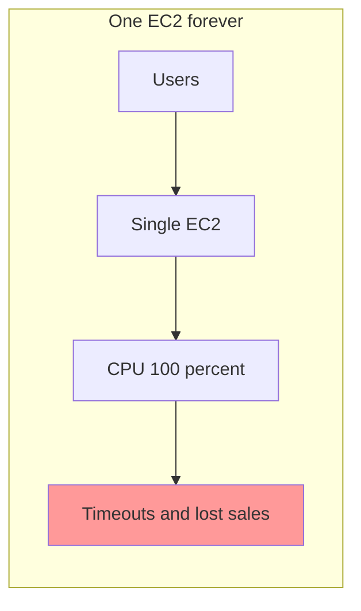
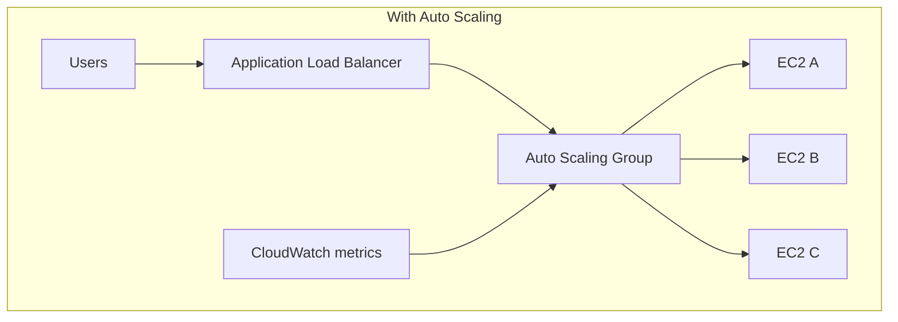
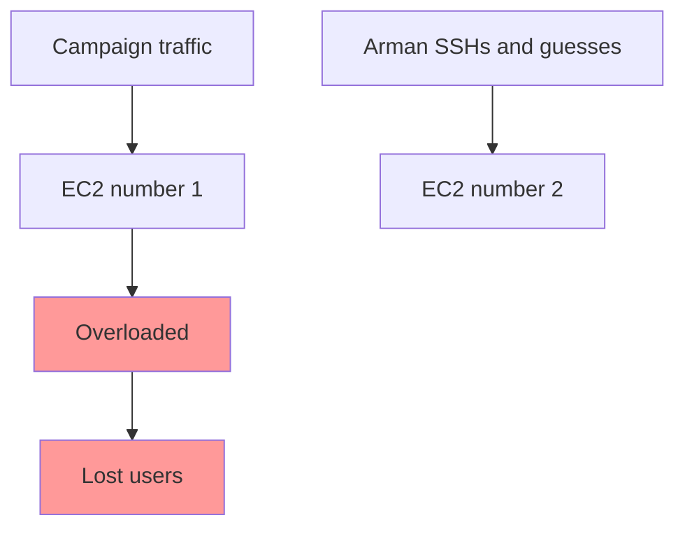
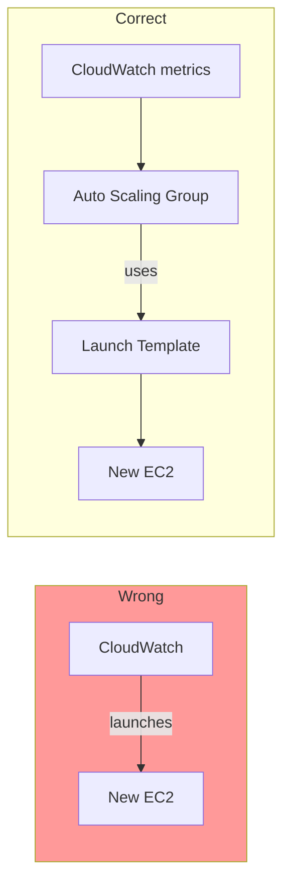
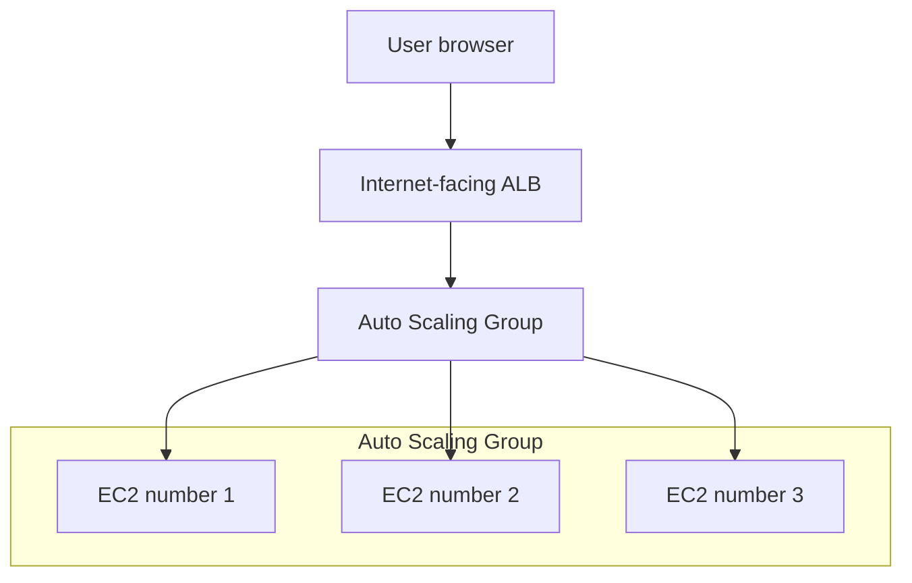
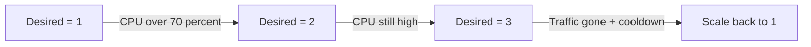
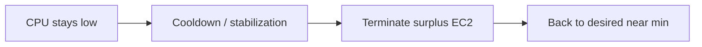
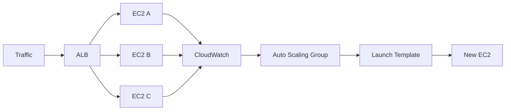
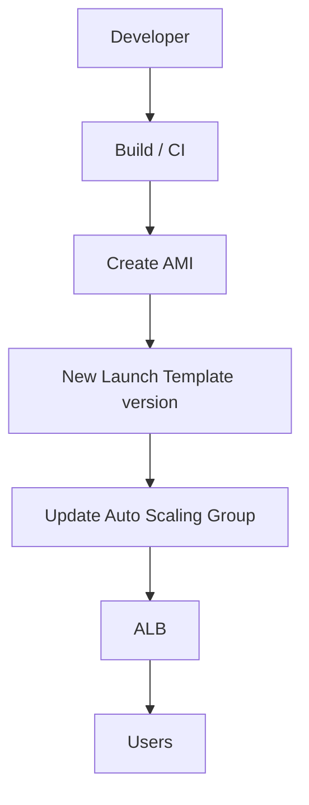

# AWS Auto Scaling — One-Stop Guide

Everything you need to understand **why Auto Scaling exists**, **how ALB + ASG + Launch Templates work together**, and **what you will watch happen in the console** — from one overloaded EC2 to capacity that follows demand.

### helping hand

[AWS Auto Scaling](https://docs.aws.amazon.com/autoscaling/)
[Application Load Balancer](https://docs.aws.amazon.com/elasticloadbalancing/latest/application/)
[Target tracking scaling](https://docs.aws.amazon.com/autoscaling/ec2/userguide/as-scaling-target-tracking.html)

This guide is a **console lab**. You will build a small demo, force CPU high, watch instances launch and terminate, then tear everything down. Production teams usually encode the same ideas in Terraform or CloudFormation — the *concepts* are identical.

---

## Table of Contents

1. [The Problem](#the-problem)
2. [Auto Scaling as the Solution](#auto-scaling-as-the-solution)
3. [Story: Black Friday on One Server](#story-black-friday-on-one-server)
4. [Core Concepts](#core-concepts)
5. [Architecture Overview](#architecture-overview)
6. [Prerequisites](#prerequisites)
7. [Lab: Build It Step by Step](#lab-build-it-step-by-step)
8. [See It Live](#see-it-live)
9. [Force Scaling](#force-scaling)
10. [What Happens Internally](#what-happens-internally)
11. [Production Parallel](#production-parallel)
12. [Troubleshooting](#troubleshooting)
13. [Cleanup](#cleanup)
14. [Quick Reference](#quick-reference)
15. [Further Reading](#further-reading)

---

## The Problem

You ship a chat API on a single EC2. Traffic is quiet most nights. Then a campaign lands.

**What goes wrong with one fixed server:**

| Problem | What happens |
|---------|----------------|
| **Traffic spikes** | CPU hits 100%, requests time out, users leave |
| **Idle capacity** | You oversize for peak and pay for empty CPUs at 3 AM |
| **Manual scaling** | Someone SSHs in, launches another box, updates a load balancer by hand — too late |
| **Snowflake servers** | Each new instance is configured differently; “it worked on the first one” |
| **No health awareness** | A crashed process still receives traffic until a human notices |



Capacity is a guess. Recovery is a pager.

---

## Auto Scaling as the Solution

**Auto Scaling** keeps a fleet of identical EC2 instances behind a load balancer. You declare a **range** (min / desired / max) and a **policy** (for example: keep average CPU near 70%). AWS adds or removes instances so capacity tracks demand.

| Without Auto Scaling | With Auto Scaling |
|----------------------|-------------------|
| One (or N) fixed servers | Fleet size changes with load |
| Manual launch + wire-up | Launch Template is the recipe |
| “Hope this box is healthy” | Target Group health checks |
| DNS pointed at one IP | ALB distributes across healthy targets |
| Guess when to scale | CloudWatch metrics + scaling policy |



**Key idea:** You do not SSH to “add capacity.” You ship a **golden image**, a **recipe**, and a **policy**. The platform does the rest.

---

## Story: Black Friday on One Server

### The scenario

**Arman** runs the chat app’s API on one `t2.micro`:

- Friday morning: ~20% CPU — fine
- Campaign drops at noon: thousands of clients connect
- API latency climbs; health checks start failing
- Arman frantically launches a second EC2 and pastes config from memory
- Half the users still hit the dead first instance because DNS / IP never updated

### Without Auto Scaling



### With Auto Scaling

Same spike. Average CPU crosses 70%. The Auto Scaling Group launches a second (then third) instance from the Launch Template. The ALB only sends traffic to **healthy** targets. When the campaign ends, unused instances terminate after a cooldown. Arman watches the ASG Activity history instead of racing the clock.

That is the lab you are about to build.

---

## Core Concepts

Learn these names before you click. Each piece exists for a reason.

| Piece | What it is | Why it exists |
|-------|------------|---------------|
| **AMI** | Frozen disk image of an EC2 | Every new server starts identical — immutable “golden image” |
| **Launch Template** | Recipe: AMI + instance type + SG + user data | ASG must know *how* to create a server |
| **Target Group** | Pool of instances the ALB can send to | Health checks decide who gets traffic |
| **ALB** | Internet-facing HTTP(S) entry point | One DNS name; many backends |
| **Auto Scaling Group** | Fleet manager: min / desired / max | Creates and terminates EC2s to match capacity |
| **Scaling policy** | Rule (e.g. target CPU 70%) | Removes human guessing from “how many?” |
| **CloudWatch** | Metrics and alarms | *Observes* load — does **not** launch instances itself |

### Capacity knobs

```
Minimum  = never go below this (availability floor)
Desired  = what ASG tries to run right now
Maximum  = hard ceiling (cost / safety cap)
```

Example for this lab:

```
Min = 1    Desired = 1    Max = 3
```

Always keep at least one server. Never exceed three.

### Wrong mental model vs correct



CloudWatch reports numbers. The **Auto Scaling Group** evaluates the policy and uses the **Launch Template** to create or terminate instances.

---

## Architecture Overview

### What you will build



### Capacity story



You will literally watch AWS launch and terminate servers in the EC2 / Auto Scaling consoles.

---

## Prerequisites

| Need | Notes |
|------|--------|
| AWS account | Permissions for EC2, ELB, Auto Scaling, CloudWatch |
| Region | Pick one and stay there (e.g. `us-east-1`) |
| VPC | Default VPC is fine for this demo |
| Subnets | Use **at least two public subnets in different AZs** for the ALB (and for ASG instances in this lab) |
| Cost awareness | `t2.micro` / `t3.micro` may be free-tier eligible; ALB and EBS snapshots are **not** free — run the lab, then [Cleanup](#cleanup) |

### Demo network choice (important)

**This lab puts ASG instances in public subnets** so User Data (`yum install`) and the `stress` tool can reach the internet without a NAT Gateway.

| Environment | Typical placement |
|-------------|-------------------|
| **This learning lab** | Instances in **public** subnets (simpler networking) |
| **Production** | Instances in **private** subnets + NAT for outbound; ALB in public subnets |

If you insist on private subnets for instances, you must already have a working **NAT Gateway** (or equivalent) or package installs in User Data will fail silently and health checks will never pass.

### Security groups (create before or during the lab)

**`alb-sg`** (for the load balancer):

- Inbound: TCP `80` from `0.0.0.0/0` (HTTP from the internet)
- Outbound: allow to instances on port 80

**`web-server-sg`** (for EC2 / Launch Template):

- Inbound: TCP `80` from `alb-sg` only (not the whole internet — ALB is the front door)
- Inbound (optional for the stress demo): TCP `22` from *your* IP only, if you will SSH
- Outbound: allow (needed for `yum` / package installs on public instances)

---

## Lab: Build It Step by Step

Work through these in order. Each step includes a short **why**.

### Step 1 — Create a simple web server

Launch an EC2 (Amazon Linux 2 or Amazon Linux 2023) in a **public** subnet with `web-server-sg`. Paste this as **User Data**:

```bash
#!/bin/bash

yum update -y
yum install -y httpd

echo "Hello from $(hostname)" > /var/www/html/index.html

systemctl enable httpd
systemctl start httpd
```

**Why:** Every instance answers with its hostname. When the ALB spreads traffic later, refreshing the page shows *which* server answered — proof that scaling and load balancing are real.

Example responses:

```
Hello from ip-10-0-2-45
```

```
Hello from ip-10-0-2-81
```

Wait until the instance is running and `http://<public-ip>/` shows the Hello page (or use Session Manager / SSH and `curl localhost`).

> Amazon Linux 2023 uses `dnf` under the hood; `yum` often still works as a compatibility command. If User Data fails, check `/var/log/cloud-init-output.log`.

---

### Step 2 — Create a custom AMI

Once the EC2 is healthy:

```
EC2
  → Actions
  → Image and templates
  → Create image
```

Name:

```
autoscaling-demo-v1
```

Wait until the AMI status is **Available**.

**Why:** Auto Scaling should not “install Apache from scratch” on every scale-out. An AMI is a frozen, repeatable starting point — the same idea production uses for immutable deploys.

You can stop or terminate the original builder instance after the AMI is ready (optional; saves a little money).

---

### Step 3 — Create a Launch Template

```
EC2
  → Launch Templates
  → Create launch template
```

Suggested settings:

| Field | Value |
|-------|--------|
| Name | `autoscaling-template` |
| AMI | `autoscaling-demo-v1` |
| Instance type | `t2.micro` or `t3.micro` |
| Security group | `web-server-sg` |
| Subnet | Leave unset in the template if the ASG will choose subnets |
| IAM instance profile | Optional for this demo |

Save.

**Why:** The ASG never “remembers” your console clicks. The Launch Template is the **recipe** it runs every time it needs a new EC2.

---

### Step 4 — Create a Target Group

```
EC2
  → Target Groups
  → Create target group
```

| Field | Value |
|-------|--------|
| Type | Instances |
| Protocol | HTTP |
| Port | 80 |
| VPC | Your demo VPC |
| Health check path | `/` |

Name it something like `demo-target-group`. You do **not** need to register instances by hand — the ASG will register them when you attach the group.

**Why:** The ALB only forwards to **healthy** targets. If httpd dies, the target fails the check and stops receiving traffic.

---

### Step 5 — Create an Application Load Balancer

```
EC2
  → Load Balancers
  → Create
  → Application Load Balancer
```

| Field | Value |
|-------|--------|
| Scheme | Internet-facing |
| Subnets | **Two or more public subnets** (different AZs) |
| Security group | `alb-sg` |
| Listener | HTTP :80 |
| Default action | Forward to `demo-target-group` |

**Why:** Users get one DNS name. The ALB spreads requests across whatever healthy instances the ASG currently has.

---

### Step 6 — Create the Auto Scaling Group

```
EC2
  → Auto Scaling Groups
  → Create Auto Scaling group
```

| Field | Value |
|-------|--------|
| Launch template | `autoscaling-template` |
| VPC | Your demo VPC |
| Subnets | **Same public subnets** used for the demo (see [Prerequisites](#prerequisites)) |
| Load balancing | Attach to existing load balancer → choose `demo-target-group` |
| Health checks | ELB health checks recommended once the ALB path works |

**Why:** The ASG owns the fleet. Attaching the target group means new instances register automatically and deregister on terminate.

---

### Step 7 — Capacity

Set:

```
Minimum capacity   = 1
Desired capacity   = 1
Maximum capacity   = 3
```

**Why:**

```
Always keep at least 1 server
Never exceed 3 servers
```

Desired starts at 1 so you can prove scale-out when CPU rises.

---

### Step 8 — Scaling policy

Add a dynamic scaling policy:

| Field | Value |
|-------|--------|
| Policy type | Target tracking |
| Metric | Average CPU utilization |
| Target value | 70 |

**Why:** You are not writing “if CPU > 70 launch 1.” Target tracking aims to keep the metric near the target. AWS decides whether to add or remove capacity (within min/max).

After create finishes, confirm:

1. ASG shows **1** in-service instance
2. Target Group shows that instance **healthy**
3. ALB DNS resolves and returns `Hello from …`

---

## See It Live

Open the ALB DNS name in a browser (EC2 → Load Balancers → copy DNS).

Refresh several times.

Initially (one instance):

```
Hello from ip-10-0-2-31
```

After you have scaled out (later section), refreshes may rotate:

```
Hello from ip-10-0-2-31
Hello from ip-10-0-2-84
Hello from ip-10-0-2-17
```

The ALB is distributing requests across healthy instances. Different hostnames = different servers.

---

## Force Scaling

Waiting for real traffic is slow. Force high CPU on an instance so CloudWatch sees it.

### Option A — `stress` (preferred)

SSH (or Session Manager) into the running ASG instance:

```bash
sudo yum install -y stress
stress --cpu 2 --timeout 600
```

This burns CPU for about 10 minutes.

**Why:** Target tracking watches **average** CPU across the group. Sustained high utilization pushes desired capacity up (toward max 3).

Watch:

1. CloudWatch → Metrics → EC2 / ASG CPU
2. Auto Scaling Group → Activity — “Launching a new EC2 instance”
3. Target Group — new target goes from initial → healthy
4. Refresh ALB DNS — new hostnames appear

### Option B — if `stress` is unavailable

Use another CPU-heavy loop (same idea: keep utilization high long enough for the policy). On some Amazon Linux versions you may need an Extra Packages repo or an alternative tool. The principle does not change.

### Scale-in (when traffic ends)

When stress stops and CPU stays low:

```
EC2 number 1   ~5%
EC2 number 2   ~4%
```

AWS waits through a **cooldown / stabilization** period so it does not flap. Then the ASG terminates surplus instances and desired capacity returns toward the minimum (here: 1).



> Scaling out and in can take several minutes. Do not expect instant second-instance launches after 10 seconds of high CPU.

---

## What Happens Internally

### Happy path when load rises

```
Initially: EC2 number 1 at ~20% CPU — OK
Then load spikes: EC2 number 1 at ~95% CPU
CloudWatch records the metric
ASG evaluates target tracking (aim ~70%)
ASG uses Launch Template → new EC2 starts
Load spreads: EC2 number 1 ~45%, EC2 number 2 ~40%
```

### Component flow



Reminder: CloudWatch does not launch instances. The **Auto Scaling Group** does, using the **Launch Template**.

---

## Production Parallel

Companies like Netflix, Airbnb, and Amazon use the same building blocks: **immutable AMIs**, **Launch Templates**, **Auto Scaling Groups**, **health checks**, and **Application Load Balancers**.

A typical release flow:



When you ship version 2:

1. Build a new AMI with the updated software
2. Create a **new version** of the Launch Template pointing at that AMI
3. Update the Auto Scaling Group to use the new template version
4. Run an **instance refresh** or rolling replace so old instances drain and new ones take over — often with **no downtime**

This lab taught the runtime path (scale with load). Rolling deployments are the natural next skill.

---

## Troubleshooting

| Symptom | Likely cause | Fix |
|---------|--------------|-----|
| Target stuck **unhealthy** | httpd not running, wrong port, SG blocks ALB → instance :80 | Check User Data / AMI; allow `alb-sg` → `web-server-sg` :80; curl `/` on the instance |
| ALB times out from browser | ALB not internet-facing, wrong SG, or no healthy targets | Confirm listener :80, `alb-sg` allows 0.0.0.0/0:80, ≥1 healthy target |
| ASG never scales out | CPU not high long enough; max already reached; wrong metric | Run `stress` longer; check max ≥ 2; confirm target tracking on ASG CPU |
| New instance has no Hello page | AMI taken before httpd was ready; User Data failed | Recreate AMI from a verified instance; inspect `cloud-init` logs |
| `yum` fails in User Data | No internet (private subnet without NAT) | Use public subnets for this lab, or add NAT |
| AMI stuck **pending** | Snapshot still copying | Wait; do not point Launch Template at a pending AMI |
| Scale-in feels “stuck” | Cooldown / stabilization; ALB connection draining | Wait; check ASG Activity and instance protection settings |
| Wrong AZ / subnet errors | ALB or ASG missing multi-AZ subnets | Attach ≥2 public subnets in different AZs |

---

## Cleanup

Delete in an order that avoids dependency errors and stops charges. **ALB and leftover EBS snapshots cost money.**

Suggested order:

1. **Auto Scaling Group** — set desired/min to 0 or delete the group (terminates managed instances)
2. **Load Balancer** — delete the ALB
3. **Target Group** — delete after the ALB is gone
4. **Launch Template** — delete when unused
5. **AMI** — deregister `autoscaling-demo-v1`, then delete the related **EBS snapshot(s)**
6. **Leftover EC2 / volumes / Elastic IPs** — terminate any builder instance; release unused EIPs
7. **Security groups** — delete `web-server-sg` / `alb-sg` once nothing references them

Confirm in Billing / Cost Explorer later that demo resources are gone.

---

## Quick Reference

### Capacity

```
Min      → availability floor
Desired  → current target size
Max      → hard ceiling
```

### Policy types (you used one)

| Type | Idea |
|------|------|
| **Target tracking** | Keep a metric near a target (e.g. CPU 70%) |
| Step / simple scaling | React to CloudWatch alarms with fixed adjustments |
| Scheduled | Change capacity at known times (business hours) |

### Console map

```
EC2 → Instances              build server / verify hostname
EC2 → AMIs                   golden image
EC2 → Launch Templates       recipe for ASG
EC2 → Target Groups          health + ALB backends
EC2 → Load Balancers         public DNS entry
EC2 → Auto Scaling Groups    fleet + policies + activity
CloudWatch → Metrics         CPU proof
```

### Mental model

```
Users → ALB → healthy targets in Target Group
ASG creates/terminates EC2 from Launch Template (AMI)
CloudWatch observes → ASG decides → capacity changes
```

---

## Further Reading

- [AWS Auto Scaling User Guide](https://docs.aws.amazon.com/autoscaling/ec2/userguide/what-is-amazon-ec2-auto-scaling.html)
- [How target tracking works](https://docs.aws.amazon.com/autoscaling/ec2/userguide/as-scaling-target-tracking.html)
- [Instance refresh](https://docs.aws.amazon.com/autoscaling/ec2/userguide/asg-instance-refresh.html) — replace the fleet with a new Launch Template version
- [Application Load Balancer](https://docs.aws.amazon.com/elasticloadbalancing/latest/application/introduction.html)

### What’s next

Once this lab feels natural, learn **rolling deployments / instance refresh**, then **custom metrics** (queue depth, request count per target), then how the same ideas appear in **ECS** or **EKS** (tasks/pods instead of raw EC2). The control loop is the same: observe → decide → replace capacity safely.

---

*Based on a hands-on dummy Auto Scaling project: immutable AMI, Launch Template, Target Group, ALB, ASG capacity, and CPU target tracking — from one server to a fleet that scales with load.*
