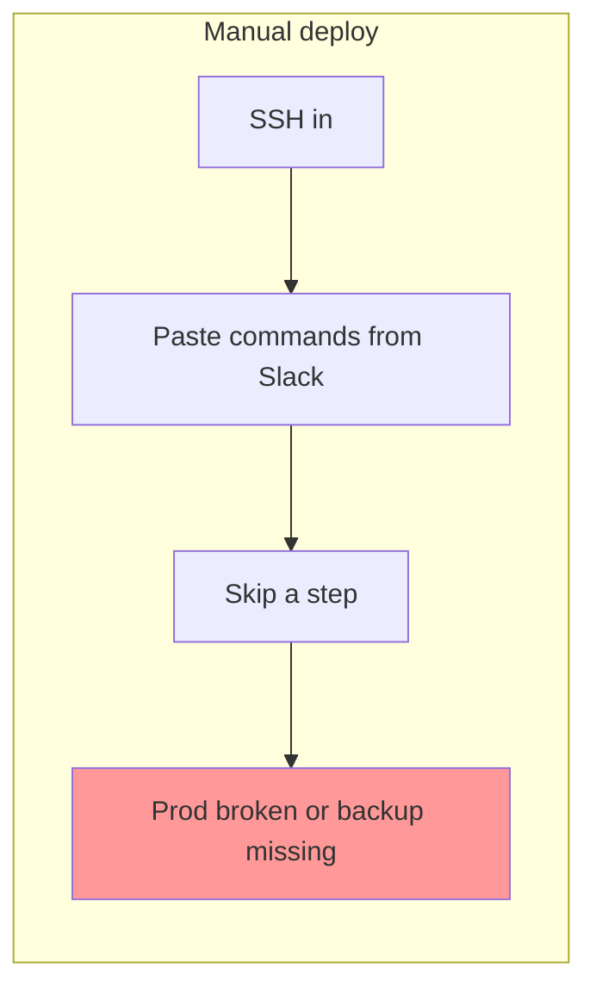
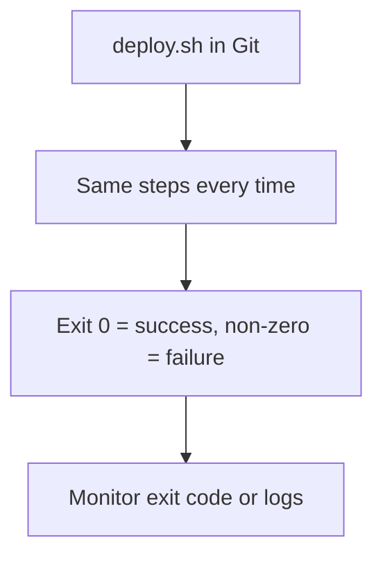
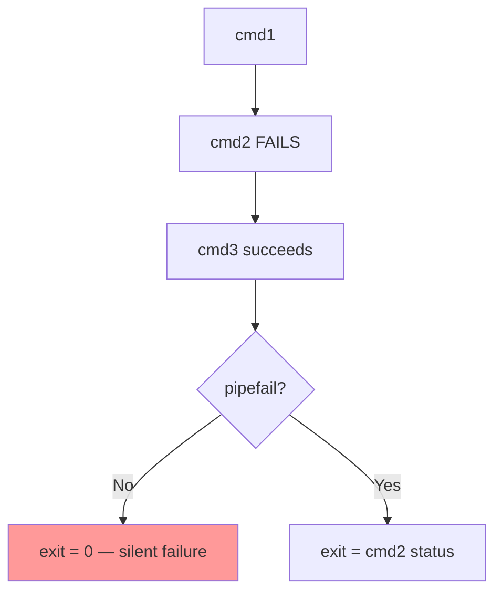

# Bash Scripting — One-Stop Guide

Everything you need to understand **why bash scripts exist**, **how to write them safely**, and **which patterns teams rely on** — from your first `#!/bin/bash` to cron jobs, pipelines, and strict error handling with `set -euo pipefail`.

For basic shell commands (`ls`, `grep`, pipes, redirection), see [linux/README.md](../linux/README.md). This guide focuses on **scripting**: repeatable automation that fails loudly when something goes wrong.

---

## Table of Contents

1. [The Problem](#the-problem)
2. [Bash Scripting as the Solution](#bash-scripting-as-the-solution)
3. [Story: The Backup That Lied](#story-the-backup-that-lied)
4. [What Is Bash Scripting?](#what-is-bash-scripting)
5. [Your First Script](#your-first-script)
6. [Variables and Quoting](#variables-and-quoting)
7. [Input and Output](#input-and-output)
8. [Control Flow](#control-flow)
9. [Scheduling with Cron](#scheduling-with-cron)
10. [Pipelines and Exit Codes](#pipelines-and-exit-codes)
11. [Strict Mode](#strict-mode)
12. [Debugging and Troubleshooting](#debugging-and-troubleshooting)
13. [Best Practices](#best-practices)
14. [Quick Reference](#quick-reference)
15. [Further Reading](#further-reading)

---

## The Problem

You ship the chat app every Friday. The deploy checklist lives in a Slack message:

1. SSH into the server
2. `git pull`
3. `npm ci`
4. `npm run build`
5. Restart the API
6. Run the database backup
7. Check logs
8. … twelve steps later, you're done

**What goes wrong without scripts:**

| Problem | What happens |
|---------|--------------|
| **Human error** | Skip step 4 once — prod runs stale code |
| **Inconsistency** | Arman does it one way, Sara another |
| **Silent failures** | A pipeline fails in the middle but exits `0` — you think the backup succeeded |
| **No audit trail** | "Did anyone run the backup last night?" — nobody knows |
| **Slow onboarding** | New teammate copies commands from a wiki that is already out of date |



Every release is a memory test. Every cron job is a gamble.

---

## Bash Scripting as the Solution

A **bash script** is a text file containing commands that bash runs line by line. Save the deploy steps once, run them the same way every time, and wire the script into **cron** or **systemd timers** for automation.

| Without scripts | With scripts |
|-----------------|--------------|
| Copy-paste from Slack | `./deploy.sh` |
| "I think I ran the backup" | Cron log + exit code |
| Silent pipeline failures | `set -o pipefail` catches them |
| Tribal knowledge | Version-controlled `.sh` in Git |



---

## Story: The Backup That Lied

**Arman** sets up a nightly database backup for the chat app:

```bash
pg_dump chatdb | gzip > /backups/chatdb-$(date +%F).sql.gz
```

He adds it to cron. Slack gets a green check — backup ran.

Three weeks later, Postgres credentials rotate. `pg_dump` starts failing every night. But `gzip` still runs on empty input and writes a tiny file. **Without `set -o pipefail`, the pipeline's exit status is that of the last command (`gzip`) — which succeeds.** Cron reports success. Nobody notices until Sara tries to restore and gets a 22-byte file.


The fix is not "run the commands more carefully." It is a script with **strict error handling** — covered in [Pipelines and Exit Codes](#pipelines-and-exit-codes) and [Strict Mode](#strict-mode).

---

## What Is Bash Scripting?

**Bash** (Bourne-Again SHell) is the default shell on most Linux distributions and macOS. A bash script is a file of commands executed by bash, one line at a time.

**Shell vs bash:** "Shell" is any command-line interpreter (`bash`, `zsh`, `sh`). Bash is one specific shell — and the one this guide uses.

```bash
# Check your shell
echo $SHELL
ps
which bash    # usually /bin/bash or /usr/bin/bash
```

**Why teams use bash scripts:**

- **Automation** — repeat tasks without retyping
- **Portability** — runs on any Linux server, macOS, WSL
- **Integration** — glue between Git, Docker, systemd, databases, and APIs
- **Scheduling** — cron and systemd timers run scripts on a timetable

---

## Your First Script

### Naming and shebang

By convention, scripts end in `.sh` (optional but clear). The **shebang** on line 1 tells the OS which interpreter to use:

```bash
#!/bin/bash
```

Find your bash path with `which bash` if it differs from `/bin/bash`.

### Example: list a directory

Create `list_dir.sh`:

```bash
#!/bin/bash
echo "Today is $(date)"
echo ""
echo "Enter the path to a directory:"
read the_path
echo ""
echo "Contents of $the_path:"
ls "$the_path"
```

### Make it executable and run

```bash
chmod u+x list_dir.sh
./list_dir.sh
# or: bash list_dir.sh
# or: sh list_dir.sh
```

| Method | Notes |
|--------|-------|
| `./list_dir.sh` | Uses shebang — preferred |
| `bash list_dir.sh` | Explicit interpreter |
| `sh list_dir.sh` | May use `dash` on Ubuntu — avoid for bash-specific syntax |

### Comments

Lines starting with `#` are comments (except the shebang on line 1):

```bash
#!/bin/bash
# This script lists a directory chosen by the user
```

---

## Variables and Quoting

Bash variables hold strings (there are no separate int/float types).

### Assignment and access

```bash
country=Pakistan          # no spaces around =
echo "$country"           # Pakistan
new_country="$country"
echo "$new_country"
```

### Command substitution

Capture command output into a variable:

```bash
today=$(date +%F)
file_count=$(ls | wc -l)
echo "Today is $today, $file_count items here"
```

Backticks also work but `$(...)` is preferred:

```bash
today=`date +%F`    # older style — avoid in new scripts
```

### Naming rules

| Valid | Invalid |
|-------|---------|
| `name`, `my_var`, `_private` | `2ndvar` (starts with number) |
| `COUNT`, `api_url` | `my var` (space) |
| | `my-var` (hyphen — parsed as subtraction) |

Avoid reserved words: `if`, `then`, `else`, `fi`, `for`, `while`.

### Always quote expansions

Unquoted variables word-split and glob-expand. This is the #1 source of subtle bugs:

```bash
# BAD — breaks on filenames with spaces
rm $file

# GOOD
rm "$file"
```

**Norm:** quote `"$variable"` unless you explicitly need word splitting.

---

## Input and Output

### Reading user input

```bash
#!/bin/bash
echo "What's your name?"
read entered_name
echo "Welcome, $entered_name"
```

### Command-line arguments

| Variable | Meaning |
|----------|---------|
| `$0` | Script name |
| `$1`, `$2`, … | Positional arguments |
| `$#` | Argument count |
| `$@` | All arguments as separate words |
| `$*` | All arguments as one string |

```bash
#!/bin/bash
echo "Hello, $1!"
# Run: ./greet.sh Sara
```

Loop over all arguments:

```bash
for arg in "$@"; do
  echo "Arg: $arg"
done
```

### Reading from a file

```bash
while read -r line; do
  echo "$line"
done < input.txt
```

### Output: terminal, files, redirects

```bash
echo "Hello, World!"                    # print to terminal
echo "text" > output.txt                # overwrite file
echo "more" >> output.txt               # append
ls > files.txt                          # redirect command output
ls >> files.txt                         # append command output
command > out.log 2>&1                  # stdout + stderr to same file
```

See [linux/README.md — Phase 12](../linux/README.md#phase-12-pipes-redirection--chaining) for pipes (`|`), `&&`, `||`, and `tee`.

---

## Control Flow

### if / elif / else

Test syntax uses `[ ]` or `[[ ]]` (bash-specific, more features):

```bash
#!/bin/bash
echo "Enter a number:"
read -r num

if [ "$num" -gt 0 ]; then
  echo "$num is positive"
elif [ "$num" -lt 0 ]; then
  echo "$num is negative"
else
  echo "$num is zero"
fi
```

Common test operators:

| Test | Meaning |
|------|---------|
| `-eq`, `-ne`, `-lt`, `-gt` | Integer compare |
| `=`, `!=` | String compare (use `[[ ]]` for `==`) |
| `-f path` | File exists |
| `-d path` | Directory exists |
| `-z "$var"` | String is empty |
| `-a` | AND (in `[ ]`) |
| `-o` | OR (in `[ ]`) |

### while loop

```bash
#!/bin/bash
i=1
while [ "$i" -le 10 ]; do
  echo "$i"
  (( i += 1 ))
done
```

### for loop

```bash
#!/bin/bash
for i in {1..5}; do
  echo "$i"
done
```

Loop over files (safe — no word-splitting issues):

```bash
for f in /var/log/*.log; do
  echo "Processing $f"
done
```

### case statement

```bash
#!/bin/bash
fruit="apple"

case $fruit in
  apple)
    echo "Red fruit."
    ;;
  banana)
    echo "Yellow fruit."
    ;;
  *)
    echo "Unknown fruit."
    ;;
esac
```

---

## Scheduling with Cron

**Cron** runs commands on a schedule. The system crontab format:

```
# minute hour day month weekday command
*      *    *   *     *       command
```

### Common schedules

| Schedule | Cron expression | Example |
|----------|-----------------|---------|
| Every day at midnight | `0 0 * * *` | `0 0 * * * /opt/scripts/backup.sh` |
| Every 5 minutes | `*/5 * * * *` | `*/5 * * * * /opt/scripts/healthcheck.sh` |
| Weekdays at 6 AM | `0 6 * * 1-5` | `0 6 * * 1-5 /opt/scripts/report.sh` |
| First day of month at noon | `0 12 1 * *` | `0 12 1 * * /opt/scripts/monthly.sh` |

### Managing crontab

```bash
crontab -l              # list your cron jobs
crontab -e              # edit your cron jobs
```

**Cron tips for scripts:**

- Use **absolute paths** (`/opt/scripts/backup.sh`, not `./backup.sh`)
- Set `PATH` at the top of the crontab or script if needed
- Redirect output to a log file: `>> /var/log/backup.log 2>&1`
- Scripts should exit non-zero on failure so monitoring can alert

### Verify cron ran

On Ubuntu/Debian:

```bash
grep CRON /var/log/syslog
```

Example log lines:

```
2026-03-11 00:00:02 Running script /opt/scripts/backup.sh
2026-03-11 00:00:05 Script completed successfully
2026-03-11 00:05:03 Error: pg_dump: connection refused
2026-03-11 00:05:03 Script exited with error code 1
```

---

## Pipelines and Exit Codes

When commands are chained with `|`, bash runs them as a **pipeline**. Understanding exit codes is critical for reliable scripts.

### Default behavior: last command wins

**Without `set -o pipefail`**, a pipeline's exit status is the exit status of the **last** command — even if an earlier command failed.

```bash
echo "data" | grep "missing" | wc -l
echo $?    # 0 — wc succeeded, even though grep found nothing (exit 1)
```

### The four cases (summary)

| Case | Pipeline | Without pipefail | With pipefail |
|------|----------|------------------|---------------|
| All succeed | `echo x \| grep x \| wc -l` | `0` | `0` |
| Last fails | `echo x \| grep x \| badcmd` | non-zero | non-zero |
| Middle fails | `echo x \| badcmd \| wc -l` | `0` (wc OK) | non-zero |
| First fails | `badcmd \| grep x \| wc -l` | `0` (wc OK) | non-zero |

The dangerous row is **middle fails**: errors are printed to the terminal, but `$?` is `0` if the last command succeeds. Your `if [ $? -ne 0 ]` check never fires.



### Real example: backup pipeline

```bash
#!/bin/bash
# WITHOUT pipefail — dangerous
pg_dump chatdb | gzip > backup.sql.gz
if [ $? -ne 0 ]; then
  echo "Backup failed"
  exit 1
fi
# If pg_dump fails but gzip succeeds, this block never runs
```

```bash
#!/bin/bash
set -o pipefail
pg_dump chatdb | gzip > backup.sql.gz
if [ $? -ne 0 ]; then
  echo "Backup failed"
  exit 1
fi
# Now a pg_dump failure makes the whole pipeline fail
```

### Checking `$?`

`$?` holds the exit status of the **most recently executed** command or pipeline:

- `0` = success
- non-zero = failure (127 = command not found, 1 = general error, etc.)

Capture it immediately — the next command overwrites it:

```bash
some_command
status=$?
if [ "$status" -ne 0 ]; then
  echo "Failed with status $status"
fi
```

---

## Strict Mode

Professional bash scripts start with a **strict mode** header. This is the industry default:

```bash
#!/bin/bash
set -euo pipefail
```

| Option | Effect |
|--------|--------|
| `set -e` | Exit immediately if any command fails (non-zero) |
| `set -u` | Treat unset variables as an error |
| `set -o pipefail` | Pipeline fails if any command in the chain fails |

### What each option catches

**`set -e`** — stops the script on failure:

```bash
set -e
false          # script exits here
echo "never runs"
```

**`set -u`** — catches typos in variable names:

```bash
set -u
echo "$usrename"    # error: usrename: unbound variable
```

**`set -o pipefail`** — catches middle-of-pipeline failures (see above).

### Debugging with `set -x`

Print every command before it runs (useful during development):

```bash
#!/bin/bash
set -euo pipefail
set -x    # remove or comment out in production

backup_dir="/backups"
pg_dump chatdb | gzip > "$backup_dir/chatdb-$(date +%F).sql.gz"
```

Or run once without editing the script:

```bash
bash -x deploy.sh
```

### Example: production-ready backup script

```bash
#!/bin/bash
set -euo pipefail

BACKUP_DIR="/backups"
DB_NAME="chatdb"
DATE=$(date +%F)
FILE="$BACKUP_DIR/${DB_NAME}-${DATE}.sql.gz"

pg_dump "$DB_NAME" | gzip > "$FILE"

if [ ! -s "$FILE" ]; then
  echo "ERROR: backup file is empty" >&2
  exit 1
fi

echo "Backup OK: $FILE ($(du -h "$FILE" | cut -f1))"
```

---

## Debugging and Troubleshooting

### Techniques

| Technique | When to use |
|-----------|-------------|
| `set -x` / `bash -x script.sh` | Trace which line fails |
| `echo "DEBUG: var=$var"` | Inspect values at a point |
| `set -e` | Stop on first error |
| Check `$?` | After pipelines or critical commands |
| `shellcheck script.sh` | Static analysis before deploy |

### Common mistakes

| Symptom | Likely cause | Fix |
|---------|--------------|-----|
| Script "succeeds" but output is wrong | Pipeline middle command failed | `set -o pipefail` |
| `command not found` in cron | `PATH` not set | Use absolute paths or set `PATH` in script |
| Variables empty in cron | Unquoted or unset | `set -u` + quote `"$var"` |
| `[: too many arguments` | Unquoted variable with spaces | Use `"$var"` inside `[ ]` |
| Permission denied | Not executable | `chmod u+x script.sh` |

### Cron-specific debugging

1. Check syslog: `grep CRON /var/log/syslog`
2. Redirect script output: `>> /var/log/myscript.log 2>&1`
3. Run the script manually as the same user cron uses
4. Verify absolute paths and environment variables

---

## Best Practices

### 1. Start every script with shebang + strict mode

```bash
#!/bin/bash
set -euo pipefail
```

### 2. Quote all variable expansions

```bash
cp "$source" "$dest"
```

### 3. Use meaningful names and comments for non-obvious logic

```bash
RETENTION_DAYS=30
find /backups -name "*.sql.gz" -mtime +"$RETENTION_DAYS" -delete
```

### 4. Run shellcheck before committing

```bash
shellcheck deploy.sh backup.sh
```

Install: `apt install shellcheck` (Debian/Ubuntu) or `brew install shellcheck` (macOS).

### 5. Keep scripts idempotent where possible

Running `deploy.sh` twice should not corrupt state. Use checks:

```bash
if systemctl is-active --quiet chat-api; then
  sudo systemctl restart chat-api
else
  sudo systemctl start chat-api
fi
```

### 6. Log with timestamps

```bash
log() { echo "[$(date '+%Y-%m-%d %H:%M:%S')] $*"; }
log "Starting deploy"
```

### 7. Version-control scripts in Git

Treat `.sh` files like application code — review, test, and tag releases together.

### 8. Prefer functions for repeated blocks

```bash
#!/bin/bash
set -euo pipefail

log() { echo "[$(date '+%Y-%m-%d %H:%M:%S')] $*"; }

deploy_api() {
  log "Pulling latest code"
  git -C /var/www/chat-api pull
  log "Installing dependencies"
  npm ci --prefix /var/www/chat-api
  log "Restarting service"
  sudo systemctl restart chat-api
}

deploy_api
log "Deploy complete"
```

---

## Quick Reference

| Task | Command / pattern |
|------|-------------------|
| Shebang | `#!/bin/bash` |
| Strict mode | `set -euo pipefail` |
| Make executable | `chmod u+x script.sh` |
| Run script | `./script.sh` |
| Debug trace | `bash -x script.sh` |
| Variable | `name="value"` / `echo "$name"` |
| Command output | `result=$(command)` |
| Read input | `read -r var` |
| First argument | `$1` |
| All arguments | `"$@"` |
| If test | `if [ "$x" -eq 0 ]; then ... fi` |
| Loop | `for i in {1..5}; do ... done` |
| Pipeline fail on error | `set -o pipefail` |
| Exit with error | `exit 1` |
| Last exit code | `$?` |
| Cron edit | `crontab -e` |
| Cron list | `crontab -l` |
| Lint script | `shellcheck script.sh` |

### Strict-mode template

```bash
#!/bin/bash
set -euo pipefail

# your script here
```

---

## Further Reading

- [Bash Scripting Tutorial — freeCodeCamp](https://www.freecodecamp.org/news/bash-scripting-tutorial-linux-shell-script-and-command-line-for-beginners/) — variables, loops, cron, debugging basics
- [Understanding Bash Pipelines and set -o pipefail — Betashorts (Medium)](https://medium.com/@betashorts1998/understanding-bash-pipelines-and-set-o-pipefail-ba7e06ffb684) — pipeline exit-status behavior
- [linux/README.md](../linux/README.md) — shell commands, pipes, redirection
- [daily-story/bash-scripting.md](../daily-story/bash-scripting.md) — the Arman/Sara story
- [daily-story/systemd.md](../daily-story/systemd.md) — running services reliably after your script deploys them
