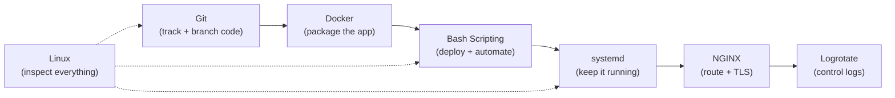

# Daily Story

Short, practical stories about **real problems** each topic solves — and the **industry norms** that grew up around them (like Git Flow, semantic versioning, and the Filesystem Hierarchy Standard).

Read the story first, then use the norms section to see how professional teams actually work with the tool.

---

## Topics

| Story | Problem it fixes | Industry norm | Guide |
|-------|------------------|---------------|-------|
| [Linux](linux.md) | "Where do things live and who is allowed to touch them?" | FHS, least privilege | [linux/README.md](../linux/README.md) |
| [Bash Scripting](bash-scripting.md) | Manual deploys and silent pipeline failures | `set -euo pipefail`, shebang, shellcheck | [bash-scripting/README.md](../bash-scripting/README.md) |
| [Git](git.md) | Two people editing the same code without conflicts | Git Flow, Conventional Commits, semver | [git/README.md](../git/README.md) |
| [Docker](docker.md) | "Works on my machine" — versions, ports, missing services | One-process containers, image tagging | [docker/README.md](../docker/README.md) |
| [Logrotate](logrotate.md) | Disk full because logs never stop growing | Retention policies, `/etc/logrotate.d/` | [logrotate/README.md](../logrotate/README.md) |
| [systemd](systemd.md) | App dies on SSH close, reboot, or crash | Unit conventions, restart policies | [linux-advanced-topics/systemd.README.md](../linux-advanced-topics/systemd.README.md) |
| [NGINX](nginx.md) | Exposed app ports, 502/504, broken WebSockets and OAuth | `proxy_pass`, forwarded headers, upstream blocks | [nginx/README.md](../nginx/README.md) |

---

## How each file is structured

Every story follows the same three parts:

1. **The problem** — a scenario you have probably lived through
2. **How it fixes the problem** — what changes in practice
3. **Industry norms & conventions** — the standard way teams use it (branching models, tagging, standards, best practices)

---

## The through-line

These tools stack into one production workflow:

The recurring cast is **Arman**, **Sara**, and their **chat app** — the same thread used across the main guides.
