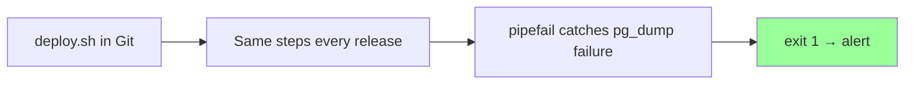

# Bash Scripting — Daily Story

## The problem

**Arman** ships the chat app every Friday. The deploy lives in a pinned Slack message — twelve commands he copies into SSH, one by one:

```bash
cd /var/www/chat-api
git pull
npm ci
npm run build
sudo systemctl restart chat-api
pg_dump chatdb | gzip > /backups/chatdb-$(date +%F).sql.gz
tail -f /var/log/nginx/error.log
# ... six more steps
```

It works — until it doesn't:

1. He **skips `npm run build`** once after a late-night deploy → API serves stale assets
2. **Sara** runs the same steps in a different order → her deploy behaves differently
3. A new teammate joins → spends a day reconstructing the checklist from Slack history
4. One night, Postgres credentials rotate. `pg_dump` fails, but `gzip` still runs on empty input and writes a 22-byte file. **The pipeline exits `0`** because only the last command's status counts. Cron reports success. Slack says "backup OK."

```mermaid
flowchart TD
    MANUAL[12 manual SSH steps] --> SKIP[Skip or reorder a step]
    PIPE[pg_dump fails | gzip OK] --> LIE[Pipeline exit = 0]
    LIE --> FALSE[Backup reported success]
    style FALSE fill:#f99
```

Three weeks later, Sara tries to restore from backup and gets an empty archive. The database is gone and nobody knew.

---

## How bash scripting fixes it

**Bash scripts** turn tribal knowledge into version-controlled, repeatable automation. Write the steps once, run them the same way every time, and let cron or CI execute them with proper exit codes.

```bash
#!/bin/bash
set -euo pipefail

APP_DIR="/var/www/chat-api"
BACKUP_DIR="/backups"
DATE=$(date +%F)

cd "$APP_DIR"
git pull
npm ci
npm run build
sudo systemctl restart chat-api

pg_dump chatdb | gzip > "$BACKUP_DIR/chatdb-${DATE}.sql.gz"

if [ ! -s "$BACKUP_DIR/chatdb-${DATE}.sql.gz" ]; then
  echo "ERROR: backup file is empty" >&2
  exit 1
fi

echo "Deploy and backup OK: chatdb-${DATE}.sql.gz"
```

| Pain | Script answer |
|------|---------------|
| Skip a step | Script runs every line — no memory involved |
| Inconsistent deploys | Same file in Git for everyone |
| Silent pipeline failure | `set -o pipefail` — middle command failure fails the whole pipeline |
| "Did backup run?" | Cron logs + non-zero exit → alert |
| Onboarding | `git clone` + `./deploy.sh` |



---

## Industry norms & conventions

### 1. Shebang + executable bit

Every script starts with the interpreter path and is marked executable:

```bash
#!/bin/bash
```

```bash
chmod u+x deploy.sh
./deploy.sh
```

**Norm:** commit scripts to Git with the shebang; never rely on `sh script.sh` (Ubuntu's `sh` may be `dash`, not bash).

### 2. Strict mode header

The standard first lines after the shebang:

```bash
#!/bin/bash
set -euo pipefail
```

| Flag | Why |
|------|-----|
| `-e` | Stop on first failed command |
| `-u` | Error on unset variables (catches typos) |
| `-o pipefail` | Pipeline fails if any command in the chain fails |

This is the single biggest difference between a hobby script and a production script.

### 3. Quote every variable expansion

```bash
# BAD
rm $file

# GOOD
rm "$file"
```

Unquoted variables break on spaces, globs, and empty values. `shellcheck` flags these automatically.

### 4. Cron jobs: absolute paths + logging

```cron
0 2 * * * /opt/scripts/backup.sh >> /var/log/backup.log 2>&1
```

- Use **full paths** to scripts and binaries
- Redirect **stdout and stderr** to a log file
- Scripts must **exit non-zero** on failure so monitoring can alert
- Verify runs in `/var/log/syslog`: `grep CRON /var/log/syslog`

### 5. shellcheck before merge

```bash
shellcheck deploy.sh backup.sh
```

Run it in CI or as a pre-commit hook. It catches quoting bugs, useless cats, and unreachable code before they hit prod.

### 6. Scripts belong in Git next to the app

| Anti-pattern | Norm |
|--------------|------|
| Deploy steps only in Slack | `scripts/deploy.sh` in the repo |
| Different backup command per server | One `backup.sh`, parameterized with env vars |
| "Works when I run it by hand" | Test in CI or staging with the same script cron uses |

---

**Next:** [systemd — keep the app running after deploy](systemd.md) · **Deep dive:** [bash-scripting/README.md](../bash-scripting/README.md)
