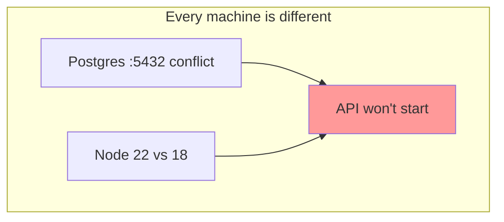
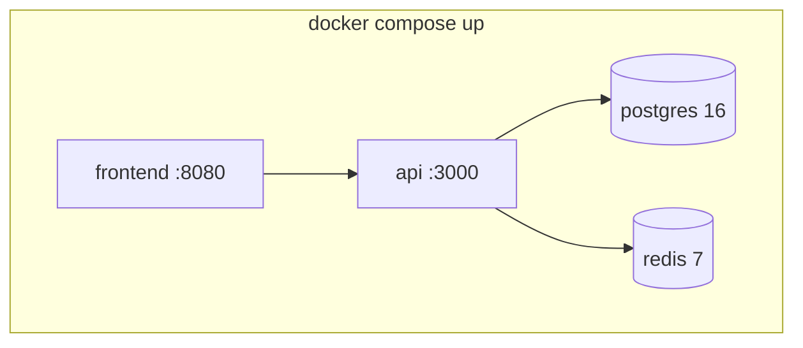
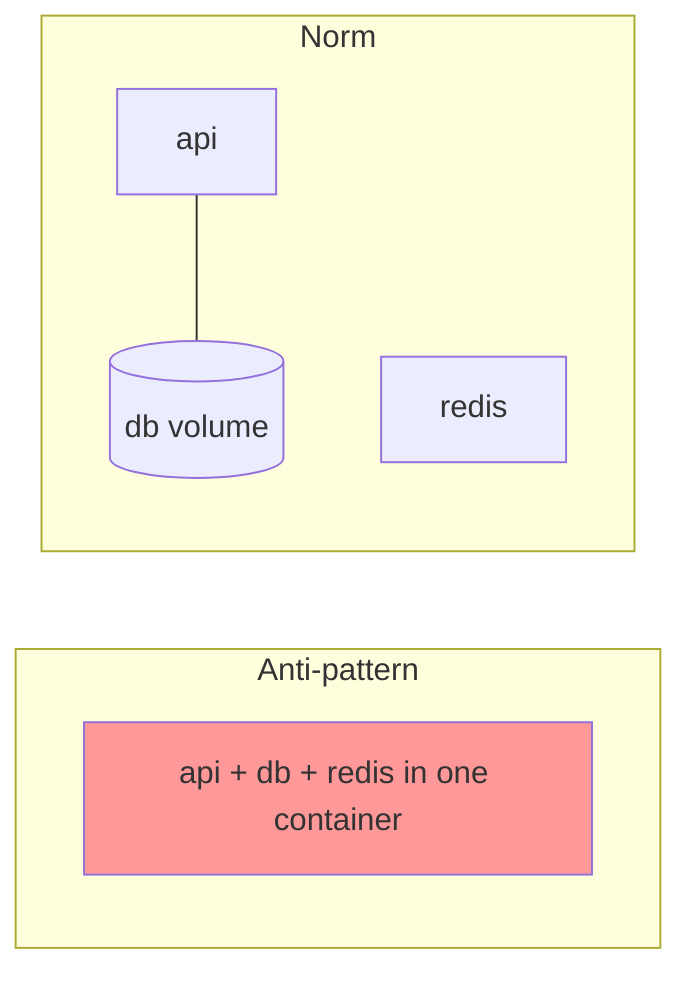

# Docker — Daily Story

## The problem

**Arman** is building a chat app: React frontend, Node API, PostgreSQL, Redis.

On his laptop:

1. Port **5432** is already taken by another Postgres install
2. Host Node is **22** but the API needs **18** — `npm install` fails
3. Teammate **Sara** on Windows cannot run his bash setup script
4. Staging uses different env vars — login works locally but fails in QA

Everyone's machine is slightly different. Onboarding takes two days, and every deploy is a guess about what is actually installed where.



---

## How Docker fixes it

Docker packages the app **and its dependencies** into an **image** — a portable, versioned snapshot that runs identically on any machine. `docker-compose.yaml` wires the services together on a private network with pinned versions.



| Pain | Docker answer |
|------|---------------|
| Wrong runtime version | `FROM node:18-alpine` baked into the image |
| Port conflicts | Map host ports (`5433:5432`) in compose |
| "Install X first" | Declare it as a service |
| Different OSes | Same image on Mac, Windows, Linux |
| "What's in prod?" | The exact same image tag |

---

## Industry norms & conventions

### 1. One concern per container

The standard model: **one main process per container**, not a whole stack in one box.

- API, database, and cache are **separate** containers.
- Containers are **ephemeral** — they can be destroyed and recreated anytime.
- Persistent data lives in **named volumes**, never inside the container.



### 2. The Twelve-Factor App

The widely-adopted standard for container-friendly apps:

| Factor | Norm |
|--------|------|
| **Config in env** | Read settings from environment variables, not hardcoded files |
| **Stateless processes** | No local session state; use Redis/DB |
| **Logs to stdout** | Let the platform collect logs, don't write log files inside the container |
| **Dev/prod parity** | Same image in every environment |

### 3. Dockerfile best practices

```dockerfile
FROM node:18-alpine            # small, pinned base image
WORKDIR /app
COPY package*.json ./          # copy deps first — layer caching
RUN npm ci                     # reproducible installs (not npm install)
COPY . .
USER node                      # run as non-root
EXPOSE 3000
CMD ["node", "server.js"]
```

- **Pin base images** (`node:18-alpine`, not `node:latest`).
- **Order layers** cheap→expensive so caching works (deps before source).
- **Multi-stage builds** to ship small production images (build with full toolchain, run with just the artifact).
- **`.dockerignore`** to keep `node_modules`, `.git`, and secrets out of the build.
- **Run as non-root** (`USER`) for security.

### 4. Image tagging conventions

`latest` is convenience only — **never** trust it in production.

```
registry/namespace/image:tag
ghcr.io/myteam/chat-api:1.2.0      # semver — human readable
ghcr.io/myteam/chat-api:a1b2c3d    # git SHA — exact traceability
```

| Tag strategy | Use |
|--------------|-----|
| **Semver** (`1.2.0`) | Releases — clear upgrade path |
| **Git SHA** (`a1b2c3d`) | Trace an image back to a commit |
| **Environment** (`staging`, `prod`) | Pointer tags moved on deploy |
| **`latest`** | Local convenience only |

> **Norm:** for production, pin by **digest** (`image@sha256:...`) — tags are mutable, digests are not.

### 5. Compose as the source of truth

```yaml
services:
  api:
    build: ./backend
    environment:
      DATABASE_URL: postgres://chat:secret@db:5432/chatdb
    depends_on: [db, redis]
  db:
    image: postgres:16
    volumes: [pgdata:/var/lib/postgresql/data]
volumes:
  pgdata:
```

- **Commit** `Dockerfile`, `docker-compose.yaml`, `.dockerignore`, `.env.example`.
- **Never commit** built images, real `.env` secrets, or volume data.
- `compose.prod.yaml` overrides for production (pinned tags, no bind mounts).

---

**Next:** [systemd — keep the service alive](systemd.md) · **Deep dive:** [docker/README.md](../docker/README.md)
