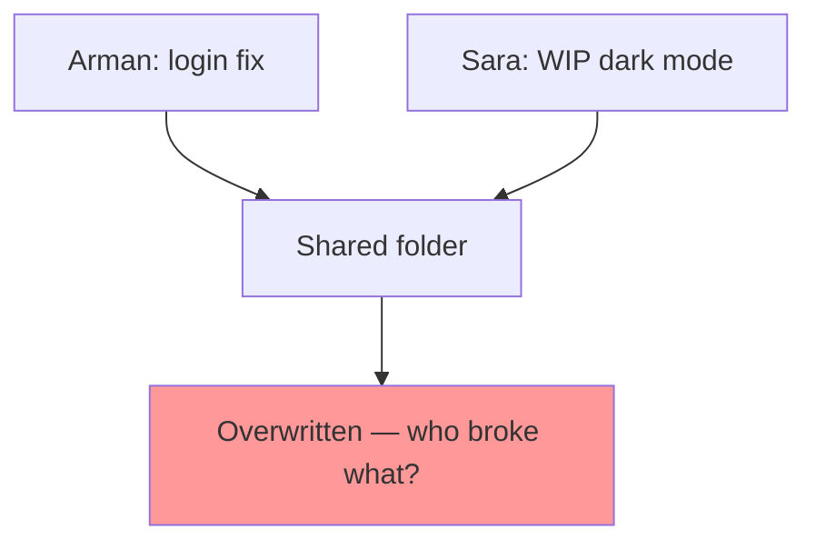
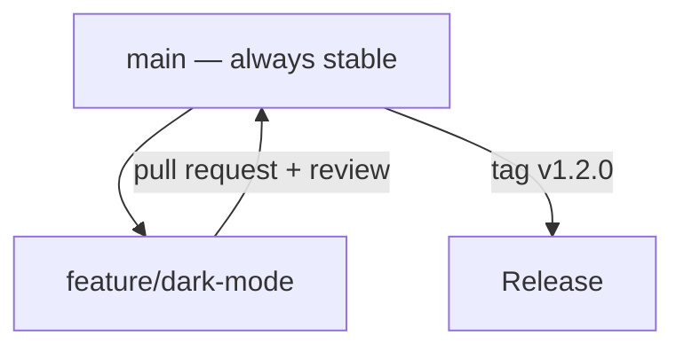
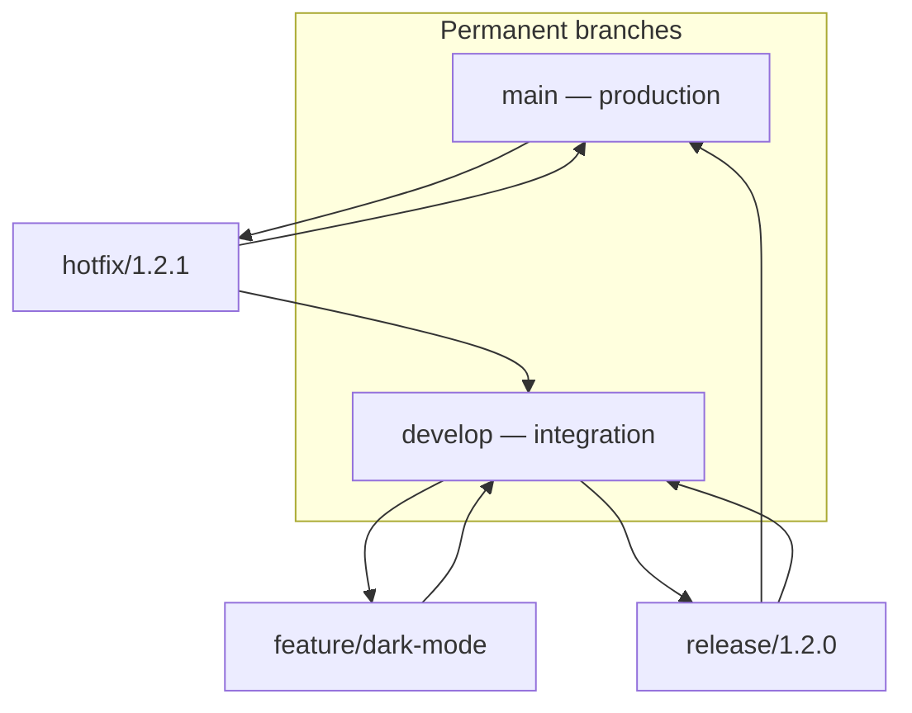
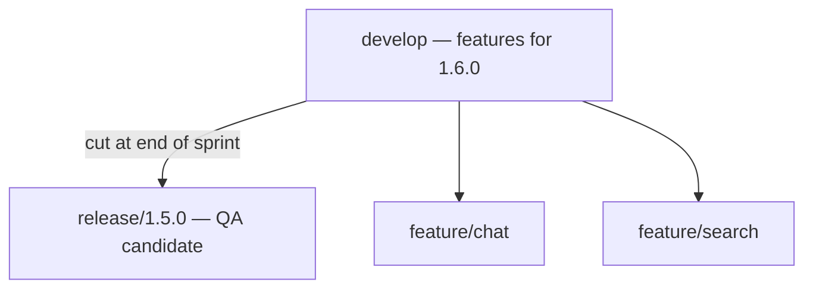
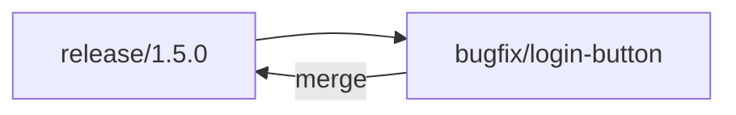
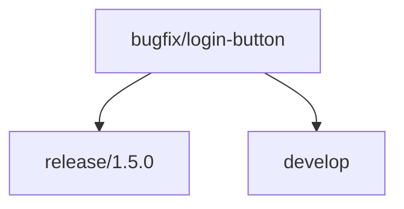
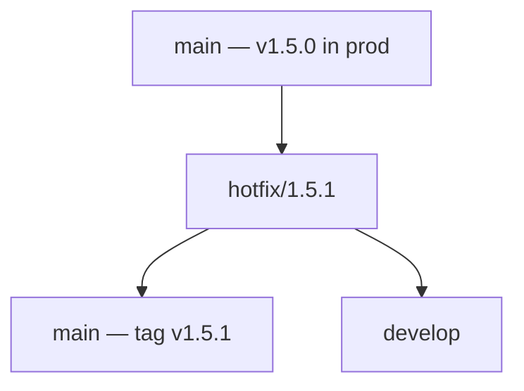
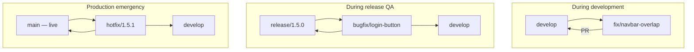
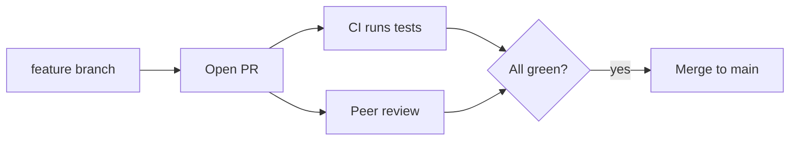
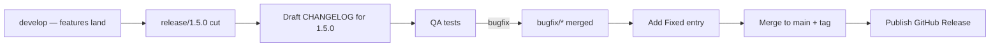

# Git — Daily Story

## The problem

**Arman** and **Sara** work on the same chat app.

Friday afternoon, both edit `api/routes.js`:

- Arman fixes a **login bug**
- Sara builds **dark mode**, half-finished
- They zip the folder as `app-final-2.zip` and email it to staging

Monday: login works, but dark mode breaks the navbar. Sara's copy overwrote Arman's fix. There is **no history**, no way to see who changed what, and no safe way to ship one change without the other.




---

## How Git fixes it

Git records **every change** as a commit with an author, message, and timestamp. Work happens on **branches**, so unfinished code never touches the stable line. Merging combines histories instead of overwriting files.




| Before Git               | After Git               |
| ------------------------ | ----------------------- |
| Overwritten files        | Isolated branches       |
| No audit trail           | `git log` + `git blame` |
| Scary "final-final" zips | Tagged releases         |
| "Whose code is this?"    | Author on every line    |


---

## Industry norms & conventions

This is how professional teams actually organize Git work.

### 1. Branching models

There is no single "correct" model — teams pick one and stay consistent.


| Model           | How it works                                                             | Best for                               |
| --------------- | ------------------------------------------------------------------------ | -------------------------------------- |
| **Git Flow**    | Long-lived `main` + `develop`, plus `feature/`*, `release/*`, `hotfix/*` | Scheduled releases, versioned products |
| **GitHub Flow** | One `main` + short-lived `feature/`*, deploy on merge                    | Web apps, continuous deployment        |
| **Trunk-Based** | Everyone commits to `main` behind feature flags                          | High-velocity teams, strong CI         |


**Git Flow** in detail:




| Branch      | Branches from | Merges into        | Purpose                           |
| ----------- | ------------- | ------------------ | --------------------------------- |
| `main`      | —             | —                  | Always reflects production        |
| `develop`   | `main`        | —                  | Integration of finished features  |
| `feature/*` | `develop`     | `develop`          | One feature at a time             |
| `release/*` | `develop`     | `main` + `develop` | Stabilize, bump version, final QA |
| `hotfix/*`  | `main`        | `main` + `develop` | Urgent production fix             |


> **Norm:** `main` is sacred — it is always deployable. Nobody commits directly to it; changes arrive via reviewed merges.

#### Git Flow in practice: the 2-week release cycle

A common question: *Do we create a release branch every two weeks, QA tests it, and we keep building the next version on `develop`? And if QA finds a bug — which branch do we fix from?*

Yes. That is exactly how many Git Flow teams work. Here is a realistic timeline.

**Week 1–2: development**

Branches at the start:

```
main          (production)
  │
  └── develop
        ├── feature/login
        ├── feature/profile
        └── feature/payment
```

Developers branch from `develop`. When a feature is done: `feature/login` → PR → `develop`.

By the end of two weeks, `develop` holds everything planned for this release.

**Release time — cut `release/1.5.0`**

```bash
git switch develop
git pull origin develop
git switch -c release/1.5.0
git push -u origin release/1.5.0
```

This is the version **QA will test**.

At this point:

- ❌ **No new features** on `release/1.5.0` — only bug fixes and release prep (version bump, changelog)
- ✅ **Developers keep working** on `develop` for the *next* release (`1.6.0`)
- 📝 **Start the release notes** on `release/1.5.0` — summarize what shipped (see [Release notes](#7-release-notes))

```
main

develop
   ├── feature/chat      ← next release work continues
   └── feature/search

release/1.5.0           ← QA tests this
```




**QA finds a bug on the release candidate**

QA reports: *"Login button doesn't work."*

**Which branch does the fix come from?** → `**release/1.5.0`**, not `develop`.

The bug exists in the **release candidate** QA is testing. Branch from there:

```bash
git switch release/1.5.0
git pull origin release/1.5.0
git switch -c bugfix/login-button

# fix, test, commit
git commit -m "fix: restore login button on mobile"
git push -u origin bugfix/login-button
# → PR → merge to release/1.5.0
```




QA re-tests `release/1.5.0`. Repeat until green.

**But what about `develop`?**

`develop` is already moving toward **v1.6.0** with new features. If you only merge the fix into `release/1.5.0`, the **same bug still exists on `develop`**.

After the fix is accepted, merge it into `**develop` as well**:




```bash
git switch develop
git pull origin develop
git merge release/1.5.0    # or cherry-pick the fix commit
git push origin develop
```

**Release to production**

QA approves. Finalize the release notes, merge release into `main`, and tag:

```bash
git switch release/1.5.0

# 1. Update CHANGELOG.md (see Release notes section)
# 2. Bump version in package.json if your project uses one
git commit -am "chore: release v1.5.0"
git push origin release/1.5.0

git switch main
git pull origin main
git merge release/1.5.0
git tag -a v1.5.0 -m "Release 1.5.0 — login, profile, payment"
git push origin main
git push origin v1.5.0

# 3. Publish GitHub/GitLab Release from the tag (paste CHANGELOG section)
```

Merge any remaining release changes back into `develop` (if not already synced), then **delete** the release branch:

```bash
git switch develop
git merge release/1.5.0
git push origin develop
git push origin --delete release/1.5.0
```

**Final state:**

```
main      → v1.5.0 (production)
develop   → fixes from 1.5.0 + new 1.6.0 features
release/1.5.0  → deleted
```

**Production bug after go-live**

`v1.5.0` is live. A critical session bug is reported.

Do **not** fix it on `develop`. Branch from `**main`**:

```bash
git switch main
git pull origin main
git switch -c hotfix/1.5.1
# fix → merge to main → update CHANGELOG → tag v1.5.1 → back-merge to develop
```




**Summary — which branch for what**


| Situation             | Create branch from | Merge back to                     | Release notes                          |
| --------------------- | ------------------ | --------------------------------- | -------------------------------------- |
| New feature           | `develop`          | `develop`                         | Listed under next release              |
| QA bug during release | `release/x.y.z`    | `release/x.y.z` **and** `develop` | **Fixed** entry on release branch      |
| Production bug        | `main`             | `main` **and** `develop`          | **Fixed** entry + hotfix release       |


> This separation is why Git Flow uses a **release branch**: QA gets a stable candidate to test while developers keep building the next version on `develop` without blocking each other.

### 2. Bugfixes — origin and how they are handled

Not every bug is handled the same way. The **origin** of the bug — where it was found — decides which branch you cut and how fast you ship.

#### Where bugfixes come from


| Found where                     | Branch type | Branches from   | Merge back to               | Ships when                      |
| ------------------------------- | ----------- | --------------- | --------------------------- | ------------------------------- |
| Dev / feature work              | `fix/`*     | `develop`       | `develop`                   | Next regular release            |
| QA on release candidate         | `bugfix/*`  | `release/x.y.z` | `release/x.y.z` + `develop` | Current release after QA passes |
| Production (users affected now) | `hotfix/*`  | `main`          | `main` + `develop`          | Immediately — PATCH tag         |


See [Git Flow in practice: the 2-week release cycle](#git-flow-in-practice-the-2-week-release-cycle) above for the full timeline.

**Three scenarios**

1. **Sara** finds a navbar bug while building dark mode on `develop` — not in any release yet → `fix/navbar-overlap` from `develop`.
2. **QA** finds a login bug while testing `release/1.5.0` → `bugfix/login-button` from `release/1.5.0`, then merge to `develop` too.
3. **Users** hit a session leak on live `v1.5.0` → `hotfix/1.5.1` from `main`, tag immediately, back-merge to `develop`.




#### Normal bugfix (`fix/*`) — found on `develop`

```bash
git switch develop
git pull origin develop
git switch -c fix/navbar-overlap

# fix, test, commit
git commit -m "fix: prevent navbar overlap in dark mode"
git push -u origin fix/navbar-overlap
# → open PR → review → merge to develop
```


| Step         | Norm                                                                                       |
| ------------ | ------------------------------------------------------------------------------------------ |
| Branch from  | `develop` (Git Flow) or `main` (GitHub Flow)                                               |
| Name         | `fix/<short-description>`                                                                  |
| Commit type  | `fix:` in Conventional Commits                                                             |
| Merge target | `develop` (or `main` in GitHub Flow)                                                       |
| Version bump | PATCH when the release ships — or bundled into the next MINOR if part of a feature release |
| Urgency      | Normal PR cycle — review + CI                                                              |


#### Release bugfix (`bugfix/*`) — found during QA on `release/x.y.z`

Use when QA is testing a **release candidate** and finds a bug. Branch from the **release branch**, not `develop`.

```bash
git switch release/1.5.0
git pull origin release/1.5.0
git switch -c bugfix/login-button

git commit -m "fix: restore login button on mobile"
git push -u origin bugfix/login-button
# → PR → merge to release/1.5.0 → QA re-tests

# then sync to develop so 1.6.0 doesn't reintroduce the bug
git switch develop
git merge release/1.5.0
git push origin develop
```


| Step                     | Norm                                          |
| ------------------------ | --------------------------------------------- |
| Branch from              | `release/x.y.z` — the branch QA is testing    |
| Name                     | `bugfix/<short-description>`                  |
| Merge target             | `release/x.y.z` first, then `**develop**`     |
| New features on release? | ❌ Never — release branch is frozen            |
| Version bump             | When release merges to `main` (e.g. `v1.5.0`) |


#### Hotfix (`hotfix/*`) — found in production

```bash
git switch main
git pull origin main
git switch -c hotfix/session-leak

# minimal fix, test, commit
git commit -m "fix: clear session cookie on logout"
git push -u origin hotfix/session-leak
# → fast-track PR → merge to main

git switch main
git pull origin main
git tag -a v1.2.1 -m "Hotfix: session leak on logout"
git push origin v1.2.1

# back-merge so develop gets the same fix
git switch develop
git merge main
git push origin develop
```


| Step         | Norm                                                 |
| ------------ | ---------------------------------------------------- |
| Branch from  | `main` — the exact line running in production        |
| Name         | `hotfix/<short-description>`                         |
| Scope        | **Smallest possible change** — no unrelated features |
| Merge target | `main` first, then **back-merge to `develop`**       |
| Version bump | Immediate PATCH tag (`v1.2.0` → `v1.2.1`)            |
| Urgency      | Fast-track review; CI must still pass                |


> **Norm:** never fix a production bug only on `develop`. If users are on `main`, the fix **starts from `main`** and flows back to `develop`. Otherwise the next release re-introduces the bug.

#### `fix/*` vs `bugfix/*` vs `hotfix/*` at a glance


|                   | `fix/*`                  | `bugfix/*`                  | `hotfix/*`          |
| ----------------- | ------------------------ | --------------------------- | ------------------- |
| **Origin**        | `develop` / feature work | `release/x.y.z` QA          | Production (`main`) |
| **Branches from** | `develop`                | `release/x.y.z`             | `main`              |
| **User impact**   | None yet                 | None yet (pre-release)      | Active              |
| **Ship speed**    | Next release             | Current release after QA    | Today               |
| **Also merge to** | `develop`                | `release/x.y.z` + `develop` | `main` + `develop`  |
| **Version**       | Next tag                 | Current release tag         | Immediate PATCH tag |


### 3. Conventional Commits

A standard commit message format that both humans and tools can read (it can auto-generate changelogs and version bumps).

```
<type>(optional scope): <description>

feat: add dark mode toggle
fix: prevent redirect loop on logout
docs: update auth section
refactor: extract session helper
chore: bump eslint to v9
```


| Type                                | Meaning               | Version impact |
| ----------------------------------- | --------------------- | -------------- |
| `feat`                              | New feature           | MINOR bump     |
| `fix`                               | Bug fix               | PATCH bump     |
| `feat!` / `BREAKING CHANGE`         | Breaking change       | MAJOR bump     |
| `docs`, `chore`, `refactor`, `test` | No user-facing change | none           |


### 4. Semantic Versioning (semver)

Releases are tagged `MAJOR.MINOR.PATCH` so everyone understands the scope of a change.


| Bump      | When                             | Example           |
| --------- | -------------------------------- | ----------------- |
| **MAJOR** | Breaking API change              | `1.0.0` → `2.0.0` |
| **MINOR** | New feature, backward compatible | `1.1.0` → `1.2.0` |
| **PATCH** | Bug fix only                     | `1.2.0` → `1.2.1` |


Pre-releases: `v2.0.0-beta.1`, `v1.3.0-rc.1`.

### 5. Pull requests & code review

The universal norm for merging into a protected branch:




- **Protected branches** — no direct pushes to `main`; require PR + passing CI + at least one approval
- **Small PRs** — easier to review, faster to merge, simpler to revert
- **Squash vs merge commits** — teams standardize on one for a clean history
- **Never rebase shared history** — only rebase local, unpushed commits

### 6. Tagging & releases

```bash
git switch main
git pull origin main
git tag -a v1.2.0 -m "Release 1.2.0 — dark mode, session fix"   # annotated tag
git push origin v1.2.0
```

> **Norm:** use **annotated** tags for releases (they store author, date, message). Tag from `main` only after CI is green.

### 7. Release notes

Release notes tell users, QA, and ops **what changed** in a version. In Git Flow they are written on the `**release/x.y.z` branch** before merge to `main`, then published when the tag is pushed.

#### Where release notes live


| Location                         | Audience                         | When updated                              |
| -------------------------------- | -------------------------------- | ----------------------------------------- |
| `CHANGELOG.md` (repo root)       | Developers, long-term history    | On `release/x.y.z` before merge to `main` |
| GitHub / GitLab **Release** page | Users, PM, support               | When tag is pushed                        |
| Annotated tag message            | Anyone running `git show v1.5.0` | At tag time — keep it short               |


#### Standard `CHANGELOG.md` format

Follow [Keep a Changelog](https://keepachangelog.com) — group changes by type, newest version at the top:

```markdown
# Changelog

## [1.5.0] - 2026-07-08

### Added
- User login with email and password (#101)
- Profile page with avatar upload (#102)
- Payment checkout flow (#103)

### Fixed
- Login button not responding on mobile (#115) — QA bugfix during release

### Changed
- Bumped minimum Node version to 18

## [1.4.0] - 2026-06-24
...
```


| Section      | Put here                                        |
| ------------ | ----------------------------------------------- |
| **Added**    | New features (`feat:` commits)                  |
| **Changed**  | Behaviour changes, dependency bumps             |
| **Fixed**    | Bug fixes (`fix:` commits, `bugfix/`* branches) |
| **Removed**  | Deprecated features taken out                   |
| **Security** | CVE fixes, auth hardening                       |


> **Norm:** write for **humans**, not commit hashes. Link PR/issue numbers (`#115`) so readers can dig deeper.

#### When to write them in Git Flow




| Phase                  | Release notes action                                                  |
| ---------------------- | --------------------------------------------------------------------- |
| Cut `release/1.5.0`    | Create `## [1.5.0]` section — list features merged since last release |
| QA bugfix merged       | Add line under **Fixed**                                              |
| Before merge to `main` | Final review — version, date, nothing missing                         |
| Tag pushed             | Copy section into GitHub/GitLab Release                               |


**On the release branch:**

```bash
git switch release/1.5.0

# Gather commits since last tag (helps draft the changelog)
git log v1.4.0..HEAD --oneline --no-merges

# Edit CHANGELOG.md, then:
git add CHANGELOG.md
git commit -m "chore: release notes for v1.5.0"
git push origin release/1.5.0
```

#### Conventional Commits → release notes

If the team uses Conventional Commits (see §3), drafting release notes is mostly sorting:


| Commit type                    | CHANGELOG section                      |
| ------------------------------ | -------------------------------------- |
| `feat:`                        | **Added**                              |
| `fix:`                         | **Fixed**                              |
| `feat!` / `BREAKING CHANGE`    | **Changed** + call out breaking change |
| `docs:`, `chore:`, `refactor:` | Usually omitted from user-facing notes |


Some teams auto-generate drafts with tools like **release-please**, **semantic-release**, or `git cliff` — the norm is still to **review** before publishing.

#### Publishing a GitHub Release

After `git push origin v1.5.0`:

1. Open **Releases → Draft a new release**
2. Choose tag `v1.5.0`
3. Title: `v1.5.0 — Login, Profile, Payment`
4. Paste the `## [1.5.0]` section from `CHANGELOG.md` into the description
5. Publish

Support, PM, and users check here — not `git log`.

#### Hotfix release notes

Hotfixes get a **short, urgent** note — users need to know what was broken and that it is fixed:

```markdown
## [1.5.1] - 2026-07-10

### Fixed
- Session cookie not cleared on logout — users remained logged in after signing out (#120)
```

```bash
git switch main
# after hotfix merge:
# update CHANGELOG.md, commit, then:
git tag -a v1.5.1 -m "Hotfix 1.5.1 — session logout"
git push origin main v1.5.1
# publish GitHub Release — mark as patch/hotfix if your platform supports it
```

> **Norm:** every tag that goes to production gets a **CHANGELOG entry** and a **published release note** — including hotfixes. No silent patches.

---

**Next:** [Docker — fix a broken dev setup](docker.md) · **Deep dive:** [git/README.md](../git/README.md)