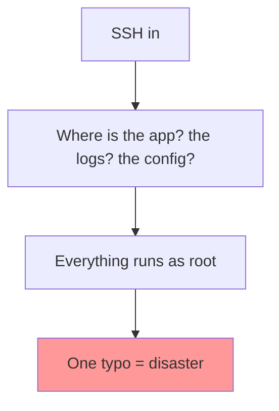

# Linux — Daily Story

## The problem

**Arman** gets paged: the chat API is slow. He SSHs into a server he has not touched in weeks and immediately gets lost.

- Where does the app live? He guesses `/opt`, then `/home`, then finds it in `/var/www`.
- Where are the logs? He hunts through random folders.
- The previous engineer ran everything as **root**, so a typo like `rm -rf /var log` almost wipes the system.
- Config files are scattered — some in the app folder, some in `/etc`, some in a user's home directory.

Nothing is *broken* in Linux. There is just **no shared convention** for where things live or who is allowed to touch them.



---

## How Linux fixes it

Linux ships with a **standard directory layout** and a **permission model**. When everyone follows them, any engineer can land on any server and know where to look.

| Question | Standard answer |
|----------|-----------------|
| App binaries | `/usr/bin`, `/usr/local/bin` |
| Config | `/etc` |
| Variable data & logs | `/var`, logs in `/var/log` |
| User files | `/home/<user>` |
| Temporary files | `/tmp` |

```bash
pwd                 # where am I?
ls -la /etc         # config lives here
cd /var/log         # logs live here
ps aux | grep node  # is it running, and as whom?
```

---

## Industry norms & conventions

### 1. Filesystem Hierarchy Standard (FHS)

The FHS is the agreed-upon map of a Linux system. Put things where the standard says, and tooling + teammates find them automatically.

| Path | Contains | Norm |
|------|----------|------|
| `/etc` | System & app config | Version-control a copy; never secrets in world-readable files |
| `/var/log` | Logs | Rotate them (see [logrotate](logrotate.md)) |
| `/usr/local` | Software installed by admins | Not from the package manager |
| `/opt` | Self-contained third-party apps | Optional large vendor software |
| `/home` | Per-user files | One user per human/service |
| `/srv` | Data served by the system | e.g. web roots on some distros |

### 2. Least privilege (don't be root)

Running as root is the most common footgun in the story above.

```bash
sudo command        # elevate only for the one command that needs it
whoami              # confirm who you are before destructive actions
```

- **Norm:** create a dedicated **service user** (e.g. `chatapi`) to run each app — never root.
- Use `sudo` for individual commands instead of a root shell.
- File permissions follow **owner / group / other** (`rwx`); secrets should be `600` (owner-only).

```
-rw-------  1 chatapi chatapi   .env        # 600 — only the service user
-rw-r--r--  1 root    root      nginx.conf  # 644 — readable, root-owned
```

### 3. SSH key authentication

The industry standard for server access — no passwords.

- Log in with **key pairs**, disable password auth in `sshd_config`.
- One key per person; revoke by removing the public key.
- Never share private keys or the `root` login.

### 4. Everything is a file

Linux exposes processes, devices, and kernel state as files, so the same tools work everywhere.

```bash
cat /proc/cpuinfo         # CPU details as a "file"
cat /proc/meminfo         # memory
ls /dev                   # devices as files
```

This is why `grep`, `cat`, pipes (`|`), and redirection (`>`, `>>`) compose across the whole system — a core Unix philosophy: **small tools, one job each, chained together**.

```bash
ps aux | grep node | awk '{print $2}'   # pipe processes → filter → extract PIDs
```

### 5. Read logs the standard way

```bash
tail -f /var/log/nginx/error.log        # follow live
grep -i error /var/log/nginx/error.log  # search
journalctl -u chat-api -f               # systemd services (see systemd story)
```

> **Norm:** logs go to `/var/log` (or journald for systemd services), never scattered in app folders or a user's home.

---

**Next:** [Git — two devs, one codebase](git.md) · **Deep dive:** [linux/README.md](../linux/README.md)
