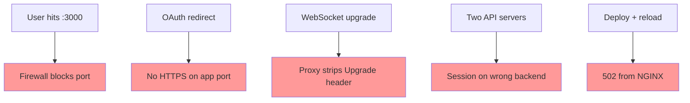
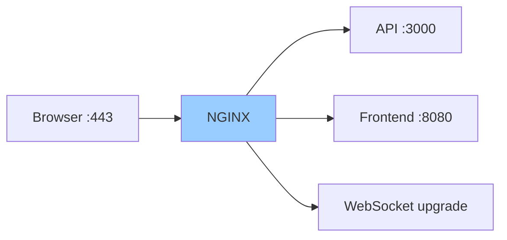

# NGINX Reverse Proxy — Daily Story

## The problem

**Arman** ships the chat app on a single VPS. The Node API listens on **port 3000**. He tells users to visit `http://chat.example.com:3000`.

It works — until it doesn't:

1. **Corporate firewalls** block non-standard ports → half the team cannot log in
2. The API has **no TLS** on `:3000` → browsers warn, OAuth redirects break
3. He adds a **React frontend** on `:8080` and a **WebSocket** channel for live messages — now there are three URLs to remember
4. **Sara** scales to two API instances behind a load balancer — users get logged out randomly because sessions land on different backends
5. A deploy goes out Friday night. Users see **502 Bad Gateway**. The API is fine on `localhost:3000` — NGINX is not



The app runs. The **edge** — how traffic reaches it — is where everything breaks.

---

## How NGINX reverse proxy fixes it

**NGINX** sits in front of your backends: it terminates HTTPS on **443**, routes `/api/` and `/` to the right services, forwards client IP and protocol in headers, balances load, and keeps WebSocket upgrades alive.

```nginx
upstream chat_api {
    least_conn;
    server 127.0.0.1:3000;
    server 127.0.0.1:3001;
    keepalive 32;
}

server {
    listen 443 ssl http2;
    server_name chat.example.com;

    ssl_certificate     /etc/letsencrypt/live/chat.example.com/fullchain.pem;
    ssl_certificate_key /etc/letsencrypt/live/chat.example.com/privkey.pem;

    location /api/ {
        proxy_pass http://chat_api;
        proxy_http_version 1.1;
        proxy_set_header Connection "";
        proxy_set_header Host $host;
        proxy_set_header X-Real-IP $remote_addr;
        proxy_set_header X-Forwarded-For $proxy_add_x_forwarded_for;
        proxy_set_header X-Forwarded-Proto $scheme;
    }

    location / {
        proxy_pass http://127.0.0.1:8080;
        proxy_set_header Host $host;
        proxy_set_header X-Forwarded-Proto $scheme;
    }
}
```

| Pain | NGINX answer |
|------|--------------|
| Port 3000 blocked | Single entry on **443** (and redirect **80 → 443**) |
| No TLS on the app | **SSL termination** at the proxy |
| Multiple services | **`location`** blocks route by path |
| Lost client IP | **`X-Real-IP`**, **`X-Forwarded-For`** |
| App thinks HTTP | **`X-Forwarded-Proto $scheme`** |
| Random logouts | **`ip_hash`** or shared session store |
| 502 after deploy | **`proxy_pass`** to correct upstream + **`nginx -t`** before reload |



---

## Story 1: The trailing slash that ate `/api`

Arman adds a path prefix so the API lives under `/api/`:

```nginx
location /api/ {
    proxy_pass http://127.0.0.1:3000/;
}
```

Request: `GET /api/users` → backend receives `GET /users`. Good.

He copies the config but **drops the trailing slash** on `proxy_pass`:

```nginx
location /api/ {
    proxy_pass http://127.0.0.1:3000;
}
```

Request: `GET /api/users` → backend receives `GET /api/users`. The Express app only mounts routes at `/users`. **404 everywhere.**

**Lesson:** A trailing slash in `proxy_pass` **strips** the matched location prefix. Without it, the full path is forwarded unchanged.

---

## Story 2: The backup that looked fine (502 edition)

Friday deploy. Slack says green. Users get **502 Bad Gateway**.

Arman checks the API:

```bash
curl -v http://127.0.0.1:3000/health
# HTTP/1.1 200 OK
```

The app is up. NGINX is wrong:

```bash
ss -tlnp | grep 3000          # app listening
sudo nginx -t                 # syntax OK
tail -f /var/log/nginx/error.log
# connect() failed (111: Connection refused) while connecting to upstream
```

`proxy_pass` still pointed at **port 3001** from an old experiment. `nginx -t` passed because syntax was valid — routing was not.

**Lesson:** 502 means NGINX could not get a valid response from the upstream. Always `curl` the **exact** upstream URL from the NGINX config, not just "the app works somewhere."

---

## Story 3: OAuth worked locally, failed in prod

Login redirects loop forever in production. Local dev on `:3000` works.

The API builds redirect URLs from `req.protocol` and `req.hostname`. Behind NGINX without headers, every request looks like **`http`** and **`localhost`**.

Fix:

```nginx
proxy_set_header Host $host;
proxy_set_header X-Forwarded-Proto $scheme;
proxy_set_header X-Forwarded-Host $host;
```

Express (with `trust proxy` enabled) now sees the real host and **https**.

**Lesson:** Backends lose client context at the proxy. Standard forwarded headers are not optional for auth, cookies, and rate limiting.

---

## Story 4: Live chat died at the upgrade

Real-time messages worked in dev. In prod, the socket connects then immediately closes.

Arman proxied `/ws/` like a normal HTTP location — no **Upgrade** handling:

```nginx
location /ws/ {
    proxy_pass http://127.0.0.1:3000;
}
```

WebSockets need HTTP/1.1 and connection upgrade:

```nginx
map $http_upgrade $connection_upgrade {
    default upgrade;
    ""      close;
}

location /ws/ {
    proxy_pass http://127.0.0.1:3000;
    proxy_http_version 1.1;
    proxy_set_header Upgrade $http_upgrade;
    proxy_set_header Connection $connection_upgrade;
    proxy_read_timeout 86400s;
}
```

**Lesson:** WebSockets are not plain request/response. The proxy must pass **`Upgrade`** and keep long timeouts.

---

## Story 5: Two servers, one shopping cart (session stickiness)

Sara adds a second API instance for load:

```nginx
upstream chat_api {
    server 127.0.0.1:3000;
    server 127.0.0.1:3001;
}
```

Round-robin spreads users across both. In-memory sessions break — user logs in on server A, next request hits server B → **logged out**.

Options:

| Approach | When |
|----------|------|
| **`ip_hash`** in upstream | Quick fix; same client IP → same backend |
| **Redis session store** | Proper fix at the app layer |
| **Sticky cookie** (commercial / module) | When you cannot change the app |

```nginx
upstream chat_api {
    ip_hash;
    server 127.0.0.1:3000;
    server 127.0.0.1:3001;
}
```

**Lesson:** Load balancing without shared state causes sticky-session bugs. Fix in the app when you can; `ip_hash` is a bandage.

---

## Story 6: The report that timed out at 60 seconds

The `/api/reports/quarterly` endpoint runs heavy SQL. After exactly **60 seconds**, users see **504 Gateway Timeout**.

Default `proxy_read_timeout` is 60s. The backend was still working — NGINX gave up between read chunks.

```nginx
location /api/reports/ {
    proxy_pass http://chat_api;
    proxy_read_timeout 300s;
}
```

Better long-term: return a job ID immediately and poll a status endpoint so the proxy does not hold a connection for minutes.

**Lesson:** Proxy timeouts measure **idle time between operations**, not total wall-clock time. Long jobs need higher timeouts or async patterns.

---

## Story 7: The admin panel the internet could see

`/admin` was reachable on the app's port internally. Once NGINX exposed everything on 443, the admin UI was public.

```nginx
location /admin/ {
    allow 10.0.0.0/8;
    allow 192.168.1.0/24;
    deny all;
    proxy_pass http://chat_api;
}
```

Plus rate limiting on the API:

```nginx
limit_req_zone $binary_remote_addr zone=api:10m rate=10r/s;

location /api/ {
    limit_req zone=api burst=20 nodelay;
    proxy_pass http://chat_api;
}
```

**Lesson:** Putting NGINX in front centralizes **TLS, access control, and rate limits** — one place to lock down what backends cannot do alone.

---

## Industry norms & conventions

### 1. One public entry point (80/443)

- Apps listen on **localhost** or a private network — not the public internet
- **HTTP → HTTPS** redirect on port 80
- TLS certificates live on NGINX, not on every microservice

### 2. `upstream` + `proxy_pass` for backends

```nginx
upstream app_backend {
    server 127.0.0.1:3000;
    keepalive 32;
}

location / {
    proxy_pass http://app_backend;
    proxy_http_version 1.1;
    proxy_set_header Connection "";
}
```

**Norm:** Named upstream blocks for multiple servers, keepalive, and failover — not raw IPs scattered in every `location`.

### 3. The standard proxy header set

```nginx
proxy_set_header Host $host;
proxy_set_header X-Real-IP $remote_addr;
proxy_set_header X-Forwarded-For $proxy_add_x_forwarded_for;
proxy_set_header X-Forwarded-Proto $scheme;
```

Enable **`trust proxy`** (or equivalent) in your framework.

### 4. Test before reload

```bash
sudo nginx -t && sudo systemctl reload nginx
```

Never `reload` on a broken config. Keep **`error_log`** pointed at a file you actually tail during incidents.

### 5. Separate `location` blocks per concern

| Path | Typical backend |
|------|-----------------|
| `/api/` | Application server |
| `/ws/` | WebSocket upstream (upgrade headers) |
| `/static/` | `alias` to disk — skip the app entirely |
| `/health` | NGINX `return 200` — no backend needed |

### 6. Hide backend fingerprints

```nginx
proxy_hide_header X-Powered-By;
proxy_hide_header Server;
```

### 7. Config lives in Git

| Anti-pattern | Norm |
|--------------|------|
| `proxy_pass` edited live on prod | `/etc/nginx/conf.d/app.conf` in Ansible / Git |
| "Works after I restarted nginx three times" | `nginx -t` in CI or pre-deploy hook |
| Mystery 502s | `error_log` + `curl` upstream URL from the same host |

---

**Previous:** [systemd — keep the app running after deploy](systemd.md) · **Deep dive:** [nginx/README.md](../nginx/README.md)
