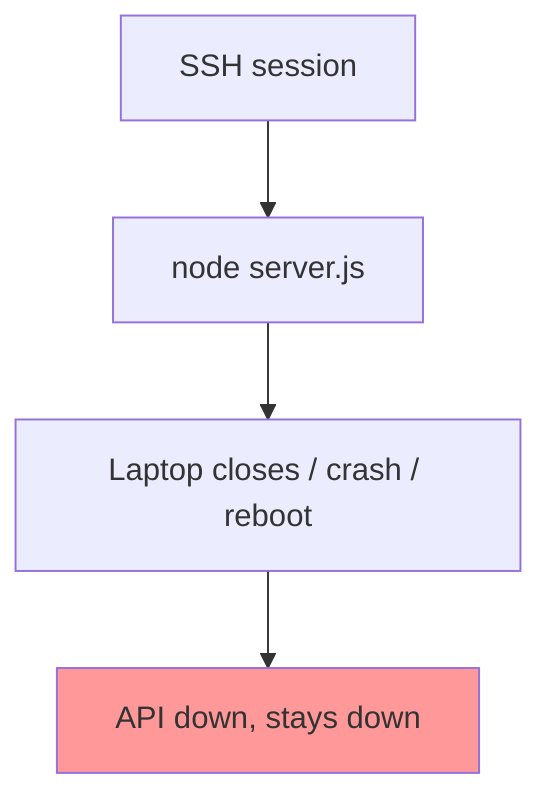
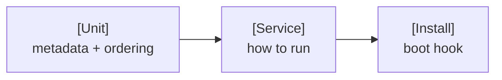

# systemd — Daily Story

## The problem

**Arman** deploys the chat API by SSHing into a VPS and running:

```bash
node server.js
```

It works — until it doesn't:

1. He closes his laptop → SSH drops → the process gets killed → **API down**
2. He tries `nohup node server.js &` → survives disconnect, but a **crash stays down**
3. The server **reboots** after a kernel patch → nothing starts automatically
4. During an incident, "is it running?" has no answer without SSH + `ps`

Users see intermittent 502s. The recovery ritual is: SSH in, restart by hand, repeat.



---

## How systemd fixes it

**systemd** is the standard init system and service manager on modern Linux (Ubuntu, Debian, RHEL, Fedora, Arch). You describe the app once in a **unit file**; systemd then keeps it running, restarts on crash, starts on boot, and centralizes logs in **journald**.

```ini
# /etc/systemd/system/chat-api.service
[Unit]
Description=Chat API
After=network.target

[Service]
ExecStart=/usr/bin/node /var/www/chat-api/server.js
Restart=always
RestartSec=5
User=chatapi
EnvironmentFile=/etc/chat-api/env

[Install]
WantedBy=multi-user.target
```

```bash
sudo systemctl enable --now chat-api.service
```

| Requirement | `node server.js` | systemd |
|-------------|------------------|---------|
| Survives SSH disconnect | ❌ | ✅ |
| Restarts on crash | ❌ | ✅ `Restart=always` |
| Starts on boot | ❌ | ✅ `enable` |
| Centralized logs | ❌ | ✅ `journalctl` |

---

## Industry norms & conventions

### 1. Where unit files belong

| Path | Owner | Norm |
|------|-------|------|
| `/etc/systemd/system/` | You (admin) | Your custom units — highest priority |
| `/lib/systemd/system/` | Packages | Shipped by apt/dnf — don't edit directly |
| Drop-ins `*.d/override.conf` | You | Override package units without editing them |

After any change: `sudo systemctl daemon-reload`.

### 2. The three-section unit file



| Section | Key directives |
|---------|----------------|
| `[Unit]` | `Description`, `After=`, `Wants=`, `Requires=` |
| `[Service]` | `ExecStart`, `Restart`, `User`, `EnvironmentFile` |
| `[Install]` | `WantedBy=multi-user.target` |

### 3. Restart policy conventions

| `Restart=` | Use for |
|-----------|---------|
| `always` | Long-running APIs and daemons |
| `on-failure` | Jobs that may exit 0 legitimately |
| `no` | One-shot tasks that should not auto-restart |

Pair with `RestartSec=5` to avoid tight crash loops.

### 4. Run as a non-root service user (least privilege)

The same norm as the [Linux story](linux.md) — never run app services as root.

```ini
User=chatapi
Group=chatapi
# Hardening options many teams add:
NoNewPrivileges=true
ProtectSystem=strict
PrivateTmp=true
```

### 5. Config via EnvironmentFile, not hardcoding

```ini
EnvironmentFile=/etc/chat-api/env     # secrets file, permissions 600
```

Keeps secrets out of the unit file (which is often committed to config management).

### 6. Logs go to journald

```bash
sudo journalctl -u chat-api.service -f          # follow live
sudo journalctl -u chat-api.service -p err      # errors only
sudo journalctl -u chat-api.service --since today
```

> **Norm:** let systemd capture stdout/stderr into journald rather than the app writing its own log files — consistent with the Twelve-Factor "logs to stdout" convention from the [Docker story](docker.md).

### 7. Ordering & dependencies

```ini
After=network.target postgresql.service   # start after network + DB
Wants=postgresql.service                   # soft dependency
```

- `After=` controls **order**; `Requires=`/`Wants=` control **dependency strength**.
- Use `WantedBy=multi-user.target` so the service starts in the normal "server is up" state.

> On Docker-based hosts, systemd usually manages `docker.service` or a unit that runs `docker compose up` — same conventions, different `ExecStart`.

---

**Next:** [Logrotate — stop the disk from filling](logrotate.md) · **Deep dive:** [systemd.README.md](../linux-advanced-topics/systemd.README.md)
