# Docker — One-Stop Guide

Everything you need to understand **why Docker exists**, **how it solves real problems**, and **which commands to use** — from your first container to multi-service apps with networks, volumes, Compose, and multi-stage builds.

---

## Table of Contents

1. [The Problem](#the-problem)
2. [Docker as the Solution](#docker-as-the-solution)
3. [Story: Fix a Broken Dev Setup with Docker](#story-fix-a-broken-dev-setup-with-docker)
4. [Core Concepts](#core-concepts)
5. [Installation](#installation)
6. [Essential Commands](#essential-commands)
7. [Dockerfile Basics](#dockerfile-basics)
8. [Multi-Stage Builds](#multi-stage-builds)
9. [Volumes](#volumes)
10. [Networks](#networks)
11. [Docker Compose](#docker-compose)
12. [Image Version Control, Tagging & Daily Workflow](#image-version-control-tagging--daily-workflow)
13. [Real-World Use Cases](#real-world-use-cases)
14. [Troubleshooting](#troubleshooting)
15. [Best Practices](#best-practices)
16. [Quick Reference](#quick-reference)

---

## The Problem

You join a team. The README says:

> Install Node 18, PostgreSQL 15, Redis 7, run three shell scripts, copy `.env.example`, pray.

**What goes wrong without containers:**

| Problem | What happens |
|---------|--------------|
| **"Works on my machine"** | App runs on your Mac, crashes on Linux prod |
| **Dependency hell** | Project A needs Python 3.9, Project B needs 3.12 |
| **Slow onboarding** | New dev spends 2 days installing tools |
| **Environment drift** | Staging and production subtly differ |
| **Risky deploys** | `apt upgrade` on the server breaks the app |
| **No isolation** | One app's Redis conflicts with another's port 6379 |

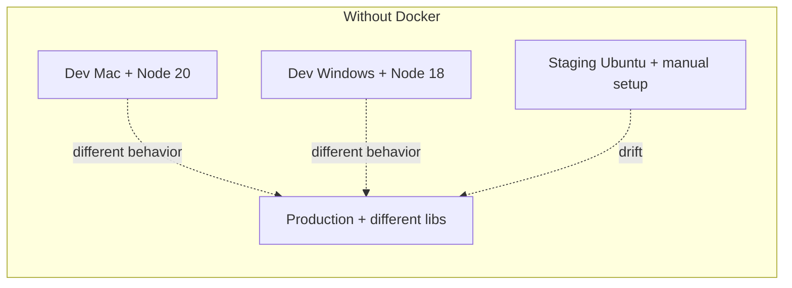

Every machine is a snowflake. Every deploy is a gamble.

---

## Docker as the Solution

**Docker** packages your app + its dependencies + runtime into a **container** — a lightweight, isolated process that runs the same everywhere.

| Without Docker | With Docker |
|----------------|-------------|
| Install runtime on host | Runtime inside image |
| Manual env setup | `Dockerfile` is the recipe |
| "What version of Postgres?" | `image: postgres:15` — exact version |
| Port conflicts on host | Each stack gets its own network |
| Data lost when container dies | **Volumes** persist data |
| 5 terminals, 5 install guides | **`docker compose up`** — one command |

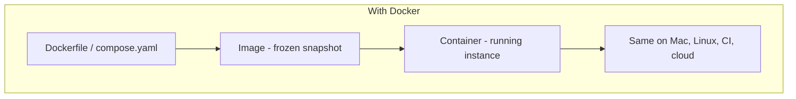

**Key idea:** You ship the **environment**, not just the code.

---

## Story: Fix a Broken Dev Setup with Docker

### The scenario

**Arman** is building a **chat app**:

- **Frontend** — React (Node 20)
- **Backend** — Node.js API (port 3000)
- **Database** — PostgreSQL
- **Cache** — Redis

On his laptop:

1. He installs PostgreSQL locally — port **5432** is already used by another project
2. Node version is **22** but the API was written for **18** — `npm install` fails
3. Teammate **Sara** on Windows can't run the same bash setup script
4. Production uses different env vars — login breaks in staging

**Sound familiar?** This is the exact problem Docker was built for.

### The pain (before)

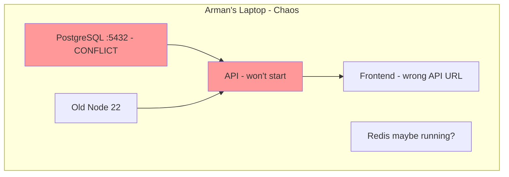

### The fix (Docker plan)

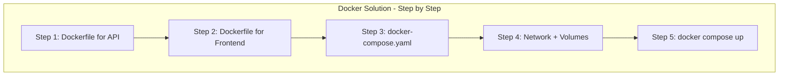

### Step-by-step solution

#### Step 1 — Containerize the API

Create `backend/Dockerfile`:

```dockerfile
FROM node:18-alpine
WORKDIR /app
COPY package*.json ./
RUN npm ci
COPY . .
EXPOSE 3000
CMD ["npm", "start"]
```

Build and test in isolation:

```bash
cd backend
docker build -t chat-api .
docker run --rm -p 3000:3000 chat-api
```

✅ Node 18 is **inside** the image. Host Node version no longer matters.

---

#### Step 2 — Containerize the frontend

Create `frontend/Dockerfile`:

```dockerfile
FROM node:20-alpine AS build
WORKDIR /app
COPY package*.json ./
RUN npm ci
COPY . .
RUN npm run build

FROM nginx:alpine
COPY --from=build /app/dist /usr/share/nginx/html
EXPOSE 80
```

```bash
cd frontend
docker build -t chat-frontend .
docker run --rm -p 8080:80 chat-frontend
```

✅ React builds with Node 20, served by nginx — small production image.

---

#### Step 3 — Wire everything with Docker Compose

Create `docker-compose.yaml` at project root:

```yaml
services:
  api:
    build: ./backend
    ports:
      - "3000:3000"
    environment:
      DATABASE_URL: postgres://chat:secret@db:5432/chatdb
      REDIS_URL: redis://redis:6379
    depends_on:
      - db
      - redis

  frontend:
    build: ./frontend
    ports:
      - "8080:80"
    depends_on:
      - api

  db:
    image: postgres:15-alpine
    environment:
      POSTGRES_USER: chat
      POSTGRES_PASSWORD: secret
      POSTGRES_DB: chatdb
    volumes:
      - pgdata:/var/lib/postgresql/data

  redis:
    image: redis:7-alpine

volumes:
  pgdata:
```

---

#### Step 4 — Networks and volumes do the heavy lifting

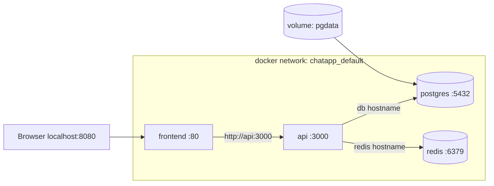

- **Network** — `api` reaches `db` by hostname `db`, not `localhost`
- **Volume `pgdata`** — database survives `docker compose down`
- **No port 5432 conflict** — Postgres is only exposed inside the network (not mapped to host)

---

#### Step 5 — One command for the whole team

```bash
docker compose up --build
```

**Sara on Windows, Arman on Mac, CI on Linux** — same command, same stack.

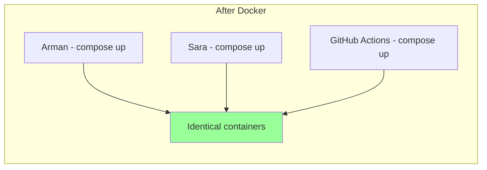

### Story outcome

| Before | After |
|--------|-------|
| 2 days setup | `git clone && docker compose up` |
| Port 5432 conflict | Postgres internal only |
| Node version mismatch | Pinned in Dockerfile |
| Lost DB on restart | Named volume `pgdata` |
| "Works on my machine" | Same image everywhere |

---

## Core Concepts

| Term | Meaning |
|------|---------|
| **Image** | Read-only template (recipe + filesystem snapshot) |
| **Container** | Running instance of an image |
| **Dockerfile** | Text file that defines how to build an image |
| **Registry** | Store for images (Docker Hub, GHCR, ECR) |
| **Volume** | Persistent storage outside container lifecycle |
| **Network** | Virtual network so containers talk by name |
| **Compose** | YAML file defining multi-container apps |

```mermaid
flowchart LR
    Dockerfile --> docker build --> Image
    Image --> docker run --> Container
    Image --> Registry
    Registry --> docker pull --> Image
```

---

## Installation

### macOS

```bash
# Docker Desktop (recommended)
# Download from https://www.docker.com/products/docker-desktop/

docker --version
docker compose version
```

### Ubuntu / Debian

```bash
sudo apt update
sudo apt install docker.io docker-compose-v2
sudo usermod -aG docker $USER
# Log out and back in
```

### Verify

```bash
docker run hello-world
```

---

## Essential Commands

### Images

| Command | Use case |
|---------|----------|
| `docker pull nginx:alpine` | Download image from registry |
| `docker images` | List local images |
| `docker build -t myapp:1.0 .` | Build image from Dockerfile |
| `docker rmi myapp:1.0` | Remove image |
| `docker image prune` | Remove unused images |

```bash
# Build with a tag for Docker Hub
docker build -t myuser/myapp:latest .

# Push to registry
docker push myuser/myapp:latest
```

### Containers

| Command | Use case |
|---------|----------|
| `docker run -d -p 8080:80 nginx` | Run nginx in background, map port |
| `docker ps` | List running containers |
| `docker ps -a` | List all containers |
| `docker stop <id>` | Stop container |
| `docker rm <id>` | Remove container |
| `docker logs -f <id>` | Follow container logs |
| `docker exec -it <id> sh` | Shell into running container |

```bash
# Run with env vars and auto-remove on exit
docker run --rm -e NODE_ENV=production -p 3000:3000 myapp

# Run with a name (easier to reference)
docker run -d --name my-api -p 3000:3000 chat-api
```

### Inspect & debug

```bash
docker inspect my-api          # Full JSON metadata
docker stats                   # CPU / memory live
docker top my-api              # Processes inside container
docker port my-api             # Port mappings
```

### Cleanup

```bash
docker container prune         # Remove stopped containers
docker system prune -a         # Remove unused images, containers, networks
docker volume prune            # Remove unused volumes (careful!)
```

---

## Dockerfile Basics

```dockerfile
# Base image
FROM node:18-alpine

# Working directory inside container
WORKDIR /app

# Copy dependency files first (better layer caching)
COPY package*.json ./
RUN npm ci --only=production

# Copy app source
COPY . .

# Document port (does not publish it)
EXPOSE 3000

# Run as non-root (security)
USER node

# Start command
CMD ["node", "server.js"]
```

### Build & run

```bash
docker build -t my-api .
docker run -d -p 3000:3000 --name api my-api
```

### `.dockerignore` (always add this)

```
node_modules
.git
.env
dist
*.log
```

---

## Multi-Stage Builds

**Problem:** Dev image has compilers, test tools, source maps — bloated and insecure for production.

**Solution:** Use multiple `FROM` stages. Only copy what you need into the final image.

```dockerfile
# ── Stage 1: Build ──
FROM node:20-alpine AS builder
WORKDIR /app
COPY package*.json ./
RUN npm ci
COPY . .
RUN npm run build

# ── Stage 2: Production ──
FROM node:18-alpine AS production
WORKDIR /app
COPY package*.json ./
RUN npm ci --only=production
COPY --from=builder /app/dist ./dist
USER node
EXPOSE 3000
CMD ["node", "dist/server.js"]
```

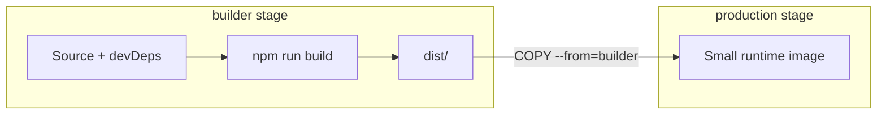

| Stage | Contains | Size |
|-------|----------|------|
| builder | compilers, tests, source | ~800 MB |
| production | runtime + built artifacts only | ~120 MB |

```bash
docker build -t my-api:slim .
docker images my-api:slim
```

---

## Volumes

Containers are **ephemeral** — when removed, data inside is gone. **Volumes** persist data on the host.

### Types

| Type | Use case |
|------|----------|
| **Named volume** | Database data, uploads (`pgdata`) |
| **Bind mount** | Live code reload in dev (`./src:/app/src`) |
| **tmpfs** | Sensitive temp data in memory |

### Commands

```bash
# Create named volume
docker volume create pgdata

# Run with named volume
docker run -d \
  --name postgres \
  -e POSTGRES_PASSWORD=secret \
  -v pgdata:/var/lib/postgresql/data \
  postgres:15-alpine

# Bind mount for live dev
docker run --rm -p 3000:3000 \
  -v $(pwd):/app \
  -w /app \
  node:18-alpine \
  npm run dev

# List / inspect volumes
docker volume ls
docker volume inspect pgdata
```

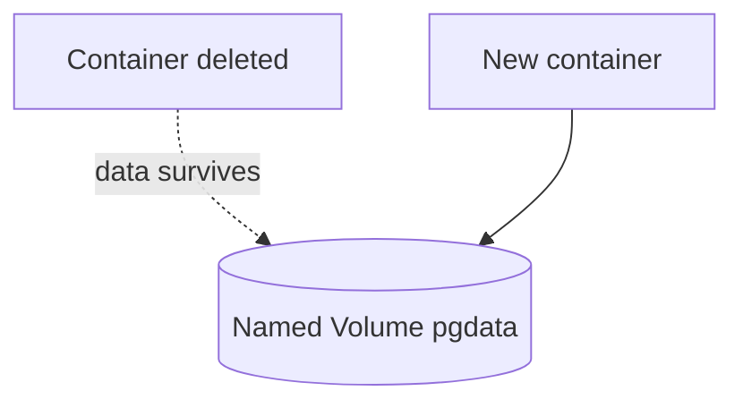

> ⚠️ `docker volume prune` deletes unused volumes — can wipe your database. Always know what you're pruning.

---

## Networks

By default, containers on the same Compose project share a network and resolve each other **by service name**.

### Commands

```bash
# Create custom network
docker network create app-net

# Run containers on same network
docker run -d --name db --network app-net postgres:15-alpine
docker run -d --name api --network app-net my-api
# API connects to postgres://db:5432

# Inspect
docker network ls
docker network inspect app-net
```

### Network modes

| Mode | Behavior |
|------|----------|
| `bridge` (default) | Containers on same host network |
| `host` | Container uses host network directly (Linux) |
| `none` | No networking |

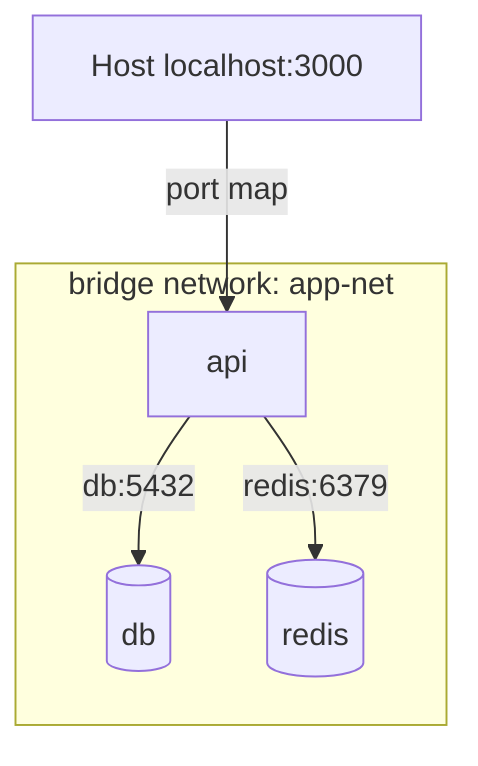

**Rule:** Inside containers, use service names (`db`, `redis`). On your host machine, use `localhost:PORT`.

---

## Docker Compose

Compose defines **multi-container apps** in one YAML file.

### Full example (chat app)

```yaml
services:
  api:
    build: ./backend
    ports:
      - "3000:3000"
    environment:
      DATABASE_URL: postgres://chat:secret@db:5432/chatdb
      REDIS_URL: redis://redis:6379
    volumes:
      - ./backend:/app          # bind mount for dev hot-reload
      - /app/node_modules       # anonymous volume — don't overwrite node_modules
    depends_on:
      db:
        condition: service_healthy
      redis:
        condition: service_started

  frontend:
    build: ./frontend
    ports:
      - "8080:80"
    depends_on:
      - api

  db:
    image: postgres:15-alpine
    environment:
      POSTGRES_USER: chat
      POSTGRES_PASSWORD: secret
      POSTGRES_DB: chatdb
    volumes:
      - pgdata:/var/lib/postgresql/data
    healthcheck:
      test: ["CMD-SHELL", "pg_isready -U chat -d chatdb"]
      interval: 5s
      timeout: 5s
      retries: 5

  redis:
    image: redis:7-alpine

volumes:
  pgdata:
```

### Compose commands

| Command | Use case |
|---------|----------|
| `docker compose up` | Start all services (foreground) |
| `docker compose up -d` | Start in background |
| `docker compose up --build` | Rebuild images then start |
| `docker compose down` | Stop and remove containers |
| `docker compose down -v` | Also remove volumes (deletes DB!) |
| `docker compose logs -f api` | Follow logs for one service |
| `docker compose ps` | List service status |
| `docker compose exec api sh` | Shell into service |
| `docker compose restart api` | Restart one service |

```bash
# Start only database + redis for local API dev
docker compose up -d db redis

# Scale workers (Swarm mode / compatible setups)
docker compose up -d --scale worker=3
```

### Dev vs prod Compose

```
compose.yaml          # base
compose.override.yaml # auto-loaded in dev (bind mounts)
compose.prod.yaml     # production overrides
```

```bash
docker compose -f compose.yaml -f compose.prod.yaml up -d
```

---

## Image Version Control, Tagging & Daily Workflow

Git tracks **source code**. Docker tags track **built images** — the thing you actually run in dev, CI, and production. Without a tagging strategy, `latest` drifts, rollbacks are guesswork, and nobody knows which code is running where.

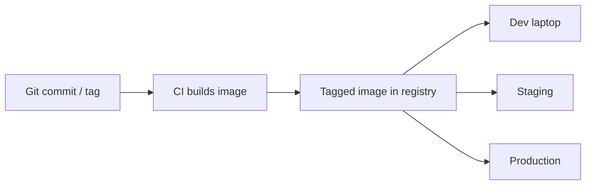

### Image tagging

A full image reference has three parts:

```
registry/namespace/image:tag
```

| Part | Example | Meaning |
|------|---------|---------|
| Registry | `ghcr.io`, `docker.io` | Where images are stored |
| Namespace | `myteam/chat-api` | Org or user + repo name |
| Tag | `1.2.0`, `abc1234` | Mutable label for a specific build |

#### Common tag strategies

| Tag | Example | When to use |
|-----|---------|-------------|
| **Semantic version** | `1.2.0` | Releases — clear upgrade path |
| **Git SHA** | `a1b2c3d` | Traceability — know exact commit |
| **Branch** | `main`, `feature-auth` | CI previews, ephemeral envs |
| **Environment** | `staging`, `prod` | Pointer tags (move on deploy) |
| **`latest`** | `latest` | Convenience only — **never** rely on it in prod |

> ⚠️ Tags are **mutable**. Pushing `myapp:1.0` again overwrites what `1.0` points to. For immutable deploys, pin by **digest** (see below).

#### Build and tag

```bash
# Single tag
docker build -t myuser/chat-api:1.2.0 ./backend

# Multiple tags in one build (release + latest)
docker build \
  -t myuser/chat-api:1.2.0 \
  -t myuser/chat-api:latest \
  ./backend

# Tag an existing image (no rebuild)
docker tag myuser/chat-api:1.2.0 myuser/chat-api:a1b2c3d

# Push all tags
docker push myuser/chat-api:1.2.0
docker push myuser/chat-api:latest
```

#### Pin by digest (production)

Tags can change. Digests cannot — they identify the exact image bytes.

```bash
# Inspect digest after pull or push
docker pull myuser/chat-api:1.2.0
docker inspect --format='{{index .RepoDigests 0}}' myuser/chat-api:1.2.0
# myuser/chat-api@sha256:abc123...

# Run or deploy by digest
docker run myuser/chat-api@sha256:abc123...
```

In Compose or Kubernetes, prefer digest pinning for production:

```yaml
services:
  api:
    image: myuser/chat-api@sha256:abc123def456...
```

---

### Version control integration

**What belongs in Git:**

| File | Purpose |
|------|---------|
| `Dockerfile` | How to build the image |
| `docker-compose.yaml` | How services connect locally |
| `.dockerignore` | Keep build context small |
| `compose.prod.yaml` | Production overrides (image tags, no bind mounts) |

**What does NOT belong in Git:**

- Built images (`docker save` tarballs)
- Local layer cache
- Secrets (`.env` with passwords — use `.env.example` instead)
- Named volume data

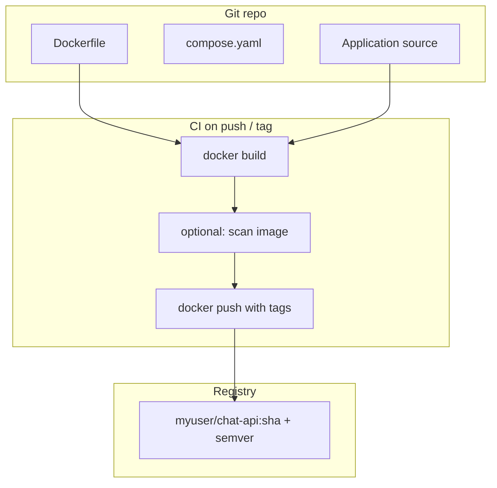

#### Tie image tags to Git

| Git event | Image tag | Example |
|-----------|-----------|---------|
| Every commit on `main` | Short SHA | `chat-api:a1b2c3d` |
| Git tag `v1.2.0` | Semver | `chat-api:1.2.0` |
| Pull request #42 | PR number | `chat-api:pr-42` |

```bash
# Local: tag from current commit
GIT_SHA=$(git rev-parse --short HEAD)
docker build -t myuser/chat-api:${GIT_SHA} ./backend
docker build -t myuser/chat-api:${GIT_SHA} -t myuser/chat-api:latest ./backend
```

#### CI example (GitHub Actions)

```yaml
# .github/workflows/docker.yml
name: Build and push

on:
  push:
    branches: [main]
    tags: ['v*']

jobs:
  build:
    runs-on: ubuntu-latest
    steps:
      - uses: actions/checkout@v4

      - name: Set image tags
        id: meta
        run: |
          SHA=$(git rev-parse --short HEAD)
          echo "tags=myuser/chat-api:${SHA}" >> $GITHUB_OUTPUT
          if [[ "${{ github.ref }}" == refs/tags/v* ]]; then
            VERSION=${GITHUB_REF#refs/tags/v}
            echo "tags=myuser/chat-api:${VERSION},myuser/chat-api:latest" >> $GITHUB_OUTPUT
          fi

      - uses: docker/build-push-action@v6
        with:
          context: ./backend
          push: true
          tags: ${{ steps.meta.outputs.tags }}
```

#### Prod compose references pinned images

Dev uses `build:`. Production uses pre-built, tagged images from CI:

```yaml
# compose.prod.yaml
services:
  api:
    image: myuser/chat-api:1.2.0   # or @sha256:... for immutability
    build: null                     # override — do not rebuild on server
  frontend:
    image: myuser/chat-frontend:1.2.0
```

```bash
# Deploy known version (no build on server)
docker compose -f compose.yaml -f compose.prod.yaml pull
docker compose -f compose.yaml -f compose.prod.yaml up -d
```

---

### Daily workflow

A typical day with the chat app — from morning sync to end-of-day cleanup.

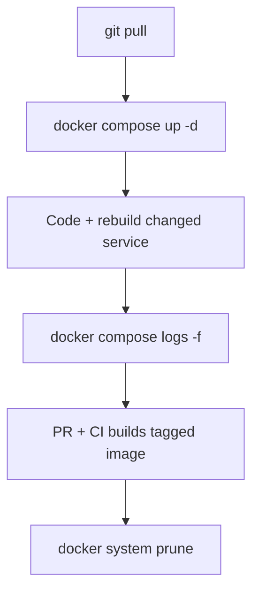

#### Morning — sync and start

```bash
git pull
docker compose pull          # refresh base images (postgres, redis)
docker compose up -d --build # rebuild only if Dockerfiles/source changed
docker compose ps            # all services healthy?
```

| Check | Command |
|-------|---------|
| Services running | `docker compose ps` |
| API healthy | `curl -s localhost:3000/health` |
| DB ready | `docker compose exec db pg_isready -U chat` |
| Recent errors | `docker compose logs --tail 50` |

#### During development — tight loop

```bash
# Rebuild only the service you changed
docker compose up -d --build api

# Follow logs for one service
docker compose logs -f api

# Shell into a running service
docker compose exec api sh

# Run a one-off command (migrations, tests)
docker compose run --rm api npm run migrate
docker compose run --rm api npm test

# Restart without rebuild (env var change)
docker compose up -d --force-recreate api
```

**Hot reload in dev** — bind mounts in `compose.override.yaml` mean you often only save files; no rebuild needed for JS/TS changes. Rebuild when `package.json` or the `Dockerfile` changes.

#### Before opening a PR

```bash
# Clean rebuild — catch stale cache issues
docker compose build --no-cache
docker compose up -d
docker compose run --rm api npm test

# Confirm image builds and is tagged (optional local check)
docker build -t chat-api:$(git rev-parse --short HEAD) ./backend
```

#### Deploy / promote a version

```bash
# Pull the version CI built
export APP_VERSION=1.2.0
docker pull myuser/chat-api:${APP_VERSION}
docker pull myuser/chat-frontend:${APP_VERSION}

# Rolling update with Compose
docker compose -f compose.yaml -f compose.prod.yaml up -d

# Rollback — redeploy previous tag
export APP_VERSION=1.1.0
docker compose -f compose.yaml -f compose.prod.yaml up -d
```

#### End of day — cleanup

```bash
# Stop stack (keep volumes — DB data survives)
docker compose down

# Remove dangling images from today's builds
docker image prune -f

# Aggressive cleanup (careful — removes unused images)
docker system prune -f
```

| Situation | Command |
|-----------|---------|
| Stop work, keep data | `docker compose down` |
| Stop work, wipe DB | `docker compose down -v` |
| Free disk space | `docker system prune -a` |
| See what's using disk | `docker system df` |

#### Daily workflow cheat sheet

```
Morning     git pull && docker compose up -d --build
Coding      docker compose logs -f api
Rebuild     docker compose up -d --build api
One-off     docker compose run --rm api <command>
PR check    docker compose build --no-cache && test
Deploy      pull tagged image → compose up -d
Evening     docker compose down && docker image prune -f
```

---

## Real-World Use Cases

### 1. Run PostgreSQL without installing it

```bash
docker run -d \
  --name local-postgres \
  -e POSTGRES_PASSWORD=dev \
  -e POSTGRES_DB=myapp \
  -p 5432:5432 \
  -v pgdata:/var/lib/postgresql/data \
  postgres:15-alpine
```

### 2. One-off command (no install)

```bash
# Run Node script without installing Node
docker run --rm -v $(pwd):/app -w /app node:18-alpine node script.js

# Format JSON with jq
echo '{"a":1}' | docker run --rm -i stedolan/jq .
```

### 3. CI pipeline

```yaml
# .github/workflows/test.yml (concept)
jobs:
  test:
    runs-on: ubuntu-latest
    steps:
      - uses: actions/checkout@v4
      - run: docker compose -f compose.test.yaml up --build --abort-on-container-exit
```

### 4. Production deploy

```bash
docker pull myuser/myapp:v1.2.0
docker stop myapp || true
docker rm myapp || true
docker run -d \
  --name myapp \
  --restart unless-stopped \
  -p 80:3000 \
  -e DATABASE_URL=$DATABASE_URL \
  myuser/myapp:v1.2.0
```

### 5. Debug a failing container

```bash
docker logs myapp --tail 100
docker exec -it myapp sh
docker inspect myapp | jq '.[0].State'
```

### 6. Full stack locally (from the story)

```bash
git clone https://github.com/team/chatapp.git
cd chatapp
cp .env.example .env
docker compose up --build
# Frontend → http://localhost:8080
# API      → http://localhost:3000
```

---

## Troubleshooting

| Symptom | Likely cause | Fix |
|---------|--------------|-----|
| `port is already allocated` | Host port in use | Change `"8081:80"` or stop conflicting process |
| `connection refused` to `localhost:5432` | Connecting from host to wrong target | Use service name inside containers; `localhost` on host |
| Changes not reflected | Cached image layers | `docker compose build --no-cache` |
| `permission denied` on volume | UID mismatch | Fix ownership or use named volume |
| Container exits immediately | App crash on start | `docker logs <container>` |
| Out of disk | Too many images | `docker system prune -a` |
| `Cannot connect to Docker daemon` | Docker not running | Start Docker Desktop / `sudo systemctl start docker` |

```bash
# See why container exited
docker logs my-api
docker inspect my-api --format='{{.State.ExitCode}} {{.State.Error}}'

# Rebuild from scratch
docker compose down
docker compose build --no-cache
docker compose up
```

---

## Best Practices

1. **Pin image versions** — `node:18-alpine`, not `node:latest`
2. **Tag every release** — semver + git SHA; avoid deploying untagged `latest` to prod
3. **Pin prod by digest** — `@sha256:...` when you need immutable deploys
4. **Use `.dockerignore`** — never copy `node_modules` into build context
5. **Order Dockerfile layers** — dependencies before source (cache hits)
6. **Multi-stage builds** for production — small, secure images
7. **Don't run as root** — use `USER` in Dockerfile
8. **Secrets** — use env files / secret managers, never hardcode in images
9. **Healthchecks** in Compose — wait for DB before starting API
10. **Named volumes for data** — bind mounts for dev only
11. **One process per container** (generally) — let Compose orchestrate
12. **`docker compose down -v`** destroys data — know before you run it
13. **Build in CI, pull in prod** — servers should not compile your app

---

## Quick Reference

```
Image      → template          docker build / docker pull
Container  → running instance  docker run / docker stop
Volume     → persistent data   -v name:/path
Network    → container DNS     --network app-net
Compose    → multi-container   docker compose up
Tag        → version label     myuser/app:1.2.0 or @sha256:...
Digest     → immutable ID      pin in production

Inside container  → use service name (db:5432)
On host machine   → use localhost:PORT
```

### Cheat sheet

```bash
docker build -t app:1.0 .                # Build with version tag
docker tag app:1.0 app:latest            # Add another tag
docker push myuser/app:1.0               # Publish to registry
docker pull myuser/app@sha256:abc...     # Pull exact image
docker build -t app:$(git rev-parse --short HEAD) .  # Tag from git
docker compose up -d --build             # Start stack
docker compose logs -f                   # Follow logs
docker compose run --rm api npm test     # One-off command
docker exec -it <name> sh                  # Shell in
docker system df                         # Disk usage
docker system prune -a                   # Cleanup
```

---

## See Also

- [Linux commands](../linux/README.md) — `ps`, `curl`, permissions, pipes
- [Logrotate](../logrotate/README.md) — manage container log growth on hosts
- Official docs: [docs.docker.com](https://docs.docker.com)
