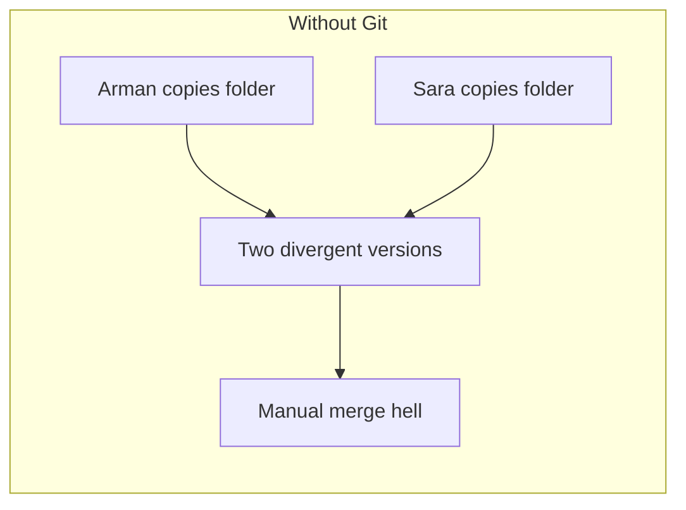
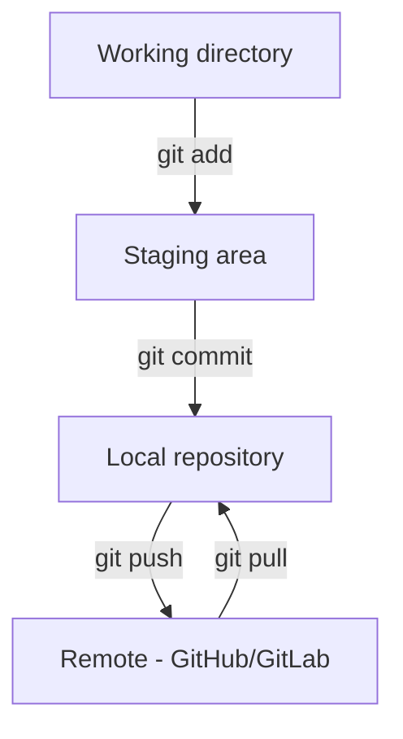
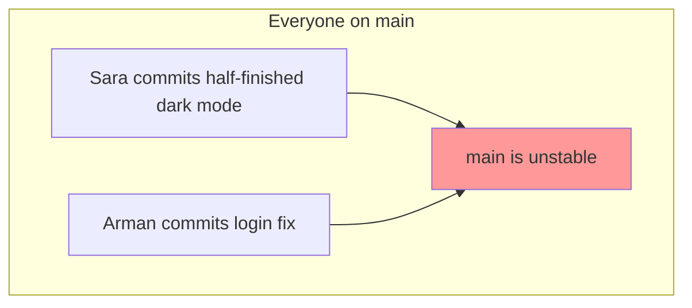
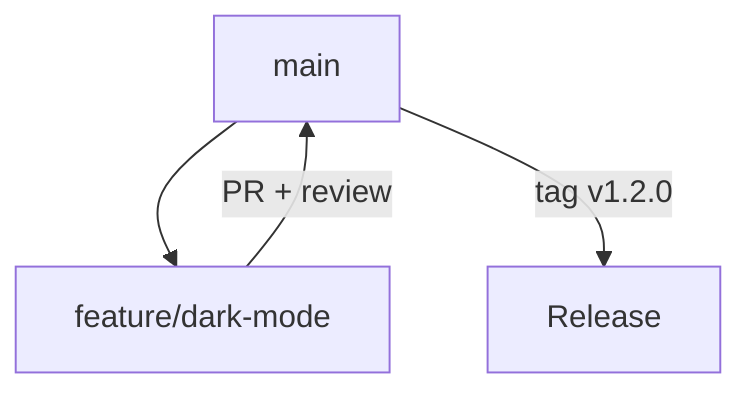
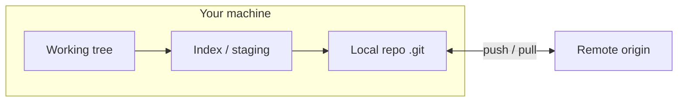
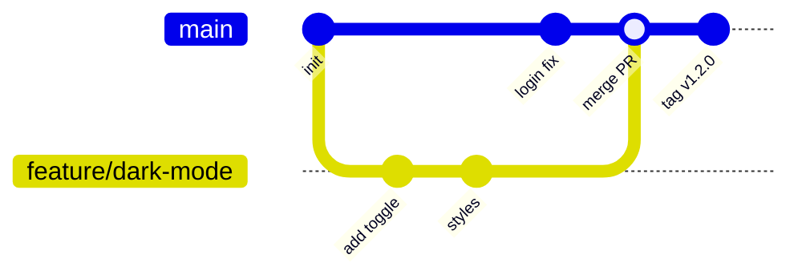
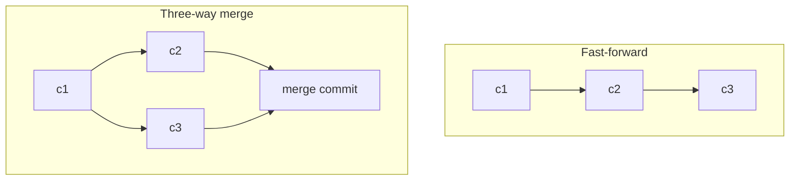
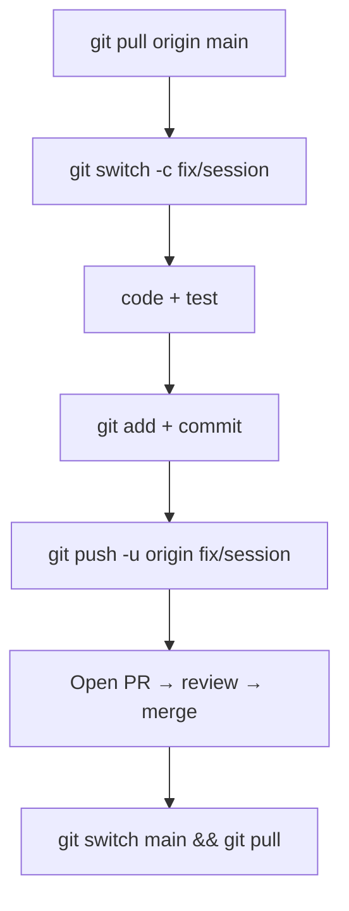
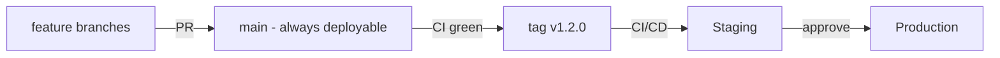
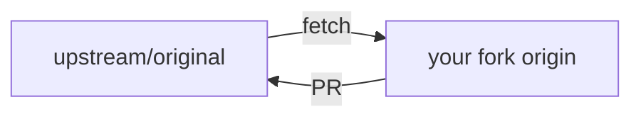

# Git — One-Stop Guide

Everything you need to understand **why Git exists**, **how teams collaborate without overwriting each other**, and **which commands to use** — from your first commit to branching, merging, tagging, and shipping releases.

---

## Table of Contents

1. [The Problem](#the-problem)
2. [Git as the Solution](#git-as-the-solution)
3. [Story: Two Devs, One Codebase](#story-two-devs-one-codebase)
4. [Core Concepts](#core-concepts)
5. [Setup & Configuration](#setup--configuration)
6. [Essential Commands](#essential-commands)
7. [Branching](#branching)
8. [Merging Concepts](#merging-concepts)
9. [Daily Workflow](#daily-workflow)
10. [Versioning, Tagging & Release Flow](#versioning-tagging--release-flow)
11. [Remote & Collaboration](#remote--collaboration)
12. [Troubleshooting](#troubleshooting)
13. [Best Practices](#best-practices)
14. [Quick Reference](#quick-reference)

---

## The Problem

You're building a chat app with a teammate. You both edit `api/routes.js` on Friday afternoon.

**Without version control:**


| Problem                | What happens                             |
| ---------------------- | ---------------------------------------- |
| **Overwrite**          | Sara's fix deletes Arman's login changes |
| **No history**         | "Who broke prod?" — nobody knows         |
| **No rollback**        | Bad deploy — no way to go back           |
| **Emailing zip files** | `chatapp-v3-FINAL-really-final.zip`      |
| **Fear of change**     | Nobody touches shared files              |





Every copy is a fork. Every deploy is a guess.

---

## Git as the Solution

**Git** tracks every change to your project as a **commit** — a snapshot with a message, author, and timestamp. Branches let you work in parallel; merges bring work back together.


| Without Git           | With Git                    |
| --------------------- | --------------------------- |
| `app-final-2.zip`     | `git log` — full history    |
| "Don't touch my file" | Branches — isolated work    |
| Lost weekend of work  | `git revert` or `git reset` |
| "What changed?"       | `git diff`                  |
| Manual file sharing   | `git push` / `git pull`     |





**Key idea:** Git records **history**, not just the latest file.

---

## Story: Two Devs, One Codebase

### The scenario

**Arman** and **Sara** work on the same chat app repo.

- Arman fixes a **login bug** on `main`
- Sara builds **dark mode** on a feature branch
- Both need to ship without stepping on each other

### The pain (before branching)




### The fix (branch → merge → release)




1. Sara creates `feature/dark-mode` from latest `main`
2. Arman merges login fix directly to `main` (small, urgent)
3. Sara finishes dark mode, opens a **pull request**
4. Team reviews, CI passes, PR merges into `main`
5. Release manager tags `v1.2.0` and deploys

### Story outcome


| Before                | After                          |
| --------------------- | ------------------------------ |
| Overwritten files     | Isolated branches              |
| No audit trail        | `git log` + PR history         |
| Scary deploys         | Tagged releases (`v1.2.0`)     |
| "Whose code is this?" | Blame + author on every commit |


---

## Core Concepts


| Term                  | Meaning                                          |
| --------------------- | ------------------------------------------------ |
| **Repository (repo)** | Project folder + full Git history                |
| **Commit**            | Snapshot of staged changes with message          |
| **Branch**            | Movable pointer to a line of commits             |
| **HEAD**              | Where you are now (usually a branch tip)         |
| **Remote**            | Shared copy on GitHub, GitLab, etc.              |
| **Origin**            | Default name for your primary remote             |
| **Staging area**      | Changes marked ready for next commit (`git add`) |
| **Merge**             | Combine two branch histories                     |
| **Tag**               | Named pointer to a commit (often a release)      |





---

## Setup & Configuration

### Install

```bash
# macOS (Xcode CLI or Homebrew)
git --version
brew install git

# Ubuntu / Debian
sudo apt update && sudo apt install git
```

### First-time config

```bash
git config --global user.name "Arman"
git config --global user.email "arman@example.com"
git config --global init.defaultBranch main
git config --global pull.rebase false   # merge on pull (team default; see Merging)

# Useful defaults
git config --global color.ui auto
git config --global core.editor "code --wait"   # or vim, nano
```

### Clone or init

```bash
# Start from existing remote repo
git clone https://github.com/team/chatapp.git
cd chatapp

# Or create new repo locally
mkdir chatapp && cd chatapp
git init
git remote add origin https://github.com/team/chatapp.git
```

### Verify

```bash
git status
git remote -v
git log --oneline -5
```

---

## Essential Commands

### Status & history


| Command                           | Use case                                |
| --------------------------------- | --------------------------------------- |
| `git status`                      | See modified / staged / untracked files |
| `git log`                         | Commit history                          |
| `git log --oneline --graph --all` | Visual branch history                   |
| `git show <commit>`               | One commit's diff + metadata            |
| `git diff`                        | Unstaged changes                        |
| `git diff --staged`               | Staged vs last commit                   |


```bash
git status
git log --oneline -10
git log --oneline --graph --decorate --all
git show a1b2c3d
```

### Save work (the daily trio)

```bash
# 1. Stage changes
git add src/api.js              # one file
git add .                       # all changes (careful)
git add -p src/api.js           # interactive hunks

# 2. Commit
git commit -m "fix: handle expired session tokens"

# 3. Publish
git push origin feature/auth
```


| Command                       | Use case                                            |
| ----------------------------- | --------------------------------------------------- |
| `git add <file>`              | Stage specific file                                 |
| `git add -p`                  | Stage interactively (best for focused commits)      |
| `git commit -m "msg"`         | Create commit                                       |
| `git commit --amend`          | Fix last commit message or contents (unpushed only) |
| `git restore <file>`          | Discard unstaged changes in file                    |
| `git restore --staged <file>` | Unstage file                                        |


### Undo (know the difference)


| Goal                              | Command                        | Safe?                      |
| --------------------------------- | ------------------------------ | -------------------------- |
| Discard unstaged edits            | `git restore file.js`          | Local only                 |
| Unstage                           | `git restore --staged file.js` | Yes                        |
| Undo last commit, keep changes    | `git reset --soft HEAD~1`      | If not pushed              |
| Undo last commit, discard changes | `git reset --hard HEAD~1`      | ⚠️ Destructive             |
| Revert a pushed commit            | `git revert <sha>`             | ✅ Safe for shared branches |


```bash
# Wrong commit message, not pushed yet
git commit --amend -m "fix: correct typo in login handler"

# Bad commit already on main — create inverse commit
git revert a1b2c3d
```

### Inspect & compare

```bash
git blame src/api.js              # who changed each line
git diff main..feature/dark-mode  # compare branches
git stash list                    # saved WIP snapshots
git stash push -m "wip dark toggle"
git stash pop
```

---

## Branching

Branches are cheap pointers. Create one for every feature, fix, or experiment.

```bash
# List branches
git branch
git branch -a                     # include remotes

# Create and switch
git switch -c feature/dark-mode   # Git 2.23+
# or: git checkout -b feature/dark-mode

# Switch existing branch
git switch main

# Delete merged branch
git branch -d feature/dark-mode
git push origin --delete feature/dark-mode   # remove remote branch
```

### Branch naming conventions


| Pattern    | Example               | Use               |
| ---------- | --------------------- | ----------------- |
| `feature/` | `feature/dark-mode`   | New functionality |
| `fix/`     | `fix/login-redirect`  | Bug fixes         |
| `hotfix/`  | `hotfix/session-leak` | Urgent prod patch |
| `chore/`   | `chore/upgrade-deps`  | Maintenance       |





### Keep branch up to date

```bash
git switch feature/dark-mode
git fetch origin
git merge origin/main             # merge main into feature
# or: git rebase origin/main      # replay commits on top (see Merging)
```

---

## Merging Concepts

Merging combines histories. Understanding **how** Git merges prevents surprises in PRs and prod.

### Merge types


| Type                | When it happens                          | Result                                   |
| ------------------- | ---------------------------------------- | ---------------------------------------- |
| **Fast-forward**    | Feature branch is straight ahead of base | No merge commit; pointer moves           |
| **Three-way merge** | Both branches diverged                   | New merge commit with two parents        |
| **Squash merge**    | PR policy on GitHub                      | All feature commits → one commit on main |
| **Rebase**          | Before merge (optional)                  | Linear history; rewrites feature commits |





### Basic merge

```bash
git switch main
git pull origin main
git merge feature/dark-mode

# If conflicts:
# 1. Fix files (remove <<<<<<< markers)
# 2. git add <fixed-files>
# 3. git commit   (or merge completes automatically)
```

### Merge conflicts

Conflict markers look like this:

```
<<<<<<< HEAD
const theme = 'light';
=======
const theme = getUserTheme();
>>>>>>> feature/dark-mode
```

**Resolution steps:**

1. Open conflicted files — search for `<<<<<<<`
2. Choose correct code (or combine both sides)
3. Remove markers
4. `git add` resolved files
5. `git commit` to finish merge

```bash
# See conflicted files
git status

# Use merge tool (optional)
git mergetool

# Abort if you're lost
git merge --abort
```

### Merge vs rebase


|                           | **Merge**                          | **Rebase**                                 |
| ------------------------- | ---------------------------------- | ------------------------------------------ |
| History                   | Preserves branch topology          | Linear, cleaner log                        |
| Safety on shared branches | ✅ Safe                             | ⚠️ Don't rebase pushed shared commits      |
| Best for                  | `main`, long-lived shared branches | Cleaning up local feature branch before PR |


```bash
# Rebase feature onto latest main (local cleanup)
git switch feature/dark-mode
git fetch origin
git rebase origin/main

# If conflicts during rebase:
# fix → git add → git rebase --continue
# or: git rebase --abort
```

> ⚠️ **Golden rule:** Never `git rebase` commits that others have already pulled. Rebase rewrites history.

### Pull = fetch + merge (or rebase)

```bash
git pull origin main              # fetch + merge
git pull --rebase origin main     # fetch + rebase your commits on top
```

Set team default:

```bash
git config --global pull.rebase false   # merge (common for beginners)
git config --global pull.rebase true    # rebase (linear history fans)
```

---

## Daily Workflow

A typical day on the chat app — sync, branch, commit, PR, merge.




### Morning — sync with team

```bash
git switch main
git pull origin main
git log --oneline -5              # see what landed overnight
```


| Check               | Command                           |
| ------------------- | --------------------------------- |
| Current branch      | `git branch --show-current`       |
| Uncommitted work    | `git status`                      |
| Behind remote?      | `git fetch && git status`         |
| Who changed a file? | `git log --oneline -- src/api.js` |


### During development — commit often

```bash
git switch -c fix/session-expiry
# ... edit files, run tests ...

git status
git diff
git add src/auth/session.js
git commit -m "fix: refresh token before expiry"

# More work on same branch
git add src/auth/session.test.js
git commit -m "test: cover session refresh edge case"
```

**Good commit messages** (Conventional Commits style):

```
feat: add dark mode toggle
fix: prevent redirect loop on logout
chore: bump eslint to v9
docs: update API auth section
refactor: extract session helper
```

### Before opening a PR

```bash
# Update branch with latest main
git fetch origin
git merge origin/main             # or: git rebase origin/main

# Run tests, lint, build
npm test

# Push branch (first time sets upstream)
git push -u origin fix/session-expiry
```

Open PR on GitHub/GitLab → request review → address comments → merge.

### After PR is merged — cleanup

```bash
git switch main
git pull origin main
git branch -d fix/session-expiry
git fetch --prune                   # remove stale remote-tracking branches
```

### Stash when interrupted

```bash
# Boss asks you to context-switch — save WIP
git stash push -m "half-done dark mode CSS"
git switch main
# ... urgent fix ...
git switch feature/dark-mode
git stash pop
```

### Daily cheat sheet

```
Morning     git switch main && git pull
New work    git switch -c feature/name
Save        git add -p && git commit -m "type: message"
Sync        git fetch && git merge origin/main
Publish     git push -u origin feature/name
After merge git switch main && git pull && git branch -d feature/name
Interrupt   git stash push -m "wip"
```

---

## Versioning, Tagging & Release Flow

Git **tags** mark specific commits — usually releases. Pair them with [semantic versioning](https://semver.org) so everyone knows what changed.

### Semantic versioning (semver)

```
MAJOR.MINOR.PATCH
  2  .  1  .  0
```


| Bump      | When                              | Example           |
| --------- | --------------------------------- | ----------------- |
| **MAJOR** | Breaking API changes              | `1.0.0` → `2.0.0` |
| **MINOR** | New features, backward compatible | `1.1.0` → `1.2.0` |
| **PATCH** | Bug fixes only                    | `1.2.0` → `1.2.1` |


Pre-release tags: `v2.0.0-beta.1`, `v1.3.0-rc.1`

### Tag types


| Type            | Command                      | Moves?      | Use                      |
| --------------- | ---------------------------- | ----------- | ------------------------ |
| **Lightweight** | `git tag v1.2.0`             | No metadata | Quick local markers      |
| **Annotated**   | `git tag -a v1.2.0 -m "..."` | No          | **Releases** (preferred) |


```bash
# List tags
git tag
git tag -l "v1.*"

# Create annotated release tag on current commit
git switch main
git pull origin main
git tag -a v1.2.0 -m "Release 1.2.0 — dark mode, session fix"

# Tag a specific past commit
git tag -a v1.1.0 a1b2c3d -m "Release 1.1.0"

# Push tags to remote
git push origin v1.2.0
git push origin --tags            # push all tags

# Delete tag (local + remote)
git tag -d v1.2.0
git push origin --delete v1.2.0

# Checkout a tag (read-only — detached HEAD)
git switch --detach v1.2.0
```

### Release flow (trunk-based / GitHub Flow)




#### Step-by-step release

```bash
# 1. Ensure main is clean and tested
git switch main
git pull origin main
npm test

# 2. Update version in package.json / CHANGELOG (if your team does this)
# 3. Commit version bump (optional separate PR)
git commit -am "chore: release v1.2.0"
git push origin main

# 4. Tag the release commit
git tag -a v1.2.0 -m "Release 1.2.0"
git push origin v1.2.0

# 5. CI/CD triggers on tag → build → deploy
```

#### Hotfix flow

```bash
git switch main
git pull origin main
git switch -c hotfix/session-leak

# fix, test, commit
git commit -m "fix: clear session on logout"
git push -u origin hotfix/session-leak
# → fast PR → merge to main

git switch main
git pull origin main
git tag -a v1.2.1 -m "Hotfix: session leak"
git push origin v1.2.1
```

### Changelog discipline

Keep `CHANGELOG.md` at repo root:

```markdown
## [1.2.0] - 2026-07-07
### Added
- Dark mode toggle (#42)
### Fixed
- Session expiry redirect (#51)
```

### Tie Git tags to Docker / deploys


| Git event        | Deploy artifact       |
| ---------------- | --------------------- |
| Commit on `main` | `myapp:a1b2c3d` (SHA) |
| Tag `v1.2.0`     | `myapp:1.2.0`         |


See [Docker versioning](../docker/README.md#image-version-control-tagging--daily-workflow) for image tagging from Git.

---

## Remote & Collaboration

### Remotes

```bash
git remote -v
git remote add upstream https://github.com/original/chatapp.git
git fetch upstream
git merge upstream/main
```

### Push & pull

```bash
git push origin main
git push -u origin feature/auth     # set upstream first time
git pull origin main
git fetch origin                    # download without merging
```

### Fork workflow (open source)




```bash
git clone https://github.com/yourname/chatapp.git
git remote add upstream https://github.com/original/chatapp.git
git fetch upstream
git switch -c fix/typo
# ... commit ...
git push origin fix/typo
# Open PR: your fork → upstream
```

### Pull request checklist

- [ ] Branch is up to date with `main`
- [ ] Commits are focused; messages are clear
- [ ] Tests pass locally
- [ ] No secrets committed (`.env`, keys)
- [ ] PR description explains **why**, not just **what**

---

## Troubleshooting


| Symptom                         | Likely cause                      | Fix                                                            |
| ------------------------------- | --------------------------------- | -------------------------------------------------------------- |
| `merge conflict`                | Same lines edited on two branches | Edit files, `git add`, `git commit`                            |
| `rejected (non-fast-forward)`   | Remote has commits you lack       | `git pull` then `git push`                                     |
| `detached HEAD`                 | Checked out tag or commit         | `git switch main`                                              |
| `Permission denied (publickey)` | SSH key not set up                | Add SSH key to GitHub / use HTTPS                              |
| Committed to wrong branch       | On `main` by mistake              | `git switch -c feature/x` (branch keeps commit) or `git reset` |
| Pushed secret                   | API key in commit                 | Rotate key; use `git filter-repo` or BFG (history rewrite)     |
| `Your branch is behind`         | Need to pull                      | `git pull origin main`                                         |


```bash
# See why push failed
git status
git log --oneline origin/main..HEAD   # commits not on remote
git log --oneline HEAD..origin/main   # commits you're missing

# Undo last commit, keep files (not pushed)
git reset --soft HEAD~1

# Recover deleted branch (if reflog has it)
git reflog
git switch -c recovered-branch a1b2c3d
```

---

## Best Practices

1. **Commit often, push daily** — small commits are easier to review and revert
2. **Write meaningful messages** — `fix: handle null session` beats `update`
3. **Use branches** — never develop features directly on `main`
4. **Pull before push** — reduce merge conflicts
5. **Review before merge** — PRs catch bugs and spread knowledge
6. **Tag releases** — annotated tags (`-a`) for anything deployed
7. **Follow semver** — communicate breaking vs compatible changes
8. **Don't commit secrets** — use `.env.example`, gitignore `.env`
9. **Don't rebase shared history** — only rebase local/unpushed work
10. `**--force` with care** — never `git push --force` to `main`
11. **Keep `main` deployable** — broken main blocks everyone
12. **Delete merged branches** — less clutter locally and on remote

---

## Quick Reference

```
Working tree  → files you edit
Staging       → git add
Local repo    → git commit
Remote        → git push / git pull
Branch        → parallel line of work
Tag           → named release snapshot

main          → production-ready trunk
feature/*     → short-lived work branches
v1.2.0        → release tag (semver)
```

### Cheat sheet

```bash
git clone <url>                      # Get repo
git status                           # What's changed
git switch -c feature/x              # New branch
git add -p && git commit -m "msg"    # Stage + commit
git push -u origin feature/x         # Publish branch
git pull origin main                 # Sync with main
git merge origin/main                # Bring main into branch
git log --oneline --graph --all      # Visual history
git tag -a v1.0.0 -m "Release"       # Tag release
git push origin v1.0.0               # Push tag
git stash / git stash pop            # Save / restore WIP
git revert <sha>                     # Safe undo on shared branch
```

---

## See Also

- [Docker](../docker/README.md) — containerize apps; tie image tags to Git SHAs and releases
- [Linux commands](../linux/README.md) — shell basics, `grep`, permissions
- [Logrotate](../logrotate/README.md) — manage log growth on servers
- Official docs: [git-scm.com/doc](https://git-scm.com/doc)

