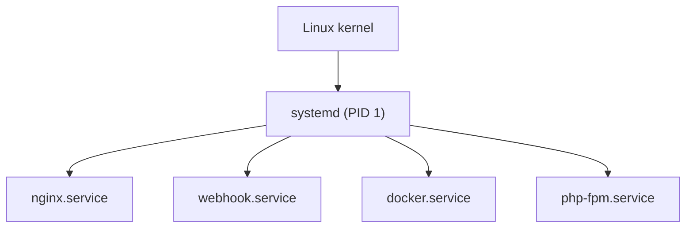
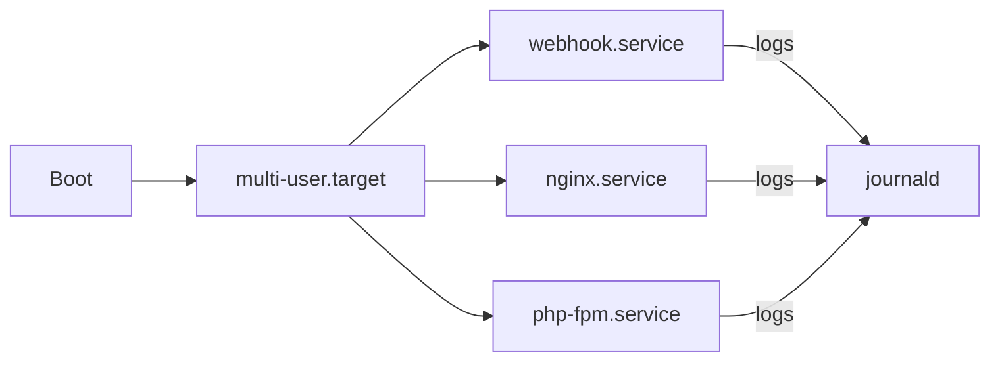
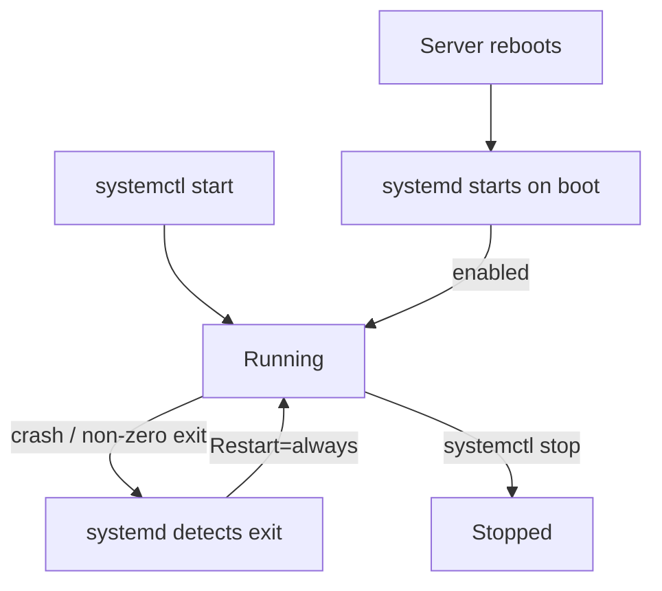
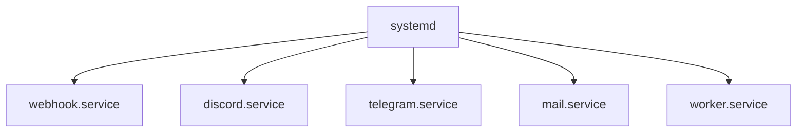
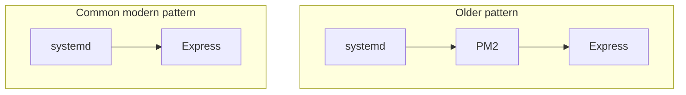
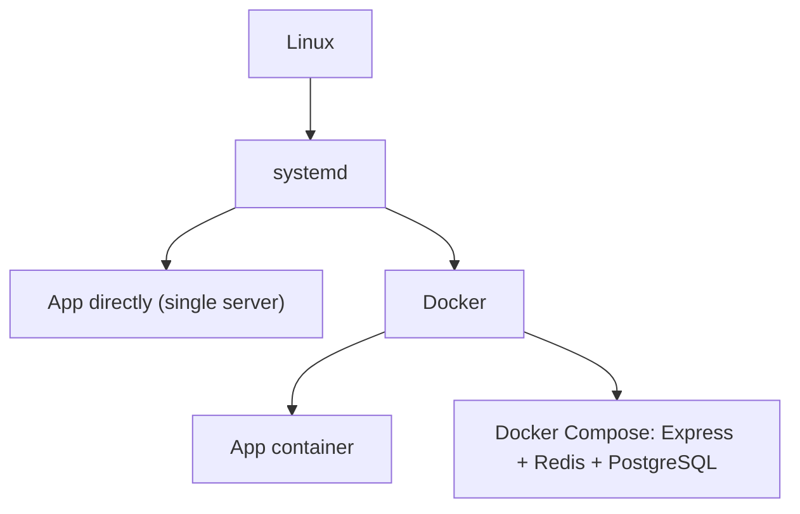
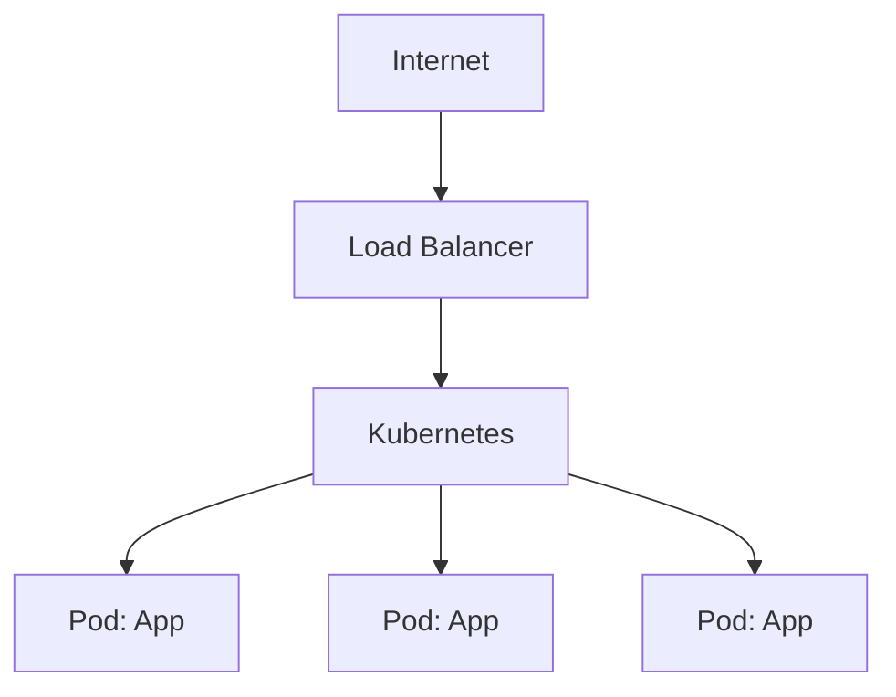
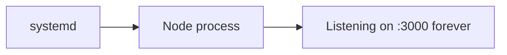
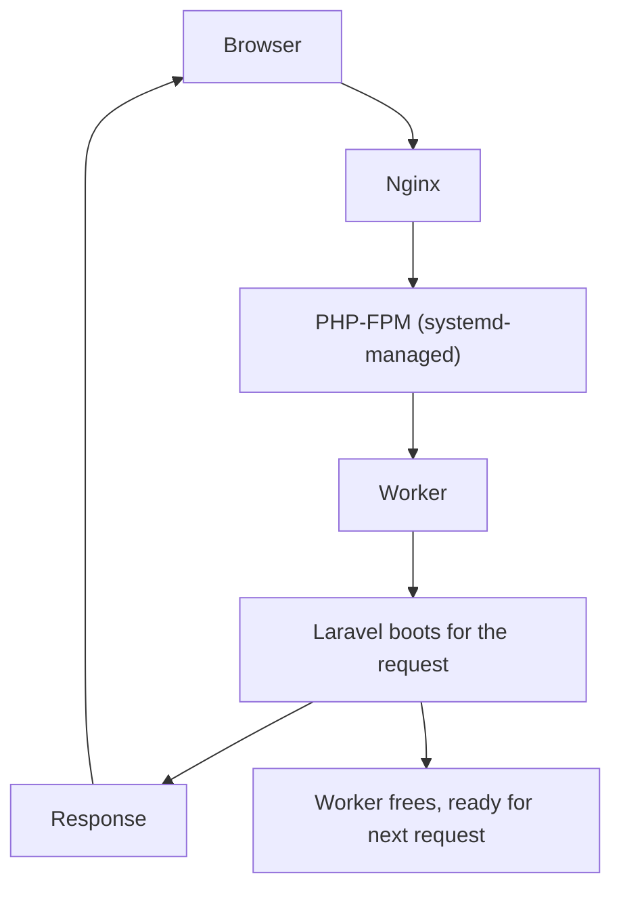
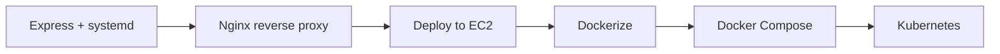

# systemd — Linux Service Management

A practical guide to **systemd**: what it is, why long-running applications need a service manager, how unit files work, and how to run, supervise, and debug real services on Linux. Comparisons with **PM2**, **Docker/Kubernetes**, and **request-driven apps (Laravel)** come after the core material.

---

## Table of Contents

1. [What is systemd?](#what-is-systemd)
2. [Why Services Need a Manager](#why-services-need-a-manager)
3. [How systemd Works](#how-systemd-works)
4. [Unit File Anatomy](#unit-file-anatomy)
5. [Key `[Service]` Options](#key-service-options)
6. [Essential Commands](#essential-commands)
7. [The Service Lifecycle](#the-service-lifecycle)
8. [Worked Example: A Webhook Service](#worked-example-a-webhook-service)
9. [Managing Multiple Services](#managing-multiple-services)
10. [Comparisons](#comparisons)
    - [systemd vs PM2](#systemd-vs-pm2)
    - [systemd vs Docker vs Kubernetes](#systemd-vs-docker-vs-kubernetes)
    - [Long-Running vs Request-Driven (Express vs Laravel)](#long-running-vs-request-driven-express-vs-laravel)
11. [Learning Path](#learning-path)

---

## What is systemd?

**systemd** is the **init system** and **service manager** used by most modern Linux distributions (Ubuntu, Debian, Fedora, RHEL, Arch). It is the first process the kernel starts (**PID 1**) and it is responsible for bringing the rest of the system up and keeping it running.

Its job for your application is simple to state:

- **Start** the service (on demand and on boot)
- **Keep** it running
- **Restart** it when it crashes
- **Stop** it cleanly
- **Log** its output centrally (`journald`)



> Even tools like Docker are usually started **by systemd**. It sits at the base of almost every Linux server.

---

## Why Services Need a Manager

Running `node server.js` in an SSH session is **not** a deployment. A production service has a lifecycle that a human on a keyboard cannot cover:

| Requirement | Manual run | With systemd |
|-------------|-----------|--------------|
| Survives SSH disconnect | ❌ dies with terminal | ✅ owned by systemd |
| Restarts after a crash | ❌ stays down | ✅ `Restart=always` |
| Starts after reboot | ❌ nothing happens | ✅ `enable` on boot |
| Centralized logs | ❌ scroll-back only | ✅ `journalctl` |
| Predictable deploys | ❌ ad-hoc | ✅ `restart` / `reload` |

> `nohup node server.js &` solves only the *first* row. It does **not** restart on crash or on reboot. That is why a real service manager is needed.

---

## How systemd Works

systemd manages **units**. The most common type is a **service unit** (`.service`), described by a plain-text file. Units are grouped by **targets** (rough equivalents of runlevels), and `multi-user.target` is the normal "server is up" state.



Unit files live in two main places:

```bash
/etc/systemd/system/     # your custom units (highest priority)
/lib/systemd/system/     # units shipped by packages
```

After editing any unit file you must reload systemd's view:

```bash
sudo systemctl daemon-reload
```

---

## Unit File Anatomy

A service unit has three sections. Example: `/etc/systemd/system/webhook.service`

```ini
[Unit]
Description=Webhook API
After=network.target
Wants=network-online.target

[Service]
Type=simple
WorkingDirectory=/home/ubuntu/webhook
ExecStart=/usr/bin/node server.js
Restart=always
RestartSec=5
User=ubuntu
Group=ubuntu
Environment=NODE_ENV=production
# EnvironmentFile=/home/ubuntu/webhook/.env

[Install]
WantedBy=multi-user.target
```

| Section | Purpose |
|---------|---------|
| `[Unit]` | Metadata + ordering (`Description`, `After`, `Wants`, `Requires`) |
| `[Service]` | How to run the process (`ExecStart`, `Restart`, `User`, env) |
| `[Install]` | How it hooks into boot (`WantedBy=multi-user.target`) |

Enable + start it:

```bash
sudo systemctl daemon-reload
sudo systemctl enable webhook
sudo systemctl start webhook
```

---

## Key `[Service]` Options

| Option | Purpose |
|--------|---------|
| `Type=simple` | Default; `ExecStart` is the main process |
| `ExecStart=` | Command that runs the service |
| `Restart=always` | Restart on any exit (crash or clean) |
| `Restart=on-failure` | Restart only on non-zero exit |
| `RestartSec=5` | Wait before restart — avoids tight crash loops |
| `User=` / `Group=` | Run as a non-root account (security) |
| `Environment=` | Inline environment variables |
| `EnvironmentFile=` | Load variables from a file (e.g. `.env`) |
| `WorkingDirectory=` | Base directory for relative paths |

> **Security:** never run app services as `root`. Use a dedicated user such as `ubuntu` or `www-data`.

---

## Essential Commands

```bash
# Control
sudo systemctl start webhook
sudo systemctl stop webhook
sudo systemctl restart webhook
sudo systemctl reload webhook      # if the app supports reload
sudo systemctl status webhook

# Boot persistence
sudo systemctl enable webhook
sudo systemctl disable webhook
sudo systemctl is-enabled webhook

# Apply unit file changes
sudo systemctl daemon-reload

# Logs (journald)
journalctl -u webhook -f               # follow live
journalctl -u webhook --since "1 hour ago"
journalctl -u webhook -n 100           # last 100 lines
journalctl -u webhook -p err           # errors only

# Discover services
systemctl list-units --type=service --state=running
```

---

## The Service Lifecycle

This is what systemd automates for you — the reason it exists.



**Crash recovery:** app throws → process exits → systemd restarts it (after `RestartSec`). Downtime is seconds, not hours.

**Reboot recovery:** because the unit was `enable`d, systemd starts it automatically — no SSH required.

---

## Worked Example: A Webhook Service

*The typical journey from "works in my terminal" to a supervised service.*

1. **It works locally** — `node server.js` prints `Server started on port 3000`. You SSH into EC2 and run it. It works.
2. **It dies on disconnect** — you close SSH, the process is killed. `ps aux | grep node` shows nothing.
3. **The `nohup` trap** — `nohup node server.js &` survives disconnect but stays down after a crash.
4. **A crash goes unnoticed** — a DB error throws, Node exits, the API is offline until customers complain.
5. **Make it a service** — create `webhook.service` (see [Unit File Anatomy](#unit-file-anatomy)), then:

```bash
sudo systemctl daemon-reload
sudo systemctl enable webhook
sudo systemctl start webhook
systemctl status webhook        # Active: active (running)
```

6. **Crash is now self-healing** — DB drops → Node exits → systemd restarts it in seconds.
7. **Reboot is safe** — AWS maintenance reboots EC2 → systemd brings the service back automatically.
8. **Debugging is easy** — a 500 report? `journalctl -u webhook -f` shows `Error: Database timeout` — the DB, not Express.
9. **Deploying an update:**

```bash
cd /home/ubuntu/webhook
git pull
npm ci --production
sudo systemctl restart webhook
systemctl status webhook
```

---

## Managing Multiple Services

As a project grows, each component gets its own unit — independently started, stopped, restarted, and logged.



Each service can be:

- Started / stopped / restarted independently
- Logged independently (`journalctl -u <name>`)
- Auto-restarted on crash
- Auto-started on boot

---

## Comparisons

Now that the core systemd model is clear, here is how it relates to the other tools and patterns you will meet.

### systemd vs PM2

**PM2** is a Node.js process manager. On Linux, systemd already covers most of what teams historically used PM2 for.



| Feature | systemd | PM2 |
|---------|---------|-----|
| Auto restart | ✅ | ✅ |
| Start on boot | ✅ | ✅ (needs systemd wrapper) |
| Logging | ✅ `journalctl` | ✅ built-in |
| Service monitoring | ✅ | ✅ |
| Node cluster mode | ❌ (use Nginx / multiple units) | ✅ |
| Zero-downtime reload | ❌ | ✅ |

**Takeaway:** prefer systemd for supervision; reach for PM2 only when you specifically need its cluster mode or zero-downtime reload without a proxy/orchestrator.

### systemd vs Docker vs Kubernetes

These are not really rivals — they operate at different scales, and systemd is usually *underneath* the others.



At large scale, **Kubernetes** manages the app lifecycle itself, so you do **not** write a systemd unit per app:



| Environment | Typical manager |
|-------------|-----------------|
| Raspberry Pi / mini PC | systemd |
| EC2 (single server) | systemd |
| Small startup | systemd or Docker |
| Medium company | Docker + Docker Compose |
| Large company | Kubernetes |
| Serverless APIs | none (functions) |

**Takeaway:** learning systemd first makes Docker and Kubernetes intuitive — they solve the same lifecycle problems (stay alive, restart, start on boot, centralized logs) at higher scale.

### Long-Running vs Request-Driven (Express vs Laravel)

Not every app should be a systemd service. The deciding question is: **is the process long-running?**

**Express (Node)** is long-running — it listens forever, so it **needs** systemd:



**Laravel (traditional PHP)** is request-driven. Laravel itself is **not** always running — **PHP-FPM** is. systemd manages PHP-FPM, not Laravel:



What systemd should and should not manage:

| Component | Long-running? | Managed by systemd? |
|-----------|---------------|---------------------|
| Express server | ✅ Yes | ✅ Yes |
| PHP-FPM | ✅ Yes | ✅ Yes |
| Laravel web request | ❌ No | ❌ No (handled by PHP-FPM) |
| Laravel `queue:work` | ✅ Yes | ✅ Yes |
| Laravel Horizon / Reverb / Octane | ✅ Yes | ✅ Yes |
| Laravel `schedule:run` | ❌ No | Cron, not systemd |
| Laravel `schedule:work` | ✅ Yes | ✅ Yes |

Example — a Laravel queue worker *is* long-running, so it gets a unit like any Node service:

```ini
[Service]
WorkingDirectory=/var/www/myapp
ExecStart=/usr/bin/php artisan queue:work --sleep=3 --tries=3
Restart=always
User=www-data
```

**Takeaway:** put **long-running** processes under systemd; leave **request-driven** work to PHP-FPM, and periodic work to cron.

---

## Learning Path



| Step | What you learn |
|------|----------------|
| Express + systemd | Native Linux service management |
| Nginx | HTTPS, reverse proxy, static files |
| EC2 | Remote servers, SSH, security groups |
| Docker | Isolation, reproducible environments |
| Docker Compose | Multi-service stacks |
| Kubernetes | Orchestration at scale |

Related guides in this repo:

- [Linux commands](../linux/README.md)
- [Docker](../docker/README.md)
- [Logrotate](../logrotate/README.md)
- [Git](../git/README.md)

---

*Based on notes covering systemd service management, Express deployment, and Laravel/PHP-FPM architecture — from a single EC2 instance to containers and orchestration.*
