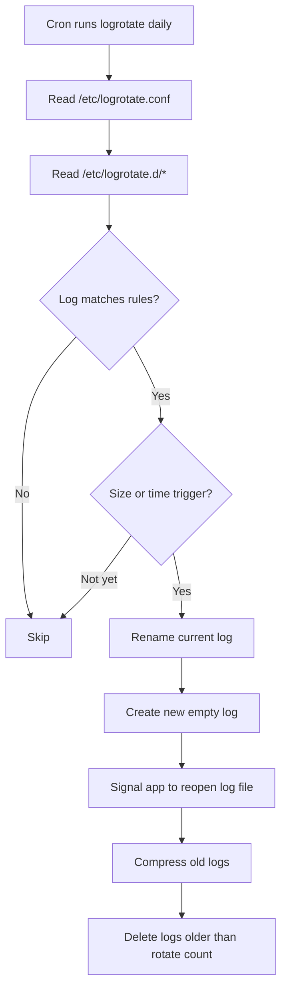
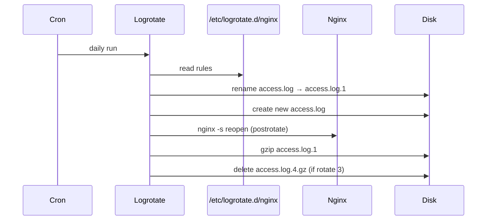
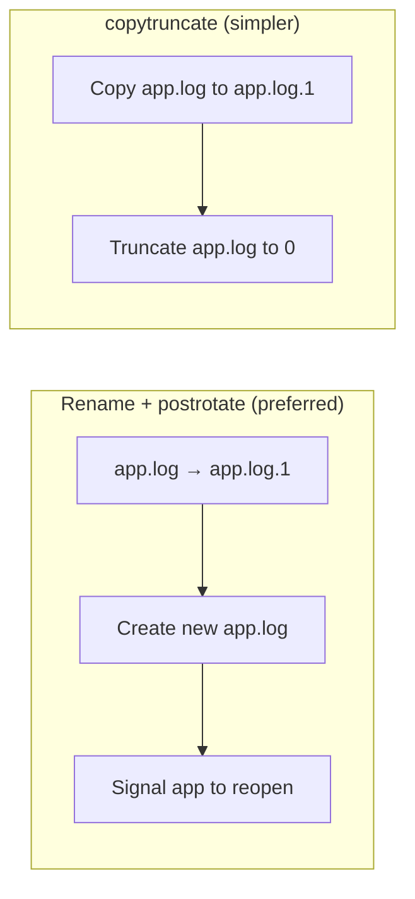

# Logrotate — Quick Look

A practical guide to **logrotate**: what it is, why servers need it, how it works, and how to install and configure it.

---

## Table of Contents

1. [What is Logrotate?](#what-is-logrotate)
2. [Why is it Needed?](#why-is-it-needed)
3. [How It Works](#how-it-works)
4. [Installation](#installation)
5. [Configuration Basics](#configuration-basics)
6. [Common Options](#common-options)
7. [Real-World Examples](#real-world-examples)
8. [Useful Commands](#useful-commands)
9. [Troubleshooting](#troubleshooting)
10. [Best Practices](#best-practices)

---

## What is Logrotate?

**Logrotate** is a Linux utility that automatically manages log files. It rotates (renames), compresses, deletes, and archives logs on a schedule — so a single log file does not grow forever.

Without logrotate, applications like **nginx**, **Apache**, **MySQL**, and **syslog** would keep writing to the same file until the disk fills up.

```bash
# Typical logrotate location
/usr/sbin/logrotate

# Main config
/etc/logrotate.conf

# Per-app configs
/etc/logrotate.d/
```

---

## Why is it Needed?

| Problem | Without logrotate | With logrotate |
|---------|-------------------|----------------|
| Disk full | One huge `access.log` eats all space | Old logs compressed or deleted |
| Slow searches | `grep` on a 50 GB file is painful | Smaller, dated files are easy to scan |
| App crashes | Some apps stop writing when log is too large | Fresh empty log after each rotation |
| Compliance | No retention policy | Keep N days/weeks of history |

**Common scenarios:**

- Web server access logs growing every second
- Application error logs on a long-running server
- System logs (`/var/log/syslog`, `messages`, `auth.log`)
- Docker/container logs on a host without a log driver limit

> ⚠️ A full disk can crash services, corrupt databases, and lock you out of SSH. Logrotate is one of the simplest ways to prevent that.

---

## How It Works

Logrotate does **not** run as a daemon. It is triggered by **cron** (usually daily).

### High-level flow



### What happens during rotation

```
BEFORE rotation:
/var/log/nginx/access.log          (500 MB, actively written)

AFTER rotation:
/var/log/nginx/access.log          (0 bytes, new file)
/var/log/nginx/access.log.1        (500 MB, renamed copy)
/var/log/nginx/access.log.2.gz     (older, compressed)
/var/log/nginx/access.log.3.gz     (oldest kept)
```

### Step-by-step

1. **Check** — Is the log due for rotation? (daily, weekly, or size limit)
2. **Copy/truncate or rename** — Move `app.log` → `app.log.1`
3. **Create** — New empty `app.log` (correct owner/permissions)
4. **Signal app** — Tell nginx/Apache/rsyslog to reopen the log file (`postrotate` script)
5. **Compress** — Gzip older rotations (`.1` → `.1.gz`)
6. **Prune** — Remove files beyond `rotate N`

### Who triggers it?



---

## Installation

Logrotate is pre-installed on most Linux distributions. Verify first:

```bash
logrotate --version
which logrotate
```

### Ubuntu / Debian

```bash
sudo apt update
sudo apt install logrotate
```

### RHEL / CentOS / Rocky / AlmaLinux

```bash
sudo dnf install logrotate
# or on older systems:
sudo yum install logrotate
```

### Fedora

```bash
sudo dnf install logrotate
```

### Arch Linux

```bash
sudo pacman -S logrotate
```

### macOS (Homebrew)

macOS does not use logrotate by default (it uses `newsyslog`). You can still install it:

```bash
brew install logrotate
```

### Verify cron is set up

```bash
# Debian/Ubuntu
cat /etc/cron.daily/logrotate

# Or check systemd timer (some distros)
systemctl list-timers | grep logrotate
```

---

## Configuration Basics

### Main config: `/etc/logrotate.conf`

Global defaults for all logs:

```
# rotate log files weekly
weekly

# keep 4 weeks worth of backups
rotate 4

# create new log files after rotating old ones
create

# use date as a suffix rather than size
# dateext

# compress logs
# compress

# RPM packages drop logrotate configs here
include /etc/logrotate.d
```

### Per-app config: `/etc/logrotate.d/`

Each file defines rules for one service. Example for nginx:

```
/var/log/nginx/*.log {
    daily
    missingok
    rotate 14
    compress
    delaycompress
    notifempty
    create 0640 www-data adm
    sharedscripts
    postrotate
        [ -f /var/run/nginx.pid ] && kill -USR1 `cat /var/run/nginx.pid`
    endscript
}
```

### Create your own config

```bash
sudo nano /etc/logrotate.d/myapp
```

```
/var/log/myapp/*.log {
    daily
    rotate 7
    compress
    missingok
    notifempty
    create 0644 myuser mygroup
}
```

Test before relying on it:

```bash
sudo logrotate -d /etc/logrotate.d/myapp    # debug (dry run)
sudo logrotate -f /etc/logrotate.d/myapp    # force rotation now
```

---

## Common Options

| Option | Meaning |
|--------|---------|
| `daily` / `weekly` / `monthly` | How often to rotate |
| `rotate N` | Keep N old log files |
| `size 100M` | Rotate when log exceeds size |
| `compress` | Gzip old logs |
| `delaycompress` | Don't compress the most recent backup |
| `missingok` | Don't error if log file is missing |
| `notifempty` | Don't rotate empty logs |
| `create MODE USER GROUP` | Create new log with permissions |
| `copytruncate` | Copy then truncate (no app signal needed) |
| `dateext` | Use date suffix: `app.log-20260707` |
| `sharedscripts` | Run postrotate once for all matched logs |
| `postrotate` / `prerotate` | Scripts before/after rotation |

### `copytruncate` vs rename + signal



- **Rename + signal** — Cleaner; app must support reopening logs
- **copytruncate** — Works with any app; brief risk of lost lines during copy

---

## Real-World Examples

### Simple application log

```
/var/log/myapp/app.log {
    weekly
    rotate 4
    compress
    missingok
    notifempty
}
```

### Size-based rotation (busy API server)

```
/var/log/api/access.log {
    size 200M
    rotate 10
    compress
    delaycompress
    missingok
    notifempty
    create 0640 api api
}
```

### Apache

```
/var/log/apache2/*.log {
    daily
    rotate 14
    compress
    delaycompress
    notifempty
    create 640 root adm
    sharedscripts
    postrotate
        systemctl reload apache2 > /dev/null 2>&1 || true
    endscript
}
```

### MySQL / MariaDB

```
/var/log/mysql/*.log {
    daily
    rotate 7
    compress
    missingok
    notifempty
    create 640 mysql mysql
}
```

### Docker container logs (host-level)

If not using a log driver with size limits:

```
/var/lib/docker/containers/*/*.log {
    daily
    rotate 7
    compress
    size 50M
    missingok
    copytruncate
}
```

---

## Useful Commands

```bash
# Show version
logrotate --version

# Debug — see what would happen (no changes)
sudo logrotate -d /etc/logrotate.conf

# Verbose debug
sudo logrotate -dv /etc/logrotate.conf

# Force rotation now
sudo logrotate -f /etc/logrotate.conf

# Force one specific config
sudo logrotate -f /etc/logrotate.d/nginx

# Check state file (tracks last rotation)
cat /var/lib/logrotate/status
# or on some systems:
cat /var/lib/logrotate/logrotate.status
```

### Inspect disk impact

```bash
# Size of all logs in a directory
du -sh /var/log/nginx/

# List rotated logs by date
ls -lh /var/log/nginx/
```

---

## Troubleshooting

### Log did not rotate

```bash
# 1. Run in debug mode
sudo logrotate -d /etc/logrotate.conf

# 2. Check cron ran
grep logrotate /var/log/syslog

# 3. Check state file
cat /var/lib/logrotate/status
```

### App still writes to old file after rotation

The app was not told to reopen logs. Add a `postrotate` script:

```
postrotate
    systemctl reload nginx
endscript
```

Or use `copytruncate` if reload is not possible.

### Permission denied

Ensure `create` uses the correct user/group:

```
create 0640 www-data adm
```

### Config syntax error

```bash
sudo logrotate -d /etc/logrotate.d/myapp
# Fix errors reported in output
```

### Disk still full

- Lower `rotate` count
- Enable `compress`
- Add `maxage 30` to delete logs older than 30 days
- Check if logs are outside logrotate paths

---

## Best Practices

1. **Always test** with `logrotate -d` before deploying a new config
2. **Prefer `postrotate`** over `copytruncate` when the app supports log reopen
3. **Set `rotate` + `compress`** on high-traffic servers
4. **Use `missingok` and `notifempty`** to avoid cron errors
5. **Monitor disk** — logrotate helps but is not a substitute for alerts (`df -h`, monitoring tools)
6. **Don't rotate logs your app still has open** without a reload signal
7. **Keep configs in `/etc/logrotate.d/`** — one file per service, easy to audit
8. **Document custom app logs** — if your app writes to `/opt/myapp/logs/`, add a config

---

## Quick Reference

```
/etc/logrotate.conf          → global defaults
/etc/logrotate.d/            → per-service rules
/var/lib/logrotate/status    → rotation history

logrotate -d <config>        → dry run (debug)
logrotate -f <config>        → force rotate now
```

---

## See Also

- `man logrotate`
- `man 5 logrotate.conf`
- Linux basics in [`../linux/README.md`](../linux/README.md) — `tail -f`, `grep`, disk usage (`df`, `du`)
