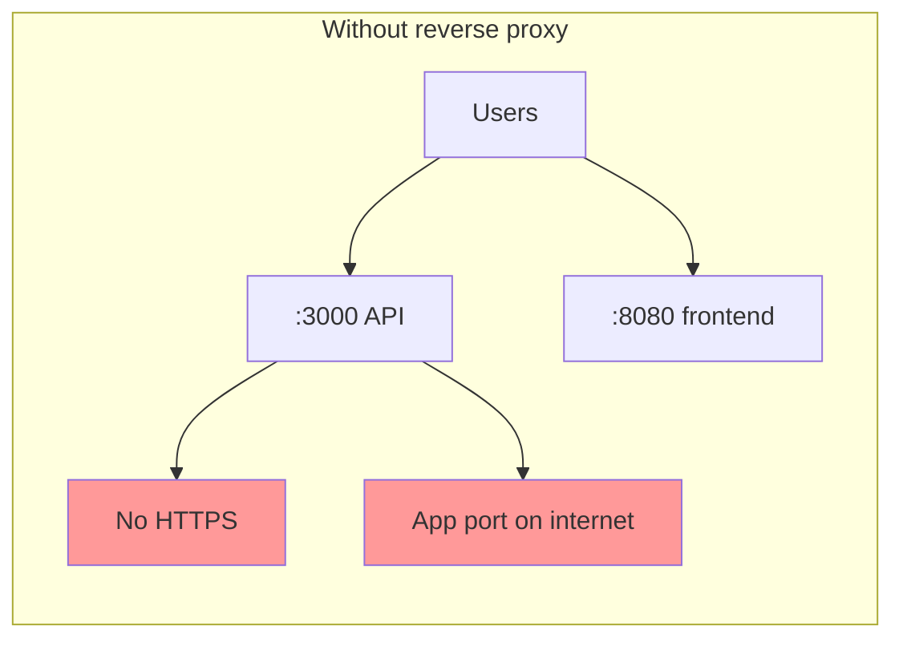
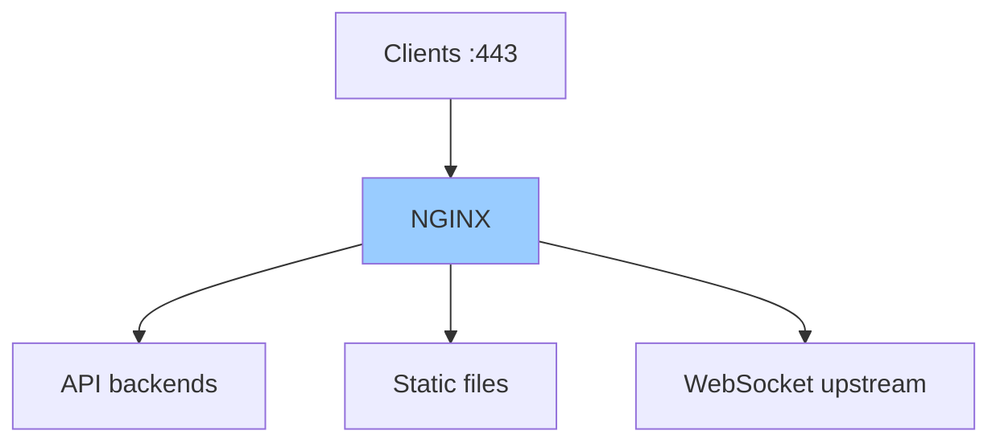

# NGINX Reverse Proxy — One-Stop Guide

Everything you need to understand **why a reverse proxy exists**, **how NGINX sits in front of your apps**, and **which directives teams rely on** — from your first `proxy_pass` to load balancing, SSL termination, WebSockets, buffering, failover, and fixing 502/504 errors.

For keeping the backend process alive after deploy, see [linux-advanced-topics/systemd.README.md](../linux-advanced-topics/systemd.README.md). For automating deploys and reloads, see [bash-scripting/README.md](../bash-scripting/README.md).

**Source reference:** [NGINX Reverse Proxy: The Complete Guide](https://www.getpagespeed.com/server-setup/nginx/nginx-reverse-proxy) (GetPageSpeed, 2026).

---

## Table of Contents

1. [The Problem](#the-problem)
2. [NGINX as the Solution](#nginx-as-the-solution)
3. [Stories from the Chat App](#stories-from-the-chat-app)
4. [What Is a Reverse Proxy?](#what-is-a-reverse-proxy)
5. [Installing NGINX](#installing-nginx)
6. [Basic proxy_pass Configuration](#basic-proxy_pass-configuration)
7. [Essential Proxy Headers](#essential-proxy-headers)
8. [Upstream Blocks and Load Balancing](#upstream-blocks-and-load-balancing)
9. [Connection Keepalive](#connection-keepalive)
10. [Buffering](#buffering)
11. [Timeouts](#timeouts)
12. [SSL/TLS Termination](#ssltls-termination)
13. [WebSocket Proxying](#websocket-proxying)
14. [Real-World Backend Examples](#real-world-backend-examples)
15. [Failover and High Availability](#failover-and-high-availability)
16. [Dynamic Backends and DNS](#dynamic-backends-and-dns)
17. [Troubleshooting 502, 504, and Connection Refused](#troubleshooting-502-504-and-connection-refused)
18. [Security Best Practices](#security-best-practices)
19. [Performance Optimization](#performance-optimization)
20. [Complete Production Configuration](#complete-production-configuration)
21. [Quick Reference](#quick-reference)
22. [Further Reading](#further-reading)

---

## The Problem

You ship the **chat app** on a VPS. The Node API listens on port **3000**. Users visit `http://chat.example.com:3000`.

**What goes wrong without a reverse proxy:**

| Problem | What happens |
|---------|--------------|
| **Non-standard ports** | Corporate firewalls block `:3000` — half the company cannot connect |
| **No TLS on the app** | Browsers warn; OAuth and cookie `Secure` flags break |
| **Multiple services** | API on 3000, frontend on 8080, WebSockets on another path — three URLs |
| **Lost client context** | App sees `http` and `127.0.0.1` — redirects and rate limits break |
| **No load distribution** | One process handles all traffic; no graceful scaling |
| **Public admin routes** | Internal paths become internet-visible when you expose the app port |
| **Opaque failures** | Users see 502/504; you grep app logs while NGINX was misconfigured |



Every service fights for ports. TLS and routing live in application code. Incidents start at the edge.

---

## NGINX as the Solution

**NGINX** is an event-driven web server and reverse proxy. It accepts client connections on **80/443**, terminates TLS, routes by URL path, and forwards requests to backend servers over HTTP, HTTPS, or Unix sockets.

| Without NGINX | With NGINX |
|---------------|------------|
| App on public `:3000` | App on `127.0.0.1:3000`; only NGINX is public |
| TLS in every service | **SSL termination** once at the proxy |
| Manual port juggling | **`location`** blocks route by path |
| Backend sees proxy IP | **`X-Forwarded-*`** headers restore client info |
| Single process bottleneck | **`upstream`** load balancing across instances |
| WebSocket hacks | Proper **Upgrade** header forwarding |



**Key idea:** NGINX is the **single front door** — security, routing, TLS, and performance tuning happen in one layer.

---

## Stories from the Chat App

These scenarios mirror [daily-story/nginx.md](../daily-story/nginx.md). Same cast: **Arman**, **Sara**, and the chat app.

### Story: Port 3000 on the internet

Arman exposes the API directly. Security scan flags open port 3000. OAuth redirects use `http://`. Fix: bind the app to localhost, put NGINX on 443, redirect 80 → HTTPS.

### Story: The trailing slash trap

`location /api/` with `proxy_pass http://backend/;` strips `/api` from the path. Without the trailing slash on `proxy_pass`, the backend receives `/api/users` instead of `/users` → 404 storm.

### Story: 502 when the app is "fine"

`curl http://127.0.0.1:3000/health` returns 200, but users get 502. NGINX still points at port **3001** from an old config. Syntax check passed; routing did not.

### Story: WebSockets close immediately

Missing `Upgrade` and `Connection` headers. Add `map $http_upgrade $connection_upgrade` and `proxy_http_version 1.1`.

### Story: Random logouts with two API servers

Round-robin without shared sessions. `ip_hash` is a quick stickiness fix; Redis sessions are the proper fix.

### Story: 504 on the quarterly report

`proxy_read_timeout` defaults to 60s. Long SQL jobs need a higher timeout or async job pattern.

### Story: Admin panel on the public internet

Restrict `/admin/` with `allow`/`deny` and add `limit_req` on `/api/`.

---

## What Is a Reverse Proxy?

A **reverse proxy** receives client requests and forwards them to one or more **backend** servers. Clients never talk to backends directly.

| Type | Who uses it | Purpose |
|------|-------------|---------|
| **Forward proxy** | Clients (browser, curl) | Access external sites through an intermediary |
| **Reverse proxy** | Server operator | Hide backends; route, balance, terminate SSL |

**Benefits of NGINX as a reverse proxy:**

- **Load balancing** across multiple backends
- **SSL/TLS termination** — encrypt client ↔ NGINX; optional plain HTTP to backends
- **Caching** and **compression** at the edge
- **Security** — hide backend versions and internal topology
- **Centralized logging** and monitoring

NGINX handles thousands of concurrent connections with low memory use thanks to its event-driven architecture.

---

## Installing NGINX

**RHEL-based** (Rocky Linux, AlmaLinux, CentOS Stream):

```bash
sudo dnf install nginx
sudo systemctl enable --now nginx
```

**Debian/Ubuntu:**

```bash
sudo apt install nginx
sudo systemctl enable --now nginx
```

Config snippets typically live in `/etc/nginx/conf.d/` or `/etc/nginx/sites-available/`. Always validate before reload:

```bash
sudo nginx -t
sudo systemctl reload nginx
```

---

## Basic proxy_pass Configuration

The **`proxy_pass`** directive tells NGINX where to forward requests.

### Minimal configuration

```nginx
server {
    listen 80;
    server_name example.com;

    location / {
        proxy_pass http://127.0.0.1:3000;
    }
}
```

All requests go to the backend on port 3000.

### URI handling — the trailing slash matters

```nginx
# Request: GET /api/users
# Backend receives: GET /api/users
location /api/ {
    proxy_pass http://backend;
}

# Request: GET /api/users
# Backend receives: GET /users  (matched prefix stripped)
location /api/ {
    proxy_pass http://backend/;
}
```

When `proxy_pass` includes a URI (even just `/`), NGINX **replaces** the matched location prefix with that URI. Without a URI, the **full original path** is passed through.

| `proxy_pass` value | Request | Backend path |
|--------------------|---------|--------------|
| `http://backend` | `/api/users` | `/api/users` |
| `http://backend/` | `/api/users` | `/users` |

This is the most common source of mysterious 404s after adding a path prefix.

---

## Essential Proxy Headers

Backends lose client IP, host, and protocol unless you forward them:

```nginx
location / {
    proxy_pass http://127.0.0.1:3000;

    proxy_set_header Host $host;
    proxy_set_header X-Real-IP $remote_addr;
    proxy_set_header X-Forwarded-For $proxy_add_x_forwarded_for;
    proxy_set_header X-Forwarded-Proto $scheme;
    proxy_set_header X-Forwarded-Host $host;
    proxy_set_header X-Forwarded-Port $server_port;
}
```

| Header | Purpose |
|--------|---------|
| `Host` | Original host requested by the client |
| `X-Real-IP` | Client's actual IP address |
| `X-Forwarded-For` | Chain of proxy IPs including the client |
| `X-Forwarded-Proto` | Original protocol (`http` or `https`) |
| `X-Forwarded-Host` | Original host header |
| `X-Forwarded-Port` | Original port number |

`$proxy_add_x_forwarded_for` appends the client IP to any existing `X-Forwarded-For` value, preserving the full proxy chain.

**Framework note:** Enable trust of these headers in your app (e.g. Express `trust proxy`, Django `SECURE_PROXY_SSL_HEADER`).

---

## Upstream Blocks and Load Balancing

For multiple backends, define an **`upstream`** block:

```nginx
upstream backend_servers {
    server 192.168.1.10:3000;
    server 192.168.1.11:3000;
    server 192.168.1.12:3000;
}

server {
    listen 80;
    server_name example.com;

    location / {
        proxy_pass http://backend_servers;
        proxy_set_header Host $host;
        proxy_set_header X-Real-IP $remote_addr;
    }
}
```

### Load balancing methods

**Round robin (default):**

```nginx
upstream backend {
    server 192.168.1.10:3000;
    server 192.168.1.11:3000;
}
```

**Least connections:**

```nginx
upstream backend {
    least_conn;
    server 192.168.1.10:3000;
    server 192.168.1.11:3000;
}
```

**IP hash (session persistence):**

```nginx
upstream backend {
    ip_hash;
    server 192.168.1.10:3000;
    server 192.168.1.11:3000;
}
```

**Weighted distribution:**

```nginx
upstream backend {
    server 192.168.1.10:3000 weight=5;
    server 192.168.1.11:3000 weight=3;
    server 192.168.1.12:3000 weight=1;
}
```

### Server parameters

```nginx
upstream backend {
    server 192.168.1.10:3000 weight=5 max_fails=3 fail_timeout=30s;
    server 192.168.1.11:3000 weight=3;
    server 192.168.1.12:3000 backup;
    server 192.168.1.13:3000 down;
}
```

| Parameter | Description |
|-----------|-------------|
| `weight=N` | Relative load (default: 1) |
| `max_fails=N` | Failed attempts before marking unavailable (default: 1) |
| `fail_timeout=Ns` | How long server stays unavailable after `max_fails` (default: 10s) |
| `backup` | Used only when primary servers are unavailable |
| `down` | Permanently marked unavailable |

---

## Connection Keepalive

Reuse connections to backends to avoid TCP handshake overhead on every request:

```nginx
upstream backend {
    server 192.168.1.10:3000;
    server 192.168.1.11:3000;

    keepalive 32;
    keepalive_requests 1000;
    keepalive_timeout 60s;
}

server {
    location / {
        proxy_pass http://backend;
        proxy_http_version 1.1;
        proxy_set_header Connection "";
        proxy_set_header Host $host;
    }
}
```

**Critical:** With keepalive you **must** set `proxy_http_version 1.1` and clear the `Connection` header. HTTP/1.0 closes connections by default.

`keepalive 32` maintains up to 32 idle connections per worker process.

---

## Buffering

NGINX buffers backend responses before sending them to clients. Backends finish quickly; NGINX handles slow clients.

```nginx
location / {
    proxy_pass http://backend;

    proxy_buffering on;
    proxy_buffer_size 4k;
    proxy_buffers 8 4k;
    proxy_busy_buffers_size 8k;
    proxy_max_temp_file_size 1024m;
}
```

| Directive | Default | Purpose |
|-----------|---------|---------|
| `proxy_buffering` | on | Enable/disable response buffering |
| `proxy_buffer_size` | 4k/8k | Buffer for response headers |
| `proxy_buffers` | 8 4k/8k | Number and size of body buffers |
| `proxy_busy_buffers_size` | 8k/16k | Max sent to client while buffering continues |
| `proxy_max_temp_file_size` | 1024m | Max temp file when buffers overflow |

### When to disable buffering

For streaming, Server-Sent Events, or low TTFB:

```nginx
location /stream/ {
    proxy_pass http://backend;
    proxy_buffering off;
    proxy_cache off;
}
```

---

## Timeouts

```nginx
location / {
    proxy_pass http://backend;

    proxy_connect_timeout 10s;
    proxy_send_timeout 60s;
    proxy_read_timeout 60s;
}
```

| Directive | Default | Purpose |
|-----------|---------|---------|
| `proxy_connect_timeout` | 60s | Time to establish connection with backend |
| `proxy_send_timeout` | 60s | Time between consecutive writes to backend |
| `proxy_read_timeout` | 60s | Time between consecutive reads from backend |

**Important:** These measure **idle time between operations**, not total request duration. Each response chunk resets the read timeout.

For long-running endpoints:

```nginx
location /api/reports/ {
    proxy_pass http://backend;
    proxy_read_timeout 300s;
}
```

---

## SSL/TLS Termination

Handle HTTPS at NGINX; speak HTTP to local backends:

```nginx
server {
    listen 443 ssl;
    server_name example.com;

    ssl_certificate     /etc/letsencrypt/live/example.com/fullchain.pem;
    ssl_certificate_key /etc/letsencrypt/live/example.com/privkey.pem;
    ssl_protocols TLSv1.2 TLSv1.3;
    ssl_ciphers ECDHE-ECDSA-AES128-GCM-SHA256:ECDHE-RSA-AES128-GCM-SHA256;
    ssl_prefer_server_ciphers off;

    location / {
        proxy_pass http://127.0.0.1:3000;
        proxy_set_header Host $host;
        proxy_set_header X-Real-IP $remote_addr;
        proxy_set_header X-Forwarded-For $proxy_add_x_forwarded_for;
        proxy_set_header X-Forwarded-Proto $scheme;
    }
}

server {
    listen 80;
    server_name example.com;
    return 301 https://$host$request_uri;
}
```

### Proxying to HTTPS backends

```nginx
location / {
    proxy_pass https://backend:443;
    proxy_ssl_verify on;
    proxy_ssl_trusted_certificate /etc/ssl/certs/ca-certificates.crt;
    proxy_ssl_server_name on;
}
```

---

## WebSocket Proxying

WebSockets upgrade from HTTP. NGINX must forward upgrade headers:

```nginx
map $http_upgrade $connection_upgrade {
    default upgrade;
    ""      close;
}

server {
    listen 80;
    server_name example.com;

    location /ws/ {
        proxy_pass http://127.0.0.1:3000;
        proxy_http_version 1.1;
        proxy_set_header Upgrade $http_upgrade;
        proxy_set_header Connection $connection_upgrade;
        proxy_set_header Host $host;
        proxy_set_header X-Real-IP $remote_addr;
        proxy_read_timeout 86400s;
        proxy_send_timeout 86400s;
    }
}
```

The `map` sets `Connection: upgrade` when the client sends `Upgrade`, otherwise `close`.

For Socket.IO on Node:

```nginx
location /socket.io/ {
    proxy_pass http://nodejs_app;
    proxy_http_version 1.1;
    proxy_set_header Upgrade $http_upgrade;
    proxy_set_header Connection "upgrade";
    proxy_set_header Host $host;
    proxy_read_timeout 86400s;
}
```

---

## Real-World Backend Examples

### Node.js application

```nginx
upstream nodejs_app {
    server 127.0.0.1:3000;
    keepalive 64;
}

server {
    listen 80;
    server_name app.example.com;

    location / {
        proxy_pass http://nodejs_app;
        proxy_http_version 1.1;
        proxy_set_header Connection "";
        proxy_set_header Host $host;
        proxy_set_header X-Real-IP $remote_addr;
        proxy_set_header X-Forwarded-For $proxy_add_x_forwarded_for;
        proxy_set_header X-Forwarded-Proto $scheme;
        proxy_read_timeout 60s;
        proxy_buffering on;
    }

    location /socket.io/ {
        proxy_pass http://nodejs_app;
        proxy_http_version 1.1;
        proxy_set_header Upgrade $http_upgrade;
        proxy_set_header Connection "upgrade";
        proxy_set_header Host $host;
        proxy_read_timeout 86400s;
    }
}
```

### Python with Gunicorn

```nginx
upstream gunicorn_app {
    server unix:/run/gunicorn/app.sock;
    keepalive 32;
}

server {
    listen 80;
    server_name api.example.com;

    location / {
        proxy_pass http://gunicorn_app;
        proxy_http_version 1.1;
        proxy_set_header Connection "";
        proxy_set_header Host $host;
        proxy_set_header X-Real-IP $remote_addr;
        proxy_set_header X-Forwarded-For $proxy_add_x_forwarded_for;
        proxy_set_header X-Forwarded-Proto $scheme;
        proxy_redirect off;
    }

    location /static/ {
        alias /var/www/app/static/;
        expires 30d;
    }
}
```

### Java (Tomcat / Spring Boot)

```nginx
upstream java_app {
    server 127.0.0.1:8080;
    server 127.0.0.1:8081;
    keepalive 64;
}

server {
    listen 80;
    server_name java.example.com;

    client_max_body_size 50m;

    location / {
        proxy_pass http://java_app;
        proxy_http_version 1.1;
        proxy_set_header Connection "";
        proxy_set_header Host $host;
        proxy_set_header X-Real-IP $remote_addr;
        proxy_set_header X-Forwarded-For $proxy_add_x_forwarded_for;
        proxy_set_header X-Forwarded-Proto $scheme;
        proxy_connect_timeout 10s;
        proxy_read_timeout 120s;
        proxy_buffer_size 8k;
        proxy_buffers 16 8k;
    }
}
```

---

## Failover and High Availability

```nginx
upstream backend {
    server 192.168.1.10:3000 max_fails=3 fail_timeout=30s;
    server 192.168.1.11:3000 max_fails=3 fail_timeout=30s;
    server 192.168.1.12:3000 backup;
}

server {
    location / {
        proxy_pass http://backend;
        proxy_next_upstream error timeout http_502 http_503 http_504;
        proxy_next_upstream_tries 3;
        proxy_next_upstream_timeout 30s;
        proxy_set_header Host $host;
        proxy_set_header X-Real-IP $remote_addr;
    }
}
```

`proxy_next_upstream` controls which conditions trigger retry on another upstream server:

| Value | Meaning |
|-------|---------|
| `error` | Connection error |
| `timeout` | Connection or read timeout |
| `http_502` / `http_503` / `http_504` | Backend returned that status |
| `http_500` | Backend returned 500 |
| `non_idempotent` | Retry POST/PATCH (use with care) |

---

## Dynamic Backends and DNS

Stock NGINX resolves upstream hostnames **once at startup**. In Kubernetes or autoscaling environments, IPs change without reload.

**NGINX 1.28+** — native re-resolution:

```nginx
http {
    upstream backend {
        zone backend 64k;
        server api.example.com:8080 resolve;
    }

    resolver 8.8.8.8 valid=30s;
}
```

Older releases may need modules such as **nginx-module-upstream-jdomain** for periodic DNS re-resolution behind a stable hostname.

---

## Troubleshooting 502, 504, and Connection Refused

### 502 Bad Gateway

NGINX received an invalid response or could not connect to the upstream.

| Cause | Check | Fix |
|-------|-------|-----|
| Backend not running | `systemctl status your-app` | Start the service |
| Wrong port | `ss -tlnp \| grep 3000` | Fix `proxy_pass` |
| Firewall | `firewall-cmd --list-all` | Open path to backend |
| Headers too large | `upstream sent too big header` in error log | Increase `proxy_buffer_size` |
| SELinux | RHEL systems | `setsebool -P httpd_can_network_connect 1` |

```bash
curl -v http://127.0.0.1:3000/
tail -f /var/log/nginx/error.log
sudo nginx -t
```

### 504 Gateway Timeout

Backend too slow for `proxy_read_timeout`.

```bash
time curl http://127.0.0.1:3000/slow-endpoint
```

```nginx
proxy_read_timeout 300s;
```

Consider async jobs for operations that run many minutes.

### Connection refused

```bash
ss -tlnp | grep LISTEN
curl -v http://127.0.0.1:3000/
```

Unix socket permissions:

```bash
ls -la /run/gunicorn/app.sock
chmod 660 /run/gunicorn/app.sock
chown nginx:nginx /run/gunicorn/app.sock
```

### Debugging tips

```nginx
error_log /var/log/nginx/error.log debug;

location /nginx_status {
    stub_status;
    allow 127.0.0.1;
    deny all;
}
```

```bash
nginx -t
nginx -T | grep proxy
```

---

## Security Best Practices

### Hide backend server information

```nginx
proxy_hide_header X-Powered-By;
proxy_hide_header Server;
proxy_hide_header X-AspNet-Version;
proxy_pass_header Date;
```

### Rate limiting

```nginx
limit_req_zone $binary_remote_addr zone=api:10m rate=10r/s;

server {
    location /api/ {
        limit_req zone=api burst=20 nodelay;
        proxy_pass http://backend;
    }
}
```

### Request size limits

```nginx
client_max_body_size 10m;
client_body_buffer_size 128k;
```

### Restrict access

```nginx
location /admin/ {
    allow 10.0.0.0/8;
    allow 192.168.1.0/24;
    deny all;
    proxy_pass http://backend;
}
```

---

## Performance Optimization

### Compression

```nginx
gzip on;
gzip_vary on;
gzip_proxied any;
gzip_comp_level 6;
gzip_types text/plain text/css application/json application/javascript text/xml application/xml;
```

### Caching

```nginx
proxy_cache_path /var/cache/nginx levels=1:2 keys_zone=cache:10m max_size=1g inactive=60m;

server {
    location / {
        proxy_cache cache;
        proxy_cache_valid 200 60m;
        proxy_cache_valid 404 1m;
        proxy_cache_use_stale error timeout updating http_502 http_503 http_504;
        proxy_cache_lock on;
        add_header X-Cache-Status $upstream_cache_status;
        proxy_pass http://backend;
    }
}
```

### Connection pooling

```nginx
upstream backend {
    server 127.0.0.1:3000;
    keepalive 64;
    keepalive_requests 10000;
    keepalive_timeout 60s;
}
```

---

## Complete Production Configuration

```nginx
upstream app_backend {
    least_conn;
    server 192.168.1.10:3000 weight=5 max_fails=3 fail_timeout=30s;
    server 192.168.1.11:3000 weight=3 max_fails=3 fail_timeout=30s;
    server 192.168.1.12:3000 backup;

    keepalive 64;
    keepalive_requests 10000;
    keepalive_timeout 60s;
}

server {
    listen 80;
    server_name example.com www.example.com;
    return 301 https://$host$request_uri;
}

server {
    listen 443 ssl http2;
    server_name example.com www.example.com;

    ssl_certificate     /etc/letsencrypt/live/example.com/fullchain.pem;
    ssl_certificate_key /etc/letsencrypt/live/example.com/privkey.pem;
    ssl_protocols TLSv1.2 TLSv1.3;
    ssl_ciphers ECDHE-ECDSA-AES128-GCM-SHA256:ECDHE-RSA-AES128-GCM-SHA256;
    ssl_prefer_server_ciphers off;
    ssl_session_cache shared:SSL:10m;
    ssl_session_timeout 1d;

    client_max_body_size 50m;
    client_body_buffer_size 128k;

    gzip on;
    gzip_vary on;
    gzip_proxied any;
    gzip_comp_level 6;
    gzip_types text/plain text/css application/json application/javascript text/xml application/xml;

    location / {
        proxy_pass http://app_backend;
        proxy_http_version 1.1;
        proxy_set_header Connection "";

        proxy_set_header Host $host;
        proxy_set_header X-Real-IP $remote_addr;
        proxy_set_header X-Forwarded-For $proxy_add_x_forwarded_for;
        proxy_set_header X-Forwarded-Proto $scheme;
        proxy_set_header X-Forwarded-Host $host;
        proxy_set_header X-Forwarded-Port $server_port;

        proxy_buffering on;
        proxy_buffer_size 8k;
        proxy_buffers 16 8k;
        proxy_busy_buffers_size 16k;

        proxy_connect_timeout 10s;
        proxy_send_timeout 60s;
        proxy_read_timeout 60s;

        proxy_next_upstream error timeout http_502 http_503 http_504;
        proxy_next_upstream_tries 3;
        proxy_next_upstream_timeout 30s;

        proxy_hide_header X-Powered-By;
    }

    location /health {
        access_log off;
        return 200 "healthy\n";
        add_header Content-Type text/plain;
    }
}
```

---

## Quick Reference

| Task | Directive / command |
|------|---------------------|
| Forward to backend | `proxy_pass http://upstream;` |
| Named backend pool | `upstream name { server ...; }` |
| Client IP | `proxy_set_header X-Real-IP $remote_addr;` |
| HTTPS awareness | `proxy_set_header X-Forwarded-Proto $scheme;` |
| WebSocket | `Upgrade` + `Connection` + HTTP/1.1 |
| Reuse backend connections | `keepalive` in upstream + `Connection ""` |
| Long requests | `proxy_read_timeout 300s;` |
| Test config | `nginx -t` |
| Reload safely | `nginx -t && systemctl reload nginx` |
| Error log | `tail -f /var/log/nginx/error.log` |

---

## Further Reading

- [GetPageSpeed — NGINX Reverse Proxy Complete Guide](https://www.getpagespeed.com/server-setup/nginx/nginx-reverse-proxy)
- [Official NGINX proxy_pass documentation](https://nginx.org/en/docs/http/ngx_http_proxy_module.html#proxy_pass)
- [Daily story — seven nginx incidents](../daily-story/nginx.md)
- [systemd — keep backends running](../linux-advanced-topics/systemd.README.md)
- [Bash scripting — deploy and reload automation](../bash-scripting/README.md)
